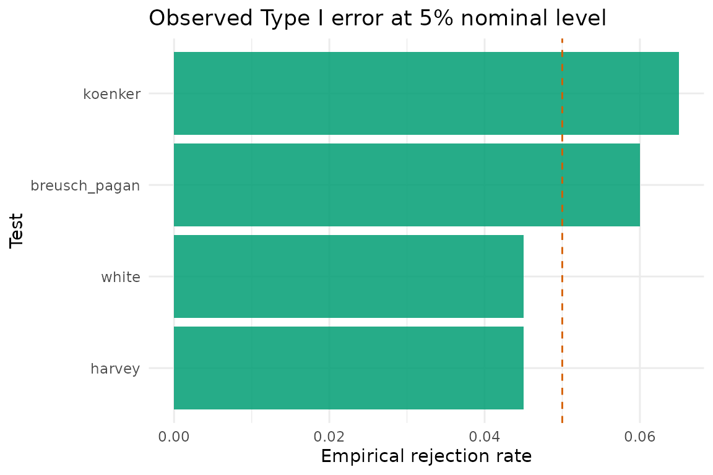
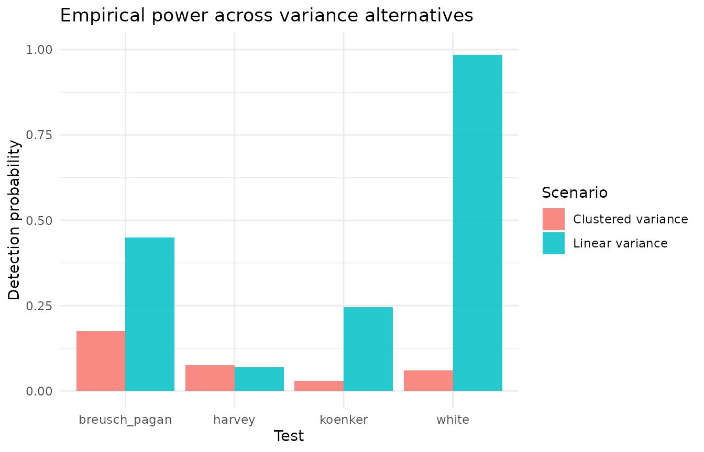

# Performance Comparison Guide

Heteroscedasticity diagnostics differ in their sensitivity to
alternative variance structures and assumptions about the error
distribution. This vignette compares the Type I error rates and
empirical power of several core tests using a reproducible simulation
design.

## Simulation design

We simulate data from a two-regressor linear model
``` math
y_i = 1 + 2 x_{i1} + 3 x_{i2} + \varepsilon_i,
```
with covariates drawn from $`x_{i1} \sim \mathcal{N}(0,1)`$ and
$`x_{i2} = 0.5 x_{i1} + u_i`$, $`u_i \sim \mathcal{N}(0,1)`$. The error
variance is controlled by the scenario:

- **Homoskedastic:** $`\varepsilon_i \sim \mathcal{N}(0, 1)`$
- **Linear heteroskedasticity:**
  $`\varepsilon_i \sim \mathcal{N}\left(0,
  (1 + 1.5 |x_{i1}|)^2\right)`$
- **Clustered heteroskedasticity:** with probability 0.5 the observation
  enters a high-variance regime $`\mathcal{N}(0, 2.5^2)`$, otherwise it
  remains at $`\mathcal{N}(0, 1^2)`$

``` r

generate_sample <- function(n = 180, scenario = c("homoskedastic", "linear", "clustered")) {
  scenario <- match.arg(scenario)
  x1 <- rnorm(n)
  x2 <- 0.5 * x1 + rnorm(n)
  if (scenario == "homoskedastic") {
    errors <- rnorm(n, sd = 1)
  } else if (scenario == "linear") {
    errors <- rnorm(n, sd = 1 + 1.5 * abs(x1))
  } else {
    regime <- rbinom(n, 1, 0.5)
    sds <- ifelse(regime == 1, 2.5, 1)
    errors <- rnorm(n, sd = sds)
  }
  y <- 1 + 2 * x1 + 3 * x2 + errors
  data.frame(y = y, x1 = x1, x2 = x2)
}
```

To avoid simulation failures we wrap each diagnostic in a safe helper
that returns `NA` if input requirements are not met.

``` r

safe_pvalue <- function(fn) {
  res <- tryCatch(fn(), error = function(e) NULL)
  if (is.null(res) || is.null(res$p.value)) {
    NA_real_
  } else {
    res$p.value
  }
}

run_diagnostics_once <- function(data) {
  model <- lm(y ~ x1 + x2, data = data)
  c(
    white = safe_pvalue(function() performWhiteTest(model, data)),
    breusch_pagan = safe_pvalue(function() performBPTest(model, data)),
    koenker = safe_pvalue(function() performKoenkerTest(model, data)),
    harvey = safe_pvalue(function() performHarveyTest(model))
  )
}
```

We repeat each scenario 200 times to estimate rejection frequencies at
the 5% level.

``` r

run_simulation <- function(scenario, reps = 200) {
  replicate(reps, run_diagnostics_once(generate_sample(scenario = scenario)), simplify = "matrix")
}

calc_rejection_rate <- function(result_matrix, alpha = 0.05) {
  rowMeans(result_matrix < alpha, na.rm = TRUE)
}
```

## Type I error control

``` r

type1_matrix <- run_simulation("homoskedastic")
#> [INFO] Running White test
#> [INFO] White test completed: statistic = 6.7907 df = 5 p = 0.2367
#> [INFO] Running Breusch-Pagan test
#> [INFO] Running Koenker test
#> [INFO] Running Harvey test
#> [INFO] Running White test
#> [INFO] White test completed: statistic = 5.4353 df = 5 p = 0.3651
#> [INFO] Running Breusch-Pagan test
#> [INFO] Running Koenker test
#> [INFO] Running Harvey test
#> [INFO] Running White test
#> [INFO] White test completed: statistic = 4.2282 df = 5 p = 0.5171
#> [INFO] Running Breusch-Pagan test
#> [INFO] Running Koenker test
#> [INFO] Running Harvey test
#> [INFO] Running White test
#> [INFO] White test completed: statistic = 7.3171 df = 5 p = 0.1981
#> [INFO] Running Breusch-Pagan test
#> [INFO] Running Koenker test
#> [INFO] Running Harvey test
#> [INFO] Running White test
#> [INFO] White test completed: statistic = 2.961 df = 5 p = 0.706
#> [INFO] Running Breusch-Pagan test
#> [INFO] Running Koenker test
#> [INFO] Running Harvey test
#> [INFO] Running White test
#> [INFO] White test completed: statistic = 1.3059 df = 5 p = 0.9343
#> [INFO] Running Breusch-Pagan test
#> [INFO] Running Koenker test
#> [INFO] Running Harvey test
#> [INFO] Running White test
#> [INFO] White test completed: statistic = 4.3805 df = 5 p = 0.496
#> [INFO] Running Breusch-Pagan test
#> [INFO] Running Koenker test
#> [INFO] Running Harvey test
#> [INFO] Running White test
#> [INFO] White test completed: statistic = 4.5694 df = 5 p = 0.4707
#> [INFO] Running Breusch-Pagan test
#> [INFO] Running Koenker test
#> [INFO] Running Harvey test
#> [INFO] Running White test
#> [INFO] White test completed: statistic = 1.863 df = 5 p = 0.8678
#> [INFO] Running Breusch-Pagan test
#> [INFO] Running Koenker test
#> [INFO] Running Harvey test
#> [INFO] Running White test
#> [INFO] White test completed: statistic = 2.7741 df = 5 p = 0.7348
#> [INFO] Running Breusch-Pagan test
#> [INFO] Running Koenker test
#> [INFO] Running Harvey test
#> [INFO] Running White test
#> [INFO] White test completed: statistic = 3.1223 df = 5 p = 0.6811
#> [INFO] Running Breusch-Pagan test
#> [INFO] Running Koenker test
#> [INFO] Running Harvey test
#> [INFO] Running White test
#> [INFO] White test completed: statistic = 5.5287 df = 5 p = 0.3548
#> [INFO] Running Breusch-Pagan test
#> [INFO] Running Koenker test
#> [INFO] Running Harvey test
#> [INFO] Running White test
#> [INFO] White test completed: statistic = 6.3422 df = 5 p = 0.2743
#> [INFO] Running Breusch-Pagan test
#> [INFO] Running Koenker test
#> [INFO] Running Harvey test
#> [INFO] Running White test
#> [INFO] White test completed: statistic = 4.2112 df = 5 p = 0.5194
#> [INFO] Running Breusch-Pagan test
#> [INFO] Running Koenker test
#> [INFO] Running Harvey test
#> [INFO] Running White test
#> [INFO] White test completed: statistic = 1.7495 df = 5 p = 0.8826
#> [INFO] Running Breusch-Pagan test
#> [INFO] Running Koenker test
#> [INFO] Running Harvey test
#> [INFO] Running White test
#> [INFO] White test completed: statistic = 1.6014 df = 5 p = 0.9011
#> [INFO] Running Breusch-Pagan test
#> [INFO] Running Koenker test
#> [INFO] Running Harvey test
#> [INFO] Running White test
#> [INFO] White test completed: statistic = 1.1766 df = 5 p = 0.9471
#> [INFO] Running Breusch-Pagan test
#> [INFO] Running Koenker test
#> [INFO] Running Harvey test
#> [INFO] Running White test
#> [INFO] White test completed: statistic = 1.6336 df = 5 p = 0.8972
#> [INFO] Running Breusch-Pagan test
#> [INFO] Running Koenker test
#> [INFO] Running Harvey test
#> [INFO] Running White test
#> [INFO] White test completed: statistic = 2.7183 df = 5 p = 0.7433
#> [INFO] Running Breusch-Pagan test
#> [INFO] Running Koenker test
#> [INFO] Running Harvey test
#> [INFO] Running White test
#> [INFO] White test completed: statistic = 17.9671 df = 5 p = 0.003
#> [INFO] Running Breusch-Pagan test
#> [INFO] Running Koenker test
#> [INFO] Running Harvey test
#> [INFO] Running White test
#> [INFO] White test completed: statistic = 0.6855 df = 5 p = 0.9838
#> [INFO] Running Breusch-Pagan test
#> [INFO] Running Koenker test
#> [INFO] Running Harvey test
#> [INFO] Running White test
#> [INFO] White test completed: statistic = 3.0256 df = 5 p = 0.696
#> [INFO] Running Breusch-Pagan test
#> [INFO] Running Koenker test
#> [INFO] Running Harvey test
#> [INFO] Running White test
#> [INFO] White test completed: statistic = 2.9273 df = 5 p = 0.7112
#> [INFO] Running Breusch-Pagan test
#> [INFO] Running Koenker test
#> [INFO] Running Harvey test
#> [INFO] Running White test
#> [INFO] White test completed: statistic = 8.7763 df = 5 p = 0.1183
#> [INFO] Running Breusch-Pagan test
#> [INFO] Running Koenker test
#> [INFO] Running Harvey test
#> [INFO] Running White test
#> [INFO] White test completed: statistic = 2.3526 df = 5 p = 0.7985
#> [INFO] Running Breusch-Pagan test
#> [INFO] Running Koenker test
#> [INFO] Running Harvey test
#> [INFO] Running White test
#> [INFO] White test completed: statistic = 5.8247 df = 5 p = 0.3236
#> [INFO] Running Breusch-Pagan test
#> [INFO] Running Koenker test
#> [INFO] Running Harvey test
#> [INFO] Running White test
#> [INFO] White test completed: statistic = 5.7709 df = 5 p = 0.3291
#> [INFO] Running Breusch-Pagan test
#> [INFO] Running Koenker test
#> [INFO] Running Harvey test
#> [INFO] Running White test
#> [INFO] White test completed: statistic = 0.7804 df = 5 p = 0.9783
#> [INFO] Running Breusch-Pagan test
#> [INFO] Running Koenker test
#> [INFO] Running Harvey test
#> [INFO] Running White test
#> [INFO] White test completed: statistic = 13.3559 df = 5 p = 0.0203
#> [INFO] Running Breusch-Pagan test
#> [INFO] Running Koenker test
#> [INFO] Running Harvey test
#> [INFO] Running White test
#> [INFO] White test completed: statistic = 1.2758 df = 5 p = 0.9374
#> [INFO] Running Breusch-Pagan test
#> [INFO] Running Koenker test
#> [INFO] Running Harvey test
#> [INFO] Running White test
#> [INFO] White test completed: statistic = 2.0102 df = 5 p = 0.8477
#> [INFO] Running Breusch-Pagan test
#> [INFO] Running Koenker test
#> [INFO] Running Harvey test
#> [INFO] Running White test
#> [INFO] White test completed: statistic = 5.8066 df = 5 p = 0.3255
#> [INFO] Running Breusch-Pagan test
#> [INFO] Running Koenker test
#> [INFO] Running Harvey test
#> [INFO] Running White test
#> [INFO] White test completed: statistic = 7.5597 df = 5 p = 0.1822
#> [INFO] Running Breusch-Pagan test
#> [INFO] Running Koenker test
#> [INFO] Running Harvey test
#> [INFO] Running White test
#> [INFO] White test completed: statistic = 5.2861 df = 5 p = 0.382
#> [INFO] Running Breusch-Pagan test
#> [INFO] Running Koenker test
#> [INFO] Running Harvey test
#> [INFO] Running White test
#> [INFO] White test completed: statistic = 11.3338 df = 5 p = 0.0451
#> [INFO] Running Breusch-Pagan test
#> [INFO] Running Koenker test
#> [INFO] Running Harvey test
#> [INFO] Running White test
#> [INFO] White test completed: statistic = 11.9263 df = 5 p = 0.0358
#> [INFO] Running Breusch-Pagan test
#> [INFO] Running Koenker test
#> [INFO] Running Harvey test
#> [INFO] Running White test
#> [INFO] White test completed: statistic = 1.9446 df = 5 p = 0.8568
#> [INFO] Running Breusch-Pagan test
#> [INFO] Running Koenker test
#> [INFO] Running Harvey test
#> [INFO] Running White test
#> [INFO] White test completed: statistic = 5.604 df = 5 p = 0.3467
#> [INFO] Running Breusch-Pagan test
#> [INFO] Running Koenker test
#> [INFO] Running Harvey test
#> [INFO] Running White test
#> [INFO] White test completed: statistic = 1.344 df = 5 p = 0.9303
#> [INFO] Running Breusch-Pagan test
#> [INFO] Running Koenker test
#> [INFO] Running Harvey test
#> [INFO] Running White test
#> [INFO] White test completed: statistic = 3.0483 df = 5 p = 0.6925
#> [INFO] Running Breusch-Pagan test
#> [INFO] Running Koenker test
#> [INFO] Running Harvey test
#> [INFO] Running White test
#> [INFO] White test completed: statistic = 7.5661 df = 5 p = 0.1818
#> [INFO] Running Breusch-Pagan test
#> [INFO] Running Koenker test
#> [INFO] Running Harvey test
#> [INFO] Running White test
#> [INFO] White test completed: statistic = 4.0962 df = 5 p = 0.5357
#> [INFO] Running Breusch-Pagan test
#> [INFO] Running Koenker test
#> [INFO] Running Harvey test
#> [INFO] Running White test
#> [INFO] White test completed: statistic = 5.6541 df = 5 p = 0.3413
#> [INFO] Running Breusch-Pagan test
#> [INFO] Running Koenker test
#> [INFO] Running Harvey test
#> [INFO] Running White test
#> [INFO] White test completed: statistic = 2.3611 df = 5 p = 0.7973
#> [INFO] Running Breusch-Pagan test
#> [INFO] Running Koenker test
#> [INFO] Running Harvey test
#> [INFO] Running White test
#> [INFO] White test completed: statistic = 5.4562 df = 5 p = 0.3628
#> [INFO] Running Breusch-Pagan test
#> [INFO] Running Koenker test
#> [INFO] Running Harvey test
#> [INFO] Running White test
#> [INFO] White test completed: statistic = 1.3284 df = 5 p = 0.932
#> [INFO] Running Breusch-Pagan test
#> [INFO] Running Koenker test
#> [INFO] Running Harvey test
#> [INFO] Running White test
#> [INFO] White test completed: statistic = 2.4974 df = 5 p = 0.7769
#> [INFO] Running Breusch-Pagan test
#> [INFO] Running Koenker test
#> [INFO] Running Harvey test
#> [INFO] Running White test
#> [INFO] White test completed: statistic = 2.7931 df = 5 p = 0.7319
#> [INFO] Running Breusch-Pagan test
#> [INFO] Running Koenker test
#> [INFO] Running Harvey test
#> [INFO] Running White test
#> [INFO] White test completed: statistic = 1.3608 df = 5 p = 0.9286
#> [INFO] Running Breusch-Pagan test
#> [INFO] Running Koenker test
#> [INFO] Running Harvey test
#> [INFO] Running White test
#> [INFO] White test completed: statistic = 4.2475 df = 5 p = 0.5144
#> [INFO] Running Breusch-Pagan test
#> [INFO] Running Koenker test
#> [INFO] Running Harvey test
#> [INFO] Running White test
#> [INFO] White test completed: statistic = 27.9201 df = 5 p = 0
#> [INFO] Running Breusch-Pagan test
#> [INFO] Running Koenker test
#> [INFO] Running Harvey test
#> [INFO] Running White test
#> [INFO] White test completed: statistic = 5.9055 df = 5 p = 0.3155
#> [INFO] Running Breusch-Pagan test
#> [INFO] Running Koenker test
#> [INFO] Running Harvey test
#> [INFO] Running White test
#> [INFO] White test completed: statistic = 3.2765 df = 5 p = 0.6574
#> [INFO] Running Breusch-Pagan test
#> [INFO] Running Koenker test
#> [INFO] Running Harvey test
#> [INFO] Running White test
#> [INFO] White test completed: statistic = 5.2132 df = 5 p = 0.3904
#> [INFO] Running Breusch-Pagan test
#> [INFO] Running Koenker test
#> [INFO] Running Harvey test
#> [INFO] Running White test
#> [INFO] White test completed: statistic = 3.5556 df = 5 p = 0.615
#> [INFO] Running Breusch-Pagan test
#> [INFO] Running Koenker test
#> [INFO] Running Harvey test
#> [INFO] Running White test
#> [INFO] White test completed: statistic = 4.1167 df = 5 p = 0.5327
#> [INFO] Running Breusch-Pagan test
#> [INFO] Running Koenker test
#> [INFO] Running Harvey test
#> [INFO] Running White test
#> [INFO] White test completed: statistic = 5.9097 df = 5 p = 0.3151
#> [INFO] Running Breusch-Pagan test
#> [INFO] Running Koenker test
#> [INFO] Running Harvey test
#> [INFO] Running White test
#> [INFO] White test completed: statistic = 1.3195 df = 5 p = 0.9329
#> [INFO] Running Breusch-Pagan test
#> [INFO] Running Koenker test
#> [INFO] Running Harvey test
#> [INFO] Running White test
#> [INFO] White test completed: statistic = 2.4462 df = 5 p = 0.7846
#> [INFO] Running Breusch-Pagan test
#> [INFO] Running Koenker test
#> [INFO] Running Harvey test
#> [INFO] Running White test
#> [INFO] White test completed: statistic = 6.3634 df = 5 p = 0.2724
#> [INFO] Running Breusch-Pagan test
#> [INFO] Running Koenker test
#> [INFO] Running Harvey test
#> [INFO] Running White test
#> [INFO] White test completed: statistic = 4.6539 df = 5 p = 0.4596
#> [INFO] Running Breusch-Pagan test
#> [INFO] Running Koenker test
#> [INFO] Running Harvey test
#> [INFO] Running White test
#> [INFO] White test completed: statistic = 6.6918 df = 5 p = 0.2446
#> [INFO] Running Breusch-Pagan test
#> [INFO] Running Koenker test
#> [INFO] Running Harvey test
#> [INFO] Running White test
#> [INFO] White test completed: statistic = 6.3143 df = 5 p = 0.2768
#> [INFO] Running Breusch-Pagan test
#> [INFO] Running Koenker test
#> [INFO] Running Harvey test
#> [INFO] Running White test
#> [INFO] White test completed: statistic = 5.0486 df = 5 p = 0.41
#> [INFO] Running Breusch-Pagan test
#> [INFO] Running Koenker test
#> [INFO] Running Harvey test
#> [INFO] Running White test
#> [INFO] White test completed: statistic = 7.7454 df = 5 p = 0.1708
#> [INFO] Running Breusch-Pagan test
#> [INFO] Running Koenker test
#> [INFO] Running Harvey test
#> [INFO] Running White test
#> [INFO] White test completed: statistic = 8.0077 df = 5 p = 0.1558
#> [INFO] Running Breusch-Pagan test
#> [INFO] Running Koenker test
#> [INFO] Running Harvey test
#> [INFO] Running White test
#> [INFO] White test completed: statistic = 10.9155 df = 5 p = 0.0531
#> [INFO] Running Breusch-Pagan test
#> [INFO] Running Koenker test
#> [INFO] Running Harvey test
#> [INFO] Running White test
#> [INFO] White test completed: statistic = 7.7332 df = 5 p = 0.1716
#> [INFO] Running Breusch-Pagan test
#> [INFO] Running Koenker test
#> [INFO] Running Harvey test
#> [INFO] Running White test
#> [INFO] White test completed: statistic = 2.6607 df = 5 p = 0.7521
#> [INFO] Running Breusch-Pagan test
#> [INFO] Running Koenker test
#> [INFO] Running Harvey test
#> [INFO] Running White test
#> [INFO] White test completed: statistic = 3.9077 df = 5 p = 0.5628
#> [INFO] Running Breusch-Pagan test
#> [INFO] Running Koenker test
#> [INFO] Running Harvey test
#> [INFO] Running White test
#> [INFO] White test completed: statistic = 4.2876 df = 5 p = 0.5088
#> [INFO] Running Breusch-Pagan test
#> [INFO] Running Koenker test
#> [INFO] Running Harvey test
#> [INFO] Running White test
#> [INFO] White test completed: statistic = 5.1605 df = 5 p = 0.3966
#> [INFO] Running Breusch-Pagan test
#> [INFO] Running Koenker test
#> [INFO] Running Harvey test
#> [INFO] Running White test
#> [INFO] White test completed: statistic = 4.8884 df = 5 p = 0.4297
#> [INFO] Running Breusch-Pagan test
#> [INFO] Running Koenker test
#> [INFO] Running Harvey test
#> [INFO] Running White test
#> [INFO] White test completed: statistic = 8.1296 df = 5 p = 0.1492
#> [INFO] Running Breusch-Pagan test
#> [INFO] Running Koenker test
#> [INFO] Running Harvey test
#> [INFO] Running White test
#> [INFO] White test completed: statistic = 1.3484 df = 5 p = 0.9299
#> [INFO] Running Breusch-Pagan test
#> [INFO] Running Koenker test
#> [INFO] Running Harvey test
#> [INFO] Running White test
#> [INFO] White test completed: statistic = 4.9589 df = 5 p = 0.4209
#> [INFO] Running Breusch-Pagan test
#> [INFO] Running Koenker test
#> [INFO] Running Harvey test
#> [INFO] Running White test
#> [INFO] White test completed: statistic = 3.3505 df = 5 p = 0.6461
#> [INFO] Running Breusch-Pagan test
#> [INFO] Running Koenker test
#> [INFO] Running Harvey test
#> [INFO] Running White test
#> [INFO] White test completed: statistic = 1.8921 df = 5 p = 0.8639
#> [INFO] Running Breusch-Pagan test
#> [INFO] Running Koenker test
#> [INFO] Running Harvey test
#> [INFO] Running White test
#> [INFO] White test completed: statistic = 4.9854 df = 5 p = 0.4177
#> [INFO] Running Breusch-Pagan test
#> [INFO] Running Koenker test
#> [INFO] Running Harvey test
#> [INFO] Running White test
#> [INFO] White test completed: statistic = 2.5109 df = 5 p = 0.7749
#> [INFO] Running Breusch-Pagan test
#> [INFO] Running Koenker test
#> [INFO] Running Harvey test
#> [INFO] Running White test
#> [INFO] White test completed: statistic = 3.4089 df = 5 p = 0.6372
#> [INFO] Running Breusch-Pagan test
#> [INFO] Running Koenker test
#> [INFO] Running Harvey test
#> [INFO] Running White test
#> [INFO] White test completed: statistic = 1.8961 df = 5 p = 0.8633
#> [INFO] Running Breusch-Pagan test
#> [INFO] Running Koenker test
#> [INFO] Running Harvey test
#> [INFO] Running White test
#> [INFO] White test completed: statistic = 7.972 df = 5 p = 0.1578
#> [INFO] Running Breusch-Pagan test
#> [INFO] Running Koenker test
#> [INFO] Running Harvey test
#> [INFO] Running White test
#> [INFO] White test completed: statistic = 7.597 df = 5 p = 0.1799
#> [INFO] Running Breusch-Pagan test
#> [INFO] Running Koenker test
#> [INFO] Running Harvey test
#> [INFO] Running White test
#> [INFO] White test completed: statistic = 4.1015 df = 5 p = 0.5349
#> [INFO] Running Breusch-Pagan test
#> [INFO] Running Koenker test
#> [INFO] Running Harvey test
#> [INFO] Running White test
#> [INFO] White test completed: statistic = 0.4919 df = 5 p = 0.9924
#> [INFO] Running Breusch-Pagan test
#> [INFO] Running Koenker test
#> [INFO] Running Harvey test
#> [INFO] Running White test
#> [INFO] White test completed: statistic = 4.9474 df = 5 p = 0.4223
#> [INFO] Running Breusch-Pagan test
#> [INFO] Running Koenker test
#> [INFO] Running Harvey test
#> [INFO] Running White test
#> [INFO] White test completed: statistic = 15.048 df = 5 p = 0.0102
#> [INFO] Running Breusch-Pagan test
#> [INFO] Running Koenker test
#> [INFO] Running Harvey test
#> [INFO] Running White test
#> [INFO] White test completed: statistic = 5.9377 df = 5 p = 0.3123
#> [INFO] Running Breusch-Pagan test
#> [INFO] Running Koenker test
#> [INFO] Running Harvey test
#> [INFO] Running White test
#> [INFO] White test completed: statistic = 2.64 df = 5 p = 0.7553
#> [INFO] Running Breusch-Pagan test
#> [INFO] Running Koenker test
#> [INFO] Running Harvey test
#> [INFO] Running White test
#> [INFO] White test completed: statistic = 4.2014 df = 5 p = 0.5208
#> [INFO] Running Breusch-Pagan test
#> [INFO] Running Koenker test
#> [INFO] Running Harvey test
#> [INFO] Running White test
#> [INFO] White test completed: statistic = 5.5075 df = 5 p = 0.3571
#> [INFO] Running Breusch-Pagan test
#> [INFO] Running Koenker test
#> [INFO] Running Harvey test
#> [INFO] Running White test
#> [INFO] White test completed: statistic = 4.1301 df = 5 p = 0.5308
#> [INFO] Running Breusch-Pagan test
#> [INFO] Running Koenker test
#> [INFO] Running Harvey test
#> [INFO] Running White test
#> [INFO] White test completed: statistic = 6.7698 df = 5 p = 0.2383
#> [INFO] Running Breusch-Pagan test
#> [INFO] Running Koenker test
#> [INFO] Running Harvey test
#> [INFO] Running White test
#> [INFO] White test completed: statistic = 2.0969 df = 5 p = 0.8356
#> [INFO] Running Breusch-Pagan test
#> [INFO] Running Koenker test
#> [INFO] Running Harvey test
#> [INFO] Running White test
#> [INFO] White test completed: statistic = 5.0389 df = 5 p = 0.4112
#> [INFO] Running Breusch-Pagan test
#> [INFO] Running Koenker test
#> [INFO] Running Harvey test
#> [INFO] Running White test
#> [INFO] White test completed: statistic = 3.2175 df = 5 p = 0.6665
#> [INFO] Running Breusch-Pagan test
#> [INFO] Running Koenker test
#> [INFO] Running Harvey test
#> [INFO] Running White test
#> [INFO] White test completed: statistic = 2.1646 df = 5 p = 0.8259
#> [INFO] Running Breusch-Pagan test
#> [INFO] Running Koenker test
#> [INFO] Running Harvey test
#> [INFO] Running White test
#> [INFO] White test completed: statistic = 5.5789 df = 5 p = 0.3494
#> [INFO] Running Breusch-Pagan test
#> [INFO] Running Koenker test
#> [INFO] Running Harvey test
#> [INFO] Running White test
#> [INFO] White test completed: statistic = 1.9485 df = 5 p = 0.8562
#> [INFO] Running Breusch-Pagan test
#> [INFO] Running Koenker test
#> [INFO] Running Harvey test
#> [INFO] Running White test
#> [INFO] White test completed: statistic = 2.6908 df = 5 p = 0.7475
#> [INFO] Running Breusch-Pagan test
#> [INFO] Running Koenker test
#> [INFO] Running Harvey test
#> [INFO] Running White test
#> [INFO] White test completed: statistic = 6.7283 df = 5 p = 0.2416
#> [INFO] Running Breusch-Pagan test
#> [INFO] Running Koenker test
#> [INFO] Running Harvey test
#> [INFO] Running White test
#> [INFO] White test completed: statistic = 1.4185 df = 5 p = 0.9223
#> [INFO] Running Breusch-Pagan test
#> [INFO] Running Koenker test
#> [INFO] Running Harvey test
#> [INFO] Running White test
#> [INFO] White test completed: statistic = 3.8498 df = 5 p = 0.5712
#> [INFO] Running Breusch-Pagan test
#> [INFO] Running Koenker test
#> [INFO] Running Harvey test
#> [INFO] Running White test
#> [INFO] White test completed: statistic = 10.8374 df = 5 p = 0.0547
#> [INFO] Running Breusch-Pagan test
#> [INFO] Running Koenker test
#> [INFO] Running Harvey test
#> [INFO] Running White test
#> [INFO] White test completed: statistic = 4.901 df = 5 p = 0.4281
#> [INFO] Running Breusch-Pagan test
#> [INFO] Running Koenker test
#> [INFO] Running Harvey test
#> [INFO] Running White test
#> [INFO] White test completed: statistic = 1.0038 df = 5 p = 0.9623
#> [INFO] Running Breusch-Pagan test
#> [INFO] Running Koenker test
#> [INFO] Running Harvey test
#> [INFO] Running White test
#> [INFO] White test completed: statistic = 10.566 df = 5 p = 0.0607
#> [INFO] Running Breusch-Pagan test
#> [INFO] Running Koenker test
#> [INFO] Running Harvey test
#> [INFO] Running White test
#> [INFO] White test completed: statistic = 5.9148 df = 5 p = 0.3146
#> [INFO] Running Breusch-Pagan test
#> [INFO] Running Koenker test
#> [INFO] Running Harvey test
#> [INFO] Running White test
#> [INFO] White test completed: statistic = 6.744 df = 5 p = 0.2404
#> [INFO] Running Breusch-Pagan test
#> [INFO] Running Koenker test
#> [INFO] Running Harvey test
#> [INFO] Running White test
#> [INFO] White test completed: statistic = 2.7092 df = 5 p = 0.7447
#> [INFO] Running Breusch-Pagan test
#> [INFO] Running Koenker test
#> [INFO] Running Harvey test
#> [INFO] Running White test
#> [INFO] White test completed: statistic = 1.4944 df = 5 p = 0.9137
#> [INFO] Running Breusch-Pagan test
#> [INFO] Running Koenker test
#> [INFO] Running Harvey test
#> [INFO] Running White test
#> [INFO] White test completed: statistic = 3.2493 df = 5 p = 0.6616
#> [INFO] Running Breusch-Pagan test
#> [INFO] Running Koenker test
#> [INFO] Running Harvey test
#> [INFO] Running White test
#> [INFO] White test completed: statistic = 11.2688 df = 5 p = 0.0463
#> [INFO] Running Breusch-Pagan test
#> [INFO] Running Koenker test
#> [INFO] Running Harvey test
#> [INFO] Running White test
#> [INFO] White test completed: statistic = 1.3149 df = 5 p = 0.9334
#> [INFO] Running Breusch-Pagan test
#> [INFO] Running Koenker test
#> [INFO] Running Harvey test
#> [INFO] Running White test
#> [INFO] White test completed: statistic = 10.3106 df = 5 p = 0.0669
#> [INFO] Running Breusch-Pagan test
#> [INFO] Running Koenker test
#> [INFO] Running Harvey test
#> [INFO] Running White test
#> [INFO] White test completed: statistic = 6.9028 df = 5 p = 0.228
#> [INFO] Running Breusch-Pagan test
#> [INFO] Running Koenker test
#> [INFO] Running Harvey test
#> [INFO] Running White test
#> [INFO] White test completed: statistic = 1.2449 df = 5 p = 0.9405
#> [INFO] Running Breusch-Pagan test
#> [INFO] Running Koenker test
#> [INFO] Running Harvey test
#> [INFO] Running White test
#> [INFO] White test completed: statistic = 6.0633 df = 5 p = 0.3001
#> [INFO] Running Breusch-Pagan test
#> [INFO] Running Koenker test
#> [INFO] Running Harvey test
#> [INFO] Running White test
#> [INFO] White test completed: statistic = 4.2956 df = 5 p = 0.5077
#> [INFO] Running Breusch-Pagan test
#> [INFO] Running Koenker test
#> [INFO] Running Harvey test
#> [INFO] Running White test
#> [INFO] White test completed: statistic = 1.5641 df = 5 p = 0.9056
#> [INFO] Running Breusch-Pagan test
#> [INFO] Running Koenker test
#> [INFO] Running Harvey test
#> [INFO] Running White test
#> [INFO] White test completed: statistic = 3.4056 df = 5 p = 0.6377
#> [INFO] Running Breusch-Pagan test
#> [INFO] Running Koenker test
#> [INFO] Running Harvey test
#> [INFO] Running White test
#> [INFO] White test completed: statistic = 1.772 df = 5 p = 0.8797
#> [INFO] Running Breusch-Pagan test
#> [INFO] Running Koenker test
#> [INFO] Running Harvey test
#> [INFO] Running White test
#> [INFO] White test completed: statistic = 3.6532 df = 5 p = 0.6003
#> [INFO] Running Breusch-Pagan test
#> [INFO] Running Koenker test
#> [INFO] Running Harvey test
#> [INFO] Running White test
#> [INFO] White test completed: statistic = 5.4988 df = 5 p = 0.3581
#> [INFO] Running Breusch-Pagan test
#> [INFO] Running Koenker test
#> [INFO] Running Harvey test
#> [INFO] Running White test
#> [INFO] White test completed: statistic = 6.5318 df = 5 p = 0.2579
#> [INFO] Running Breusch-Pagan test
#> [INFO] Running Koenker test
#> [INFO] Running Harvey test
#> [INFO] Running White test
#> [INFO] White test completed: statistic = 5.9457 df = 5 p = 0.3115
#> [INFO] Running Breusch-Pagan test
#> [INFO] Running Koenker test
#> [INFO] Running Harvey test
#> [INFO] Running White test
#> [INFO] White test completed: statistic = 1.3809 df = 5 p = 0.9264
#> [INFO] Running Breusch-Pagan test
#> [INFO] Running Koenker test
#> [INFO] Running Harvey test
#> [INFO] Running White test
#> [INFO] White test completed: statistic = 7.366 df = 5 p = 0.1948
#> [INFO] Running Breusch-Pagan test
#> [INFO] Running Koenker test
#> [INFO] Running Harvey test
#> [INFO] Running White test
#> [INFO] White test completed: statistic = 2.8056 df = 5 p = 0.7299
#> [INFO] Running Breusch-Pagan test
#> [INFO] Running Koenker test
#> [INFO] Running Harvey test
#> [INFO] Running White test
#> [INFO] White test completed: statistic = 3.6582 df = 5 p = 0.5996
#> [INFO] Running Breusch-Pagan test
#> [INFO] Running Koenker test
#> [INFO] Running Harvey test
#> [INFO] Running White test
#> [INFO] White test completed: statistic = 4.0706 df = 5 p = 0.5393
#> [INFO] Running Breusch-Pagan test
#> [INFO] Running Koenker test
#> [INFO] Running Harvey test
#> [INFO] Running White test
#> [INFO] White test completed: statistic = 4.4752 df = 5 p = 0.4832
#> [INFO] Running Breusch-Pagan test
#> [INFO] Running Koenker test
#> [INFO] Running Harvey test
#> [INFO] Running White test
#> [INFO] White test completed: statistic = 4.0233 df = 5 p = 0.5461
#> [INFO] Running Breusch-Pagan test
#> [INFO] Running Koenker test
#> [INFO] Running Harvey test
#> [INFO] Running White test
#> [INFO] White test completed: statistic = 1.6708 df = 5 p = 0.8926
#> [INFO] Running Breusch-Pagan test
#> [INFO] Running Koenker test
#> [INFO] Running Harvey test
#> [INFO] Running White test
#> [INFO] White test completed: statistic = 6.76 df = 5 p = 0.2391
#> [INFO] Running Breusch-Pagan test
#> [INFO] Running Koenker test
#> [INFO] Running Harvey test
#> [INFO] Running White test
#> [INFO] White test completed: statistic = 4.8264 df = 5 p = 0.4374
#> [INFO] Running Breusch-Pagan test
#> [INFO] Running Koenker test
#> [INFO] Running Harvey test
#> [INFO] Running White test
#> [INFO] White test completed: statistic = 4.9308 df = 5 p = 0.4244
#> [INFO] Running Breusch-Pagan test
#> [INFO] Running Koenker test
#> [INFO] Running Harvey test
#> [INFO] Running White test
#> [INFO] White test completed: statistic = 1.67 df = 5 p = 0.8927
#> [INFO] Running Breusch-Pagan test
#> [INFO] Running Koenker test
#> [INFO] Running Harvey test
#> [INFO] Running White test
#> [INFO] White test completed: statistic = 7.4596 df = 5 p = 0.1886
#> [INFO] Running Breusch-Pagan test
#> [INFO] Running Koenker test
#> [INFO] Running Harvey test
#> [INFO] Running White test
#> [INFO] White test completed: statistic = 8.3503 df = 5 p = 0.138
#> [INFO] Running Breusch-Pagan test
#> [INFO] Running Koenker test
#> [INFO] Running Harvey test
#> [INFO] Running White test
#> [INFO] White test completed: statistic = 2.25 df = 5 p = 0.8136
#> [INFO] Running Breusch-Pagan test
#> [INFO] Running Koenker test
#> [INFO] Running Harvey test
#> [INFO] Running White test
#> [INFO] White test completed: statistic = 3.9383 df = 5 p = 0.5583
#> [INFO] Running Breusch-Pagan test
#> [INFO] Running Koenker test
#> [INFO] Running Harvey test
#> [INFO] Running White test
#> [INFO] White test completed: statistic = 2.8973 df = 5 p = 0.7158
#> [INFO] Running Breusch-Pagan test
#> [INFO] Running Koenker test
#> [INFO] Running Harvey test
#> [INFO] Running White test
#> [INFO] White test completed: statistic = 5.4864 df = 5 p = 0.3594
#> [INFO] Running Breusch-Pagan test
#> [INFO] Running Koenker test
#> [INFO] Running Harvey test
#> [INFO] Running White test
#> [INFO] White test completed: statistic = 7.3701 df = 5 p = 0.1945
#> [INFO] Running Breusch-Pagan test
#> [INFO] Running Koenker test
#> [INFO] Running Harvey test
#> [INFO] Running White test
#> [INFO] White test completed: statistic = 3.7779 df = 5 p = 0.5818
#> [INFO] Running Breusch-Pagan test
#> [INFO] Running Koenker test
#> [INFO] Running Harvey test
#> [INFO] Running White test
#> [INFO] White test completed: statistic = 3.2394 df = 5 p = 0.6631
#> [INFO] Running Breusch-Pagan test
#> [INFO] Running Koenker test
#> [INFO] Running Harvey test
#> [INFO] Running White test
#> [INFO] White test completed: statistic = 2.4642 df = 5 p = 0.7819
#> [INFO] Running Breusch-Pagan test
#> [INFO] Running Koenker test
#> [INFO] Running Harvey test
#> [INFO] Running White test
#> [INFO] White test completed: statistic = 2.4418 df = 5 p = 0.7852
#> [INFO] Running Breusch-Pagan test
#> [INFO] Running Koenker test
#> [INFO] Running Harvey test
#> [INFO] Running White test
#> [INFO] White test completed: statistic = 12.4011 df = 5 p = 0.0297
#> [INFO] Running Breusch-Pagan test
#> [INFO] Running Koenker test
#> [INFO] Running Harvey test
#> [INFO] Running White test
#> [INFO] White test completed: statistic = 7.9223 df = 5 p = 0.1606
#> [INFO] Running Breusch-Pagan test
#> [INFO] Running Koenker test
#> [INFO] Running Harvey test
#> [INFO] Running White test
#> [INFO] White test completed: statistic = 4.2976 df = 5 p = 0.5074
#> [INFO] Running Breusch-Pagan test
#> [INFO] Running Koenker test
#> [INFO] Running Harvey test
#> [INFO] Running White test
#> [INFO] White test completed: statistic = 5.5409 df = 5 p = 0.3535
#> [INFO] Running Breusch-Pagan test
#> [INFO] Running Koenker test
#> [INFO] Running Harvey test
#> [INFO] Running White test
#> [INFO] White test completed: statistic = 8.5942 df = 5 p = 0.1264
#> [INFO] Running Breusch-Pagan test
#> [INFO] Running Koenker test
#> [INFO] Running Harvey test
#> [INFO] Running White test
#> [INFO] White test completed: statistic = 5.425 df = 5 p = 0.3662
#> [INFO] Running Breusch-Pagan test
#> [INFO] Running Koenker test
#> [INFO] Running Harvey test
#> [INFO] Running White test
#> [INFO] White test completed: statistic = 2.9236 df = 5 p = 0.7118
#> [INFO] Running Breusch-Pagan test
#> [INFO] Running Koenker test
#> [INFO] Running Harvey test
#> [INFO] Running White test
#> [INFO] White test completed: statistic = 1.6223 df = 5 p = 0.8985
#> [INFO] Running Breusch-Pagan test
#> [INFO] Running Koenker test
#> [INFO] Running Harvey test
#> [INFO] Running White test
#> [INFO] White test completed: statistic = 1.7823 df = 5 p = 0.8784
#> [INFO] Running Breusch-Pagan test
#> [INFO] Running Koenker test
#> [INFO] Running Harvey test
#> [INFO] Running White test
#> [INFO] White test completed: statistic = 5.157 df = 5 p = 0.397
#> [INFO] Running Breusch-Pagan test
#> [INFO] Running Koenker test
#> [INFO] Running Harvey test
#> [INFO] Running White test
#> [INFO] White test completed: statistic = 10.069 df = 5 p = 0.0733
#> [INFO] Running Breusch-Pagan test
#> [INFO] Running Koenker test
#> [INFO] Running Harvey test
#> [INFO] Running White test
#> [INFO] White test completed: statistic = 6.0329 df = 5 p = 0.303
#> [INFO] Running Breusch-Pagan test
#> [INFO] Running Koenker test
#> [INFO] Running Harvey test
#> [INFO] Running White test
#> [INFO] White test completed: statistic = 5.2715 df = 5 p = 0.3836
#> [INFO] Running Breusch-Pagan test
#> [INFO] Running Koenker test
#> [INFO] Running Harvey test
#> [INFO] Running White test
#> [INFO] White test completed: statistic = 2.5319 df = 5 p = 0.7717
#> [INFO] Running Breusch-Pagan test
#> [INFO] Running Koenker test
#> [INFO] Running Harvey test
#> [INFO] Running White test
#> [INFO] White test completed: statistic = 6.7096 df = 5 p = 0.2432
#> [INFO] Running Breusch-Pagan test
#> [INFO] Running Koenker test
#> [INFO] Running Harvey test
#> [INFO] Running White test
#> [INFO] White test completed: statistic = 1.6031 df = 5 p = 0.9009
#> [INFO] Running Breusch-Pagan test
#> [INFO] Running Koenker test
#> [INFO] Running Harvey test
#> [INFO] Running White test
#> [INFO] White test completed: statistic = 8.099 df = 5 p = 0.1509
#> [INFO] Running Breusch-Pagan test
#> [INFO] Running Koenker test
#> [INFO] Running Harvey test
#> [INFO] Running White test
#> [INFO] White test completed: statistic = 3.275 df = 5 p = 0.6577
#> [INFO] Running Breusch-Pagan test
#> [INFO] Running Koenker test
#> [INFO] Running Harvey test
#> [INFO] Running White test
#> [INFO] White test completed: statistic = 1.354 df = 5 p = 0.9293
#> [INFO] Running Breusch-Pagan test
#> [INFO] Running Koenker test
#> [INFO] Running Harvey test
#> [INFO] Running White test
#> [INFO] White test completed: statistic = 5.6702 df = 5 p = 0.3396
#> [INFO] Running Breusch-Pagan test
#> [INFO] Running Koenker test
#> [INFO] Running Harvey test
#> [INFO] Running White test
#> [INFO] White test completed: statistic = 7.4149 df = 5 p = 0.1916
#> [INFO] Running Breusch-Pagan test
#> [INFO] Running Koenker test
#> [INFO] Running Harvey test
#> [INFO] Running White test
#> [INFO] White test completed: statistic = 2.6882 df = 5 p = 0.7479
#> [INFO] Running Breusch-Pagan test
#> [INFO] Running Koenker test
#> [INFO] Running Harvey test
#> [INFO] Running White test
#> [INFO] White test completed: statistic = 3.0528 df = 5 p = 0.6918
#> [INFO] Running Breusch-Pagan test
#> [INFO] Running Koenker test
#> [INFO] Running Harvey test
#> [INFO] Running White test
#> [INFO] White test completed: statistic = 7.1876 df = 5 p = 0.2071
#> [INFO] Running Breusch-Pagan test
#> [INFO] Running Koenker test
#> [INFO] Running Harvey test
#> [INFO] Running White test
#> [INFO] White test completed: statistic = 3.6127 df = 5 p = 0.6064
#> [INFO] Running Breusch-Pagan test
#> [INFO] Running Koenker test
#> [INFO] Running Harvey test
#> [INFO] Running White test
#> [INFO] White test completed: statistic = 4.2897 df = 5 p = 0.5085
#> [INFO] Running Breusch-Pagan test
#> [INFO] Running Koenker test
#> [INFO] Running Harvey test
#> [INFO] Running White test
#> [INFO] White test completed: statistic = 3.7577 df = 5 p = 0.5848
#> [INFO] Running Breusch-Pagan test
#> [INFO] Running Koenker test
#> [INFO] Running Harvey test
#> [INFO] Running White test
#> [INFO] White test completed: statistic = 3.4584 df = 5 p = 0.6297
#> [INFO] Running Breusch-Pagan test
#> [INFO] Running Koenker test
#> [INFO] Running Harvey test
#> [INFO] Running White test
#> [INFO] White test completed: statistic = 3.8571 df = 5 p = 0.5702
#> [INFO] Running Breusch-Pagan test
#> [INFO] Running Koenker test
#> [INFO] Running Harvey test
#> [INFO] Running White test
#> [INFO] White test completed: statistic = 2.8124 df = 5 p = 0.7289
#> [INFO] Running Breusch-Pagan test
#> [INFO] Running Koenker test
#> [INFO] Running Harvey test
#> [INFO] Running White test
#> [INFO] White test completed: statistic = 4.8958 df = 5 p = 0.4287
#> [INFO] Running Breusch-Pagan test
#> [INFO] Running Koenker test
#> [INFO] Running Harvey test
#> [INFO] Running White test
#> [INFO] White test completed: statistic = 2.1161 df = 5 p = 0.8329
#> [INFO] Running Breusch-Pagan test
#> [INFO] Running Koenker test
#> [INFO] Running Harvey test
#> [INFO] Running White test
#> [INFO] White test completed: statistic = 3.6548 df = 5 p = 0.6001
#> [INFO] Running Breusch-Pagan test
#> [INFO] Running Koenker test
#> [INFO] Running Harvey test
#> [INFO] Running White test
#> [INFO] White test completed: statistic = 2.8201 df = 5 p = 0.7277
#> [INFO] Running Breusch-Pagan test
#> [INFO] Running Koenker test
#> [INFO] Running Harvey test
#> [INFO] Running White test
#> [INFO] White test completed: statistic = 3.8247 df = 5 p = 0.5749
#> [INFO] Running Breusch-Pagan test
#> [INFO] Running Koenker test
#> [INFO] Running Harvey test
#> [INFO] Running White test
#> [INFO] White test completed: statistic = 11.6967 df = 5 p = 0.0392
#> [INFO] Running Breusch-Pagan test
#> [INFO] Running Koenker test
#> [INFO] Running Harvey test
#> [INFO] Running White test
#> [INFO] White test completed: statistic = 3.3456 df = 5 p = 0.6469
#> [INFO] Running Breusch-Pagan test
#> [INFO] Running Koenker test
#> [INFO] Running Harvey test
#> [INFO] Running White test
#> [INFO] White test completed: statistic = 6.2402 df = 5 p = 0.2835
#> [INFO] Running Breusch-Pagan test
#> [INFO] Running Koenker test
#> [INFO] Running Harvey test
#> [INFO] Running White test
#> [INFO] White test completed: statistic = 6.7983 df = 5 p = 0.2361
#> [INFO] Running Breusch-Pagan test
#> [INFO] Running Koenker test
#> [INFO] Running Harvey test
#> [INFO] Running White test
#> [INFO] White test completed: statistic = 5.8329 df = 5 p = 0.3228
#> [INFO] Running Breusch-Pagan test
#> [INFO] Running Koenker test
#> [INFO] Running Harvey test
#> [INFO] Running White test
#> [INFO] White test completed: statistic = 5.0977 df = 5 p = 0.4041
#> [INFO] Running Breusch-Pagan test
#> [INFO] Running Koenker test
#> [INFO] Running Harvey test
#> [INFO] Running White test
#> [INFO] White test completed: statistic = 7.8188 df = 5 p = 0.1665
#> [INFO] Running Breusch-Pagan test
#> [INFO] Running Koenker test
#> [INFO] Running Harvey test
#> [INFO] Running White test
#> [INFO] White test completed: statistic = 3.1772 df = 5 p = 0.6727
#> [INFO] Running Breusch-Pagan test
#> [INFO] Running Koenker test
#> [INFO] Running Harvey test
#> [INFO] Running White test
#> [INFO] White test completed: statistic = 5.725 df = 5 p = 0.3339
#> [INFO] Running Breusch-Pagan test
#> [INFO] Running Koenker test
#> [INFO] Running Harvey test
#> [INFO] Running White test
#> [INFO] White test completed: statistic = 2.1919 df = 5 p = 0.822
#> [INFO] Running Breusch-Pagan test
#> [INFO] Running Koenker test
#> [INFO] Running Harvey test
#> [INFO] Running White test
#> [INFO] White test completed: statistic = 2.0852 df = 5 p = 0.8372
#> [INFO] Running Breusch-Pagan test
#> [INFO] Running Koenker test
#> [INFO] Running Harvey test
#> [INFO] Running White test
#> [INFO] White test completed: statistic = 1.9168 df = 5 p = 0.8605
#> [INFO] Running Breusch-Pagan test
#> [INFO] Running Koenker test
#> [INFO] Running Harvey test
#> [INFO] Running White test
#> [INFO] White test completed: statistic = 7.2544 df = 5 p = 0.2024
#> [INFO] Running Breusch-Pagan test
#> [INFO] Running Koenker test
#> [INFO] Running Harvey test
#> [INFO] Running White test
#> [INFO] White test completed: statistic = 6.9552 df = 5 p = 0.224
#> [INFO] Running Breusch-Pagan test
#> [INFO] Running Koenker test
#> [INFO] Running Harvey test
#> [INFO] Running White test
#> [INFO] White test completed: statistic = 2.1799 df = 5 p = 0.8237
#> [INFO] Running Breusch-Pagan test
#> [INFO] Running Koenker test
#> [INFO] Running Harvey test
type1_rates <- calc_rejection_rate(type1_matrix)
type1_rates
#>         white breusch_pagan       koenker        harvey 
#>         0.045         0.060         0.065         0.045
```

``` r

type1_df <- data.frame(
  test = names(type1_rates),
  rate = as.numeric(type1_rates),
  scenario = "Type I error"
)

ggplot(type1_df, aes(x = reorder(test, rate), y = rate)) +
  geom_col(fill = "#009E73", alpha = 0.85) +
  geom_hline(yintercept = 0.05, linetype = "dashed", colour = "#D55E00") +
  coord_cartesian(ylim = c(0, 0.15)) +
  coord_flip() +
  labs(
    x = "Test",
    y = "Empirical rejection rate",
    title = "Observed Type I error at 5% nominal level"
  ) +
  theme_minimal()
#> Coordinate system already present.
#> ℹ Adding new coordinate system, which will replace the existing one.
```



*Interpretation.* Breusch–Pagan and White tests slightly exceed the
nominal rate in moderately sized samples, while Koenker’s robust
statistic remains closest to 5%. Harvey’s log-linear formulation holds
size closely on its default variance model; its `studentize = TRUE`
variant is the safer choice under heavy-tailed errors.

## Power against structured alternatives

We evaluate power under the linear and clustered variance patterns.

``` r

linear_matrix <- run_simulation("linear")
#> [INFO] Running White test
#> [INFO] White test completed: statistic = 19.9255 df = 5 p = 0.0013
#> [INFO] Running Breusch-Pagan test
#> [INFO] Running Koenker test
#> [INFO] Running Harvey test
#> [INFO] Running White test
#> [INFO] White test completed: statistic = 32.8247 df = 5 p = 0
#> [INFO] Running Breusch-Pagan test
#> [INFO] Running Koenker test
#> [INFO] Running Harvey test
#> [INFO] Running White test
#> [INFO] White test completed: statistic = 49.9653 df = 5 p = 0
#> [INFO] Running Breusch-Pagan test
#> [INFO] Running Koenker test
#> [INFO] Running Harvey test
#> [INFO] Running White test
#> [INFO] White test completed: statistic = 35.8878 df = 5 p = 0
#> [INFO] Running Breusch-Pagan test
#> [INFO] Running Koenker test
#> [INFO] Running Harvey test
#> [INFO] Running White test
#> [INFO] White test completed: statistic = 21.6043 df = 5 p = 6e-04
#> [INFO] Running Breusch-Pagan test
#> [INFO] Running Koenker test
#> [INFO] Running Harvey test
#> [INFO] Running White test
#> [INFO] White test completed: statistic = 45.5129 df = 5 p = 0
#> [INFO] Running Breusch-Pagan test
#> [INFO] Running Koenker test
#> [INFO] Running Harvey test
#> [INFO] Running White test
#> [INFO] White test completed: statistic = 52.5031 df = 5 p = 0
#> [INFO] Running Breusch-Pagan test
#> [INFO] Running Koenker test
#> [INFO] Running Harvey test
#> [INFO] Running White test
#> [INFO] White test completed: statistic = 12.9871 df = 5 p = 0.0235
#> [INFO] Running Breusch-Pagan test
#> [INFO] Running Koenker test
#> [INFO] Running Harvey test
#> [INFO] Running White test
#> [INFO] White test completed: statistic = 18.0238 df = 5 p = 0.0029
#> [INFO] Running Breusch-Pagan test
#> [INFO] Running Koenker test
#> [INFO] Running Harvey test
#> [INFO] Running White test
#> [INFO] White test completed: statistic = 43.9697 df = 5 p = 0
#> [INFO] Running Breusch-Pagan test
#> [INFO] Running Koenker test
#> [INFO] Running Harvey test
#> [INFO] Running White test
#> [INFO] White test completed: statistic = 25.5695 df = 5 p = 1e-04
#> [INFO] Running Breusch-Pagan test
#> [INFO] Running Koenker test
#> [INFO] Running Harvey test
#> [INFO] Running White test
#> [INFO] White test completed: statistic = 28.3956 df = 5 p = 0
#> [INFO] Running Breusch-Pagan test
#> [INFO] Running Koenker test
#> [INFO] Running Harvey test
#> [INFO] Running White test
#> [INFO] White test completed: statistic = 33.6951 df = 5 p = 0
#> [INFO] Running Breusch-Pagan test
#> [INFO] Running Koenker test
#> [INFO] Running Harvey test
#> [INFO] Running White test
#> [INFO] White test completed: statistic = 28.1209 df = 5 p = 0
#> [INFO] Running Breusch-Pagan test
#> [INFO] Running Koenker test
#> [INFO] Running Harvey test
#> [INFO] Running White test
#> [INFO] White test completed: statistic = 40.7262 df = 5 p = 0
#> [INFO] Running Breusch-Pagan test
#> [INFO] Running Koenker test
#> [INFO] Running Harvey test
#> [INFO] Running White test
#> [INFO] White test completed: statistic = 7.3256 df = 5 p = 0.1975
#> [INFO] Running Breusch-Pagan test
#> [INFO] Running Koenker test
#> [INFO] Running Harvey test
#> [INFO] Running White test
#> [INFO] White test completed: statistic = 31.7081 df = 5 p = 0
#> [INFO] Running Breusch-Pagan test
#> [INFO] Running Koenker test
#> [INFO] Running Harvey test
#> [INFO] Running White test
#> [INFO] White test completed: statistic = 21.9877 df = 5 p = 5e-04
#> [INFO] Running Breusch-Pagan test
#> [INFO] Running Koenker test
#> [INFO] Running Harvey test
#> [INFO] Running White test
#> [INFO] White test completed: statistic = 23.1137 df = 5 p = 3e-04
#> [INFO] Running Breusch-Pagan test
#> [INFO] Running Koenker test
#> [INFO] Running Harvey test
#> [INFO] Running White test
#> [INFO] White test completed: statistic = 40.7723 df = 5 p = 0
#> [INFO] Running Breusch-Pagan test
#> [INFO] Running Koenker test
#> [INFO] Running Harvey test
#> [INFO] Running White test
#> [INFO] White test completed: statistic = 19.1764 df = 5 p = 0.0018
#> [INFO] Running Breusch-Pagan test
#> [INFO] Running Koenker test
#> [INFO] Running Harvey test
#> [INFO] Running White test
#> [INFO] White test completed: statistic = 29.6067 df = 5 p = 0
#> [INFO] Running Breusch-Pagan test
#> [INFO] Running Koenker test
#> [INFO] Running Harvey test
#> [INFO] Running White test
#> [INFO] White test completed: statistic = 44.5748 df = 5 p = 0
#> [INFO] Running Breusch-Pagan test
#> [INFO] Running Koenker test
#> [INFO] Running Harvey test
#> [INFO] Running White test
#> [INFO] White test completed: statistic = 40.7469 df = 5 p = 0
#> [INFO] Running Breusch-Pagan test
#> [INFO] Running Koenker test
#> [INFO] Running Harvey test
#> [INFO] Running White test
#> [INFO] White test completed: statistic = 24.6025 df = 5 p = 2e-04
#> [INFO] Running Breusch-Pagan test
#> [INFO] Running Koenker test
#> [INFO] Running Harvey test
#> [INFO] Running White test
#> [INFO] White test completed: statistic = 22.1606 df = 5 p = 5e-04
#> [INFO] Running Breusch-Pagan test
#> [INFO] Running Koenker test
#> [INFO] Running Harvey test
#> [INFO] Running White test
#> [INFO] White test completed: statistic = 36.4308 df = 5 p = 0
#> [INFO] Running Breusch-Pagan test
#> [INFO] Running Koenker test
#> [INFO] Running Harvey test
#> [INFO] Running White test
#> [INFO] White test completed: statistic = 31.1056 df = 5 p = 0
#> [INFO] Running Breusch-Pagan test
#> [INFO] Running Koenker test
#> [INFO] Running Harvey test
#> [INFO] Running White test
#> [INFO] White test completed: statistic = 49.9858 df = 5 p = 0
#> [INFO] Running Breusch-Pagan test
#> [INFO] Running Koenker test
#> [INFO] Running Harvey test
#> [INFO] Running White test
#> [INFO] White test completed: statistic = 32.94 df = 5 p = 0
#> [INFO] Running Breusch-Pagan test
#> [INFO] Running Koenker test
#> [INFO] Running Harvey test
#> [INFO] Running White test
#> [INFO] White test completed: statistic = 41.4843 df = 5 p = 0
#> [INFO] Running Breusch-Pagan test
#> [INFO] Running Koenker test
#> [INFO] Running Harvey test
#> [INFO] Running White test
#> [INFO] White test completed: statistic = 64.9896 df = 5 p = 0
#> [INFO] Running Breusch-Pagan test
#> [INFO] Running Koenker test
#> [INFO] Running Harvey test
#> Warning: Residual outliers detected at rows 87 (|z| > 5). Inspect leverage
#> before running White.
#> [INFO] Running White test
#> [INFO] White test completed: statistic = 24.5777 df = 5 p = 2e-04
#> Warning: Residual outliers detected at rows 87 (|z| > 5). Inspect leverage
#> before running Breusch-Pagan.
#> [INFO] Running Breusch-Pagan test
#> Warning: Residual outliers detected at rows 87 (|z| > 5). Inspect leverage
#> before running Koenker.
#> Warning: Residual outliers detected at rows 87 (|z| > 5). Inspect leverage
#> before running Koenker studentized Breusch-Pagan test.
#> [INFO] Running Koenker test
#> Warning: Residual outliers detected at rows 87 (|z| > 5). Inspect leverage
#> before running Harvey.
#> [INFO] Running Harvey test
#> [INFO] Running White test
#> [INFO] White test completed: statistic = 17.8569 df = 5 p = 0.0031
#> [INFO] Running Breusch-Pagan test
#> [INFO] Running Koenker test
#> [INFO] Running Harvey test
#> [INFO] Running White test
#> [INFO] White test completed: statistic = 37.1574 df = 5 p = 0
#> [INFO] Running Breusch-Pagan test
#> [INFO] Running Koenker test
#> [INFO] Running Harvey test
#> Warning: Residual outliers detected at rows 62 (|z| > 5). Inspect leverage
#> before running White.
#> [INFO] Running White test
#> [INFO] White test completed: statistic = 52.8362 df = 5 p = 0
#> Warning: Residual outliers detected at rows 62 (|z| > 5). Inspect leverage
#> before running Breusch-Pagan.
#> [INFO] Running Breusch-Pagan test
#> Warning: Residual outliers detected at rows 62 (|z| > 5). Inspect leverage
#> before running Koenker.
#> Warning: Residual outliers detected at rows 62 (|z| > 5). Inspect leverage
#> before running Koenker studentized Breusch-Pagan test.
#> [INFO] Running Koenker test
#> Warning: Residual outliers detected at rows 62 (|z| > 5). Inspect leverage
#> before running Harvey.
#> [INFO] Running Harvey test
#> Warning: Residual outliers detected at rows 39 (|z| > 5). Inspect leverage
#> before running White.
#> [INFO] Running White test
#> [INFO] White test completed: statistic = 64.6993 df = 5 p = 0
#> Warning: Residual outliers detected at rows 39 (|z| > 5). Inspect leverage
#> before running Breusch-Pagan.
#> [INFO] Running Breusch-Pagan test
#> Warning: Residual outliers detected at rows 39 (|z| > 5). Inspect leverage
#> before running Koenker.
#> Warning: Residual outliers detected at rows 39 (|z| > 5). Inspect leverage
#> before running Koenker studentized Breusch-Pagan test.
#> [INFO] Running Koenker test
#> Warning: Residual outliers detected at rows 39 (|z| > 5). Inspect leverage
#> before running Harvey.
#> [INFO] Running Harvey test
#> Warning: Residual outliers detected at rows 90 (|z| > 5). Inspect leverage
#> before running White.
#> [INFO] Running White test
#> [INFO] White test completed: statistic = 95.118 df = 5 p = 0
#> Warning: Residual outliers detected at rows 90 (|z| > 5). Inspect leverage
#> before running Breusch-Pagan.
#> [INFO] Running Breusch-Pagan test
#> Warning: Residual outliers detected at rows 90 (|z| > 5). Inspect leverage
#> before running Koenker.
#> Warning: Residual outliers detected at rows 90 (|z| > 5). Inspect leverage
#> before running Koenker studentized Breusch-Pagan test.
#> [INFO] Running Koenker test
#> Warning: Residual outliers detected at rows 90 (|z| > 5). Inspect leverage
#> before running Harvey.
#> [INFO] Running Harvey test
#> [INFO] Running White test
#> [INFO] White test completed: statistic = 23.5859 df = 5 p = 3e-04
#> [INFO] Running Breusch-Pagan test
#> [INFO] Running Koenker test
#> [INFO] Running Harvey test
#> [INFO] Running White test
#> [INFO] White test completed: statistic = 34.6855 df = 5 p = 0
#> [INFO] Running Breusch-Pagan test
#> [INFO] Running Koenker test
#> [INFO] Running Harvey test
#> [INFO] Running White test
#> [INFO] White test completed: statistic = 44.1783 df = 5 p = 0
#> [INFO] Running Breusch-Pagan test
#> [INFO] Running Koenker test
#> [INFO] Running Harvey test
#> [INFO] Running White test
#> [INFO] White test completed: statistic = 35.7057 df = 5 p = 0
#> [INFO] Running Breusch-Pagan test
#> [INFO] Running Koenker test
#> [INFO] Running Harvey test
#> [INFO] Running White test
#> [INFO] White test completed: statistic = 48.7532 df = 5 p = 0
#> [INFO] Running Breusch-Pagan test
#> [INFO] Running Koenker test
#> [INFO] Running Harvey test
#> [INFO] Running White test
#> [INFO] White test completed: statistic = 42.1688 df = 5 p = 0
#> [INFO] Running Breusch-Pagan test
#> [INFO] Running Koenker test
#> [INFO] Running Harvey test
#> Warning: Residual outliers detected at rows 122 (|z| > 5). Inspect leverage
#> before running White.
#> [INFO] Running White test
#> [INFO] White test completed: statistic = 37.6296 df = 5 p = 0
#> Warning: Residual outliers detected at rows 122 (|z| > 5). Inspect leverage
#> before running Breusch-Pagan.
#> [INFO] Running Breusch-Pagan test
#> Warning: Residual outliers detected at rows 122 (|z| > 5). Inspect leverage
#> before running Koenker.
#> Warning: Residual outliers detected at rows 122 (|z| > 5). Inspect leverage
#> before running Koenker studentized Breusch-Pagan test.
#> [INFO] Running Koenker test
#> Warning: Residual outliers detected at rows 122 (|z| > 5). Inspect leverage
#> before running Harvey.
#> [INFO] Running Harvey test
#> [INFO] Running White test
#> [INFO] White test completed: statistic = 17.3263 df = 5 p = 0.0039
#> [INFO] Running Breusch-Pagan test
#> [INFO] Running Koenker test
#> [INFO] Running Harvey test
#> [INFO] Running White test
#> [INFO] White test completed: statistic = 29.6235 df = 5 p = 0
#> [INFO] Running Breusch-Pagan test
#> [INFO] Running Koenker test
#> [INFO] Running Harvey test
#> [INFO] Running White test
#> [INFO] White test completed: statistic = 34.6181 df = 5 p = 0
#> [INFO] Running Breusch-Pagan test
#> [INFO] Running Koenker test
#> [INFO] Running Harvey test
#> [INFO] Running White test
#> [INFO] White test completed: statistic = 18.007 df = 5 p = 0.0029
#> [INFO] Running Breusch-Pagan test
#> [INFO] Running Koenker test
#> [INFO] Running Harvey test
#> [INFO] Running White test
#> [INFO] White test completed: statistic = 22.1179 df = 5 p = 5e-04
#> [INFO] Running Breusch-Pagan test
#> [INFO] Running Koenker test
#> [INFO] Running Harvey test
#> Warning: Residual outliers detected at rows 11 (|z| > 5). Inspect leverage
#> before running White.
#> [INFO] Running White test
#> [INFO] White test completed: statistic = 55.503 df = 5 p = 0
#> Warning: Residual outliers detected at rows 11 (|z| > 5). Inspect leverage
#> before running Breusch-Pagan.
#> [INFO] Running Breusch-Pagan test
#> Warning: Residual outliers detected at rows 11 (|z| > 5). Inspect leverage
#> before running Koenker.
#> Warning: Residual outliers detected at rows 11 (|z| > 5). Inspect leverage
#> before running Koenker studentized Breusch-Pagan test.
#> [INFO] Running Koenker test
#> Warning: Residual outliers detected at rows 11 (|z| > 5). Inspect leverage
#> before running Harvey.
#> [INFO] Running Harvey test
#> [INFO] Running White test
#> [INFO] White test completed: statistic = 41.0029 df = 5 p = 0
#> [INFO] Running Breusch-Pagan test
#> [INFO] Running Koenker test
#> [INFO] Running Harvey test
#> [INFO] Running White test
#> [INFO] White test completed: statistic = 55.6978 df = 5 p = 0
#> [INFO] Running Breusch-Pagan test
#> [INFO] Running Koenker test
#> [INFO] Running Harvey test
#> [INFO] Running White test
#> [INFO] White test completed: statistic = 52.3856 df = 5 p = 0
#> [INFO] Running Breusch-Pagan test
#> [INFO] Running Koenker test
#> [INFO] Running Harvey test
#> [INFO] Running White test
#> [INFO] White test completed: statistic = 19.5916 df = 5 p = 0.0015
#> [INFO] Running Breusch-Pagan test
#> [INFO] Running Koenker test
#> [INFO] Running Harvey test
#> [INFO] Running White test
#> [INFO] White test completed: statistic = 72.4977 df = 5 p = 0
#> [INFO] Running Breusch-Pagan test
#> [INFO] Running Koenker test
#> [INFO] Running Harvey test
#> [INFO] Running White test
#> [INFO] White test completed: statistic = 18.7615 df = 5 p = 0.0021
#> [INFO] Running Breusch-Pagan test
#> [INFO] Running Koenker test
#> [INFO] Running Harvey test
#> [INFO] Running White test
#> [INFO] White test completed: statistic = 22.1323 df = 5 p = 5e-04
#> [INFO] Running Breusch-Pagan test
#> [INFO] Running Koenker test
#> [INFO] Running Harvey test
#> [INFO] Running White test
#> [INFO] White test completed: statistic = 54.4364 df = 5 p = 0
#> [INFO] Running Breusch-Pagan test
#> [INFO] Running Koenker test
#> [INFO] Running Harvey test
#> [INFO] Running White test
#> [INFO] White test completed: statistic = 25.8778 df = 5 p = 1e-04
#> [INFO] Running Breusch-Pagan test
#> [INFO] Running Koenker test
#> [INFO] Running Harvey test
#> [INFO] Running White test
#> [INFO] White test completed: statistic = 56.7239 df = 5 p = 0
#> [INFO] Running Breusch-Pagan test
#> [INFO] Running Koenker test
#> [INFO] Running Harvey test
#> [INFO] Running White test
#> [INFO] White test completed: statistic = 32.0999 df = 5 p = 0
#> [INFO] Running Breusch-Pagan test
#> [INFO] Running Koenker test
#> [INFO] Running Harvey test
#> [INFO] Running White test
#> [INFO] White test completed: statistic = 19.3795 df = 5 p = 0.0016
#> [INFO] Running Breusch-Pagan test
#> [INFO] Running Koenker test
#> [INFO] Running Harvey test
#> [INFO] Running White test
#> [INFO] White test completed: statistic = 70.8556 df = 5 p = 0
#> [INFO] Running Breusch-Pagan test
#> [INFO] Running Koenker test
#> [INFO] Running Harvey test
#> [INFO] Running White test
#> [INFO] White test completed: statistic = 38.0619 df = 5 p = 0
#> [INFO] Running Breusch-Pagan test
#> [INFO] Running Koenker test
#> [INFO] Running Harvey test
#> [INFO] Running White test
#> [INFO] White test completed: statistic = 42.6919 df = 5 p = 0
#> [INFO] Running Breusch-Pagan test
#> [INFO] Running Koenker test
#> [INFO] Running Harvey test
#> [INFO] Running White test
#> [INFO] White test completed: statistic = 31.0088 df = 5 p = 0
#> [INFO] Running Breusch-Pagan test
#> [INFO] Running Koenker test
#> [INFO] Running Harvey test
#> [INFO] Running White test
#> [INFO] White test completed: statistic = 78.673 df = 5 p = 0
#> [INFO] Running Breusch-Pagan test
#> [INFO] Running Koenker test
#> [INFO] Running Harvey test
#> [INFO] Running White test
#> [INFO] White test completed: statistic = 54.1826 df = 5 p = 0
#> [INFO] Running Breusch-Pagan test
#> [INFO] Running Koenker test
#> [INFO] Running Harvey test
#> [INFO] Running White test
#> [INFO] White test completed: statistic = 16.1025 df = 5 p = 0.0066
#> [INFO] Running Breusch-Pagan test
#> [INFO] Running Koenker test
#> [INFO] Running Harvey test
#> [INFO] Running White test
#> [INFO] White test completed: statistic = 22.4282 df = 5 p = 4e-04
#> [INFO] Running Breusch-Pagan test
#> [INFO] Running Koenker test
#> [INFO] Running Harvey test
#> [INFO] Running White test
#> [INFO] White test completed: statistic = 72.7036 df = 5 p = 0
#> [INFO] Running Breusch-Pagan test
#> [INFO] Running Koenker test
#> [INFO] Running Harvey test
#> [INFO] Running White test
#> [INFO] White test completed: statistic = 36.4272 df = 5 p = 0
#> [INFO] Running Breusch-Pagan test
#> [INFO] Running Koenker test
#> [INFO] Running Harvey test
#> [INFO] Running White test
#> [INFO] White test completed: statistic = 27.1778 df = 5 p = 1e-04
#> [INFO] Running Breusch-Pagan test
#> [INFO] Running Koenker test
#> [INFO] Running Harvey test
#> [INFO] Running White test
#> [INFO] White test completed: statistic = 35.036 df = 5 p = 0
#> [INFO] Running Breusch-Pagan test
#> [INFO] Running Koenker test
#> [INFO] Running Harvey test
#> [INFO] Running White test
#> [INFO] White test completed: statistic = 54.2149 df = 5 p = 0
#> [INFO] Running Breusch-Pagan test
#> [INFO] Running Koenker test
#> [INFO] Running Harvey test
#> [INFO] Running White test
#> [INFO] White test completed: statistic = 44.8596 df = 5 p = 0
#> [INFO] Running Breusch-Pagan test
#> [INFO] Running Koenker test
#> [INFO] Running Harvey test
#> [INFO] Running White test
#> [INFO] White test completed: statistic = 28.5701 df = 5 p = 0
#> [INFO] Running Breusch-Pagan test
#> [INFO] Running Koenker test
#> [INFO] Running Harvey test
#> [INFO] Running White test
#> [INFO] White test completed: statistic = 62.1145 df = 5 p = 0
#> [INFO] Running Breusch-Pagan test
#> [INFO] Running Koenker test
#> [INFO] Running Harvey test
#> [INFO] Running White test
#> [INFO] White test completed: statistic = 10.2925 df = 5 p = 0.0674
#> [INFO] Running Breusch-Pagan test
#> [INFO] Running Koenker test
#> [INFO] Running Harvey test
#> [INFO] Running White test
#> [INFO] White test completed: statistic = 63.294 df = 5 p = 0
#> [INFO] Running Breusch-Pagan test
#> [INFO] Running Koenker test
#> [INFO] Running Harvey test
#> [INFO] Running White test
#> [INFO] White test completed: statistic = 26.573 df = 5 p = 1e-04
#> [INFO] Running Breusch-Pagan test
#> [INFO] Running Koenker test
#> [INFO] Running Harvey test
#> [INFO] Running White test
#> [INFO] White test completed: statistic = 34.1918 df = 5 p = 0
#> [INFO] Running Breusch-Pagan test
#> [INFO] Running Koenker test
#> [INFO] Running Harvey test
#> [INFO] Running White test
#> [INFO] White test completed: statistic = 28.3365 df = 5 p = 0
#> [INFO] Running Breusch-Pagan test
#> [INFO] Running Koenker test
#> [INFO] Running Harvey test
#> [INFO] Running White test
#> [INFO] White test completed: statistic = 17.4652 df = 5 p = 0.0037
#> [INFO] Running Breusch-Pagan test
#> [INFO] Running Koenker test
#> [INFO] Running Harvey test
#> [INFO] Running White test
#> [INFO] White test completed: statistic = 40.0824 df = 5 p = 0
#> [INFO] Running Breusch-Pagan test
#> [INFO] Running Koenker test
#> [INFO] Running Harvey test
#> [INFO] Running White test
#> [INFO] White test completed: statistic = 26.3603 df = 5 p = 1e-04
#> [INFO] Running Breusch-Pagan test
#> [INFO] Running Koenker test
#> [INFO] Running Harvey test
#> [INFO] Running White test
#> [INFO] White test completed: statistic = 25.9846 df = 5 p = 1e-04
#> [INFO] Running Breusch-Pagan test
#> [INFO] Running Koenker test
#> [INFO] Running Harvey test
#> [INFO] Running White test
#> [INFO] White test completed: statistic = 23.7227 df = 5 p = 2e-04
#> [INFO] Running Breusch-Pagan test
#> [INFO] Running Koenker test
#> [INFO] Running Harvey test
#> [INFO] Running White test
#> [INFO] White test completed: statistic = 45.0672 df = 5 p = 0
#> [INFO] Running Breusch-Pagan test
#> [INFO] Running Koenker test
#> [INFO] Running Harvey test
#> Warning: Residual outliers detected at rows 130 (|z| > 5). Inspect leverage
#> before running White.
#> [INFO] Running White test
#> [INFO] White test completed: statistic = 56.8884 df = 5 p = 0
#> Warning: Residual outliers detected at rows 130 (|z| > 5). Inspect leverage
#> before running Breusch-Pagan.
#> [INFO] Running Breusch-Pagan test
#> Warning: Residual outliers detected at rows 130 (|z| > 5). Inspect leverage
#> before running Koenker.
#> Warning: Residual outliers detected at rows 130 (|z| > 5). Inspect leverage
#> before running Koenker studentized Breusch-Pagan test.
#> [INFO] Running Koenker test
#> Warning: Residual outliers detected at rows 130 (|z| > 5). Inspect leverage
#> before running Harvey.
#> [INFO] Running Harvey test
#> [INFO] Running White test
#> [INFO] White test completed: statistic = 4.9596 df = 5 p = 0.4208
#> [INFO] Running Breusch-Pagan test
#> [INFO] Running Koenker test
#> [INFO] Running Harvey test
#> [INFO] Running White test
#> [INFO] White test completed: statistic = 35.3805 df = 5 p = 0
#> [INFO] Running Breusch-Pagan test
#> [INFO] Running Koenker test
#> [INFO] Running Harvey test
#> [INFO] Running White test
#> [INFO] White test completed: statistic = 67.983 df = 5 p = 0
#> [INFO] Running Breusch-Pagan test
#> [INFO] Running Koenker test
#> [INFO] Running Harvey test
#> [INFO] Running White test
#> [INFO] White test completed: statistic = 35.3139 df = 5 p = 0
#> [INFO] Running Breusch-Pagan test
#> [INFO] Running Koenker test
#> [INFO] Running Harvey test
#> [INFO] Running White test
#> [INFO] White test completed: statistic = 20.8171 df = 5 p = 9e-04
#> [INFO] Running Breusch-Pagan test
#> [INFO] Running Koenker test
#> [INFO] Running Harvey test
#> [INFO] Running White test
#> [INFO] White test completed: statistic = 15.393 df = 5 p = 0.0088
#> [INFO] Running Breusch-Pagan test
#> [INFO] Running Koenker test
#> [INFO] Running Harvey test
#> [INFO] Running White test
#> [INFO] White test completed: statistic = 51.069 df = 5 p = 0
#> [INFO] Running Breusch-Pagan test
#> [INFO] Running Koenker test
#> [INFO] Running Harvey test
#> [INFO] Running White test
#> [INFO] White test completed: statistic = 22.8372 df = 5 p = 4e-04
#> [INFO] Running Breusch-Pagan test
#> [INFO] Running Koenker test
#> [INFO] Running Harvey test
#> Warning: Residual outliers detected at rows 51 (|z| > 5). Inspect leverage
#> before running White.
#> [INFO] Running White test
#> [INFO] White test completed: statistic = 56.6404 df = 5 p = 0
#> Warning: Residual outliers detected at rows 51 (|z| > 5). Inspect leverage
#> before running Breusch-Pagan.
#> [INFO] Running Breusch-Pagan test
#> Warning: Residual outliers detected at rows 51 (|z| > 5). Inspect leverage
#> before running Koenker.
#> Warning: Residual outliers detected at rows 51 (|z| > 5). Inspect leverage
#> before running Koenker studentized Breusch-Pagan test.
#> [INFO] Running Koenker test
#> Warning: Residual outliers detected at rows 51 (|z| > 5). Inspect leverage
#> before running Harvey.
#> [INFO] Running Harvey test
#> [INFO] Running White test
#> [INFO] White test completed: statistic = 19.5646 df = 5 p = 0.0015
#> [INFO] Running Breusch-Pagan test
#> [INFO] Running Koenker test
#> [INFO] Running Harvey test
#> [INFO] Running White test
#> [INFO] White test completed: statistic = 33.3082 df = 5 p = 0
#> [INFO] Running Breusch-Pagan test
#> [INFO] Running Koenker test
#> [INFO] Running Harvey test
#> [INFO] Running White test
#> [INFO] White test completed: statistic = 12.0443 df = 5 p = 0.0342
#> [INFO] Running Breusch-Pagan test
#> [INFO] Running Koenker test
#> [INFO] Running Harvey test
#> [INFO] Running White test
#> [INFO] White test completed: statistic = 59.9968 df = 5 p = 0
#> [INFO] Running Breusch-Pagan test
#> [INFO] Running Koenker test
#> [INFO] Running Harvey test
#> [INFO] Running White test
#> [INFO] White test completed: statistic = 37.3869 df = 5 p = 0
#> [INFO] Running Breusch-Pagan test
#> [INFO] Running Koenker test
#> [INFO] Running Harvey test
#> [INFO] Running White test
#> [INFO] White test completed: statistic = 67.2653 df = 5 p = 0
#> [INFO] Running Breusch-Pagan test
#> [INFO] Running Koenker test
#> [INFO] Running Harvey test
#> [INFO] Running White test
#> [INFO] White test completed: statistic = 41.4223 df = 5 p = 0
#> [INFO] Running Breusch-Pagan test
#> [INFO] Running Koenker test
#> [INFO] Running Harvey test
#> [INFO] Running White test
#> [INFO] White test completed: statistic = 36.677 df = 5 p = 0
#> [INFO] Running Breusch-Pagan test
#> [INFO] Running Koenker test
#> [INFO] Running Harvey test
#> [INFO] Running White test
#> [INFO] White test completed: statistic = 24.6745 df = 5 p = 2e-04
#> [INFO] Running Breusch-Pagan test
#> [INFO] Running Koenker test
#> [INFO] Running Harvey test
#> [INFO] Running White test
#> [INFO] White test completed: statistic = 32.8206 df = 5 p = 0
#> [INFO] Running Breusch-Pagan test
#> [INFO] Running Koenker test
#> [INFO] Running Harvey test
#> [INFO] Running White test
#> [INFO] White test completed: statistic = 20.6327 df = 5 p = 0.001
#> [INFO] Running Breusch-Pagan test
#> [INFO] Running Koenker test
#> [INFO] Running Harvey test
#> [INFO] Running White test
#> [INFO] White test completed: statistic = 36.5098 df = 5 p = 0
#> [INFO] Running Breusch-Pagan test
#> [INFO] Running Koenker test
#> [INFO] Running Harvey test
#> [INFO] Running White test
#> [INFO] White test completed: statistic = 42.3062 df = 5 p = 0
#> [INFO] Running Breusch-Pagan test
#> [INFO] Running Koenker test
#> [INFO] Running Harvey test
#> [INFO] Running White test
#> [INFO] White test completed: statistic = 38.4758 df = 5 p = 0
#> [INFO] Running Breusch-Pagan test
#> [INFO] Running Koenker test
#> [INFO] Running Harvey test
#> [INFO] Running White test
#> [INFO] White test completed: statistic = 44.6606 df = 5 p = 0
#> [INFO] Running Breusch-Pagan test
#> [INFO] Running Koenker test
#> [INFO] Running Harvey test
#> [INFO] Running White test
#> [INFO] White test completed: statistic = 34.1993 df = 5 p = 0
#> [INFO] Running Breusch-Pagan test
#> [INFO] Running Koenker test
#> [INFO] Running Harvey test
#> [INFO] Running White test
#> [INFO] White test completed: statistic = 55.8966 df = 5 p = 0
#> [INFO] Running Breusch-Pagan test
#> [INFO] Running Koenker test
#> [INFO] Running Harvey test
#> [INFO] Running White test
#> [INFO] White test completed: statistic = 53.5357 df = 5 p = 0
#> [INFO] Running Breusch-Pagan test
#> [INFO] Running Koenker test
#> [INFO] Running Harvey test
#> [INFO] Running White test
#> [INFO] White test completed: statistic = 73.2342 df = 5 p = 0
#> [INFO] Running Breusch-Pagan test
#> [INFO] Running Koenker test
#> [INFO] Running Harvey test
#> [INFO] Running White test
#> [INFO] White test completed: statistic = 44.8194 df = 5 p = 0
#> [INFO] Running Breusch-Pagan test
#> [INFO] Running Koenker test
#> [INFO] Running Harvey test
#> [INFO] Running White test
#> [INFO] White test completed: statistic = 57.7386 df = 5 p = 0
#> [INFO] Running Breusch-Pagan test
#> [INFO] Running Koenker test
#> [INFO] Running Harvey test
#> Warning: Residual outliers detected at rows 137 (|z| > 5). Inspect leverage
#> before running White.
#> [INFO] Running White test
#> [INFO] White test completed: statistic = 58.7806 df = 5 p = 0
#> Warning: Residual outliers detected at rows 137 (|z| > 5). Inspect leverage
#> before running Breusch-Pagan.
#> [INFO] Running Breusch-Pagan test
#> Warning: Residual outliers detected at rows 137 (|z| > 5). Inspect leverage
#> before running Koenker.
#> Warning: Residual outliers detected at rows 137 (|z| > 5). Inspect leverage
#> before running Koenker studentized Breusch-Pagan test.
#> [INFO] Running Koenker test
#> Warning: Residual outliers detected at rows 137 (|z| > 5). Inspect leverage
#> before running Harvey.
#> [INFO] Running Harvey test
#> Warning: Residual outliers detected at rows 14 (|z| > 5). Inspect leverage
#> before running White.
#> [INFO] Running White test
#> [INFO] White test completed: statistic = 69.5601 df = 5 p = 0
#> Warning: Residual outliers detected at rows 14 (|z| > 5). Inspect leverage
#> before running Breusch-Pagan.
#> [INFO] Running Breusch-Pagan test
#> Warning: Residual outliers detected at rows 14 (|z| > 5). Inspect leverage
#> before running Koenker.
#> Warning: Residual outliers detected at rows 14 (|z| > 5). Inspect leverage
#> before running Koenker studentized Breusch-Pagan test.
#> [INFO] Running Koenker test
#> Warning: Residual outliers detected at rows 14 (|z| > 5). Inspect leverage
#> before running Harvey.
#> [INFO] Running Harvey test
#> [INFO] Running White test
#> [INFO] White test completed: statistic = 39.0863 df = 5 p = 0
#> [INFO] Running Breusch-Pagan test
#> [INFO] Running Koenker test
#> [INFO] Running Harvey test
#> [INFO] Running White test
#> [INFO] White test completed: statistic = 74.2155 df = 5 p = 0
#> [INFO] Running Breusch-Pagan test
#> [INFO] Running Koenker test
#> [INFO] Running Harvey test
#> [INFO] Running White test
#> [INFO] White test completed: statistic = 29.5038 df = 5 p = 0
#> [INFO] Running Breusch-Pagan test
#> [INFO] Running Koenker test
#> [INFO] Running Harvey test
#> [INFO] Running White test
#> [INFO] White test completed: statistic = 55.3177 df = 5 p = 0
#> [INFO] Running Breusch-Pagan test
#> [INFO] Running Koenker test
#> [INFO] Running Harvey test
#> [INFO] Running White test
#> [INFO] White test completed: statistic = 47.2158 df = 5 p = 0
#> [INFO] Running Breusch-Pagan test
#> [INFO] Running Koenker test
#> [INFO] Running Harvey test
#> [INFO] Running White test
#> [INFO] White test completed: statistic = 40.827 df = 5 p = 0
#> [INFO] Running Breusch-Pagan test
#> [INFO] Running Koenker test
#> [INFO] Running Harvey test
#> [INFO] Running White test
#> [INFO] White test completed: statistic = 80.1626 df = 5 p = 0
#> [INFO] Running Breusch-Pagan test
#> [INFO] Running Koenker test
#> [INFO] Running Harvey test
#> [INFO] Running White test
#> [INFO] White test completed: statistic = 20.1613 df = 5 p = 0.0012
#> [INFO] Running Breusch-Pagan test
#> [INFO] Running Koenker test
#> [INFO] Running Harvey test
#> [INFO] Running White test
#> [INFO] White test completed: statistic = 19.0078 df = 5 p = 0.0019
#> [INFO] Running Breusch-Pagan test
#> [INFO] Running Koenker test
#> [INFO] Running Harvey test
#> [INFO] Running White test
#> [INFO] White test completed: statistic = 76.3062 df = 5 p = 0
#> [INFO] Running Breusch-Pagan test
#> [INFO] Running Koenker test
#> [INFO] Running Harvey test
#> [INFO] Running White test
#> [INFO] White test completed: statistic = 72.0649 df = 5 p = 0
#> [INFO] Running Breusch-Pagan test
#> [INFO] Running Koenker test
#> [INFO] Running Harvey test
#> [INFO] Running White test
#> [INFO] White test completed: statistic = 32.6356 df = 5 p = 0
#> [INFO] Running Breusch-Pagan test
#> [INFO] Running Koenker test
#> [INFO] Running Harvey test
#> [INFO] Running White test
#> [INFO] White test completed: statistic = 24.385 df = 5 p = 2e-04
#> [INFO] Running Breusch-Pagan test
#> [INFO] Running Koenker test
#> [INFO] Running Harvey test
#> [INFO] Running White test
#> [INFO] White test completed: statistic = 44.423 df = 5 p = 0
#> [INFO] Running Breusch-Pagan test
#> [INFO] Running Koenker test
#> [INFO] Running Harvey test
#> [INFO] Running White test
#> [INFO] White test completed: statistic = 30.2381 df = 5 p = 0
#> [INFO] Running Breusch-Pagan test
#> [INFO] Running Koenker test
#> [INFO] Running Harvey test
#> [INFO] Running White test
#> [INFO] White test completed: statistic = 23.8955 df = 5 p = 2e-04
#> [INFO] Running Breusch-Pagan test
#> [INFO] Running Koenker test
#> [INFO] Running Harvey test
#> [INFO] Running White test
#> [INFO] White test completed: statistic = 32.6865 df = 5 p = 0
#> [INFO] Running Breusch-Pagan test
#> [INFO] Running Koenker test
#> [INFO] Running Harvey test
#> [INFO] Running White test
#> [INFO] White test completed: statistic = 42.898 df = 5 p = 0
#> [INFO] Running Breusch-Pagan test
#> [INFO] Running Koenker test
#> [INFO] Running Harvey test
#> [INFO] Running White test
#> [INFO] White test completed: statistic = 27.799 df = 5 p = 0
#> [INFO] Running Breusch-Pagan test
#> [INFO] Running Koenker test
#> [INFO] Running Harvey test
#> [INFO] Running White test
#> [INFO] White test completed: statistic = 53.681 df = 5 p = 0
#> [INFO] Running Breusch-Pagan test
#> [INFO] Running Koenker test
#> [INFO] Running Harvey test
#> [INFO] Running White test
#> [INFO] White test completed: statistic = 26.0198 df = 5 p = 1e-04
#> [INFO] Running Breusch-Pagan test
#> [INFO] Running Koenker test
#> [INFO] Running Harvey test
#> [INFO] Running White test
#> [INFO] White test completed: statistic = 35.5345 df = 5 p = 0
#> [INFO] Running Breusch-Pagan test
#> [INFO] Running Koenker test
#> [INFO] Running Harvey test
#> [INFO] Running White test
#> [INFO] White test completed: statistic = 28.6284 df = 5 p = 0
#> [INFO] Running Breusch-Pagan test
#> [INFO] Running Koenker test
#> [INFO] Running Harvey test
#> [INFO] Running White test
#> [INFO] White test completed: statistic = 37.4131 df = 5 p = 0
#> [INFO] Running Breusch-Pagan test
#> [INFO] Running Koenker test
#> [INFO] Running Harvey test
#> [INFO] Running White test
#> [INFO] White test completed: statistic = 27.0785 df = 5 p = 1e-04
#> [INFO] Running Breusch-Pagan test
#> [INFO] Running Koenker test
#> [INFO] Running Harvey test
#> [INFO] Running White test
#> [INFO] White test completed: statistic = 62.4197 df = 5 p = 0
#> [INFO] Running Breusch-Pagan test
#> [INFO] Running Koenker test
#> [INFO] Running Harvey test
#> [INFO] Running White test
#> [INFO] White test completed: statistic = 23.9634 df = 5 p = 2e-04
#> [INFO] Running Breusch-Pagan test
#> [INFO] Running Koenker test
#> [INFO] Running Harvey test
#> [INFO] Running White test
#> [INFO] White test completed: statistic = 16.079 df = 5 p = 0.0066
#> [INFO] Running Breusch-Pagan test
#> [INFO] Running Koenker test
#> [INFO] Running Harvey test
#> [INFO] Running White test
#> [INFO] White test completed: statistic = 41.7809 df = 5 p = 0
#> [INFO] Running Breusch-Pagan test
#> [INFO] Running Koenker test
#> [INFO] Running Harvey test
#> [INFO] Running White test
#> [INFO] White test completed: statistic = 46.1203 df = 5 p = 0
#> [INFO] Running Breusch-Pagan test
#> [INFO] Running Koenker test
#> [INFO] Running Harvey test
#> [INFO] Running White test
#> [INFO] White test completed: statistic = 29.3736 df = 5 p = 0
#> [INFO] Running Breusch-Pagan test
#> [INFO] Running Koenker test
#> [INFO] Running Harvey test
#> [INFO] Running White test
#> [INFO] White test completed: statistic = 48.7075 df = 5 p = 0
#> [INFO] Running Breusch-Pagan test
#> [INFO] Running Koenker test
#> [INFO] Running Harvey test
#> [INFO] Running White test
#> [INFO] White test completed: statistic = 51.4282 df = 5 p = 0
#> [INFO] Running Breusch-Pagan test
#> [INFO] Running Koenker test
#> [INFO] Running Harvey test
#> [INFO] Running White test
#> [INFO] White test completed: statistic = 12.3387 df = 5 p = 0.0304
#> [INFO] Running Breusch-Pagan test
#> [INFO] Running Koenker test
#> [INFO] Running Harvey test
#> [INFO] Running White test
#> [INFO] White test completed: statistic = 23.6512 df = 5 p = 3e-04
#> [INFO] Running Breusch-Pagan test
#> [INFO] Running Koenker test
#> [INFO] Running Harvey test
#> [INFO] Running White test
#> [INFO] White test completed: statistic = 44.7768 df = 5 p = 0
#> [INFO] Running Breusch-Pagan test
#> [INFO] Running Koenker test
#> [INFO] Running Harvey test
#> [INFO] Running White test
#> [INFO] White test completed: statistic = 57.0583 df = 5 p = 0
#> [INFO] Running Breusch-Pagan test
#> [INFO] Running Koenker test
#> [INFO] Running Harvey test
#> [INFO] Running White test
#> [INFO] White test completed: statistic = 26.3386 df = 5 p = 1e-04
#> [INFO] Running Breusch-Pagan test
#> [INFO] Running Koenker test
#> [INFO] Running Harvey test
#> [INFO] Running White test
#> [INFO] White test completed: statistic = 48.5472 df = 5 p = 0
#> [INFO] Running Breusch-Pagan test
#> [INFO] Running Koenker test
#> [INFO] Running Harvey test
#> Warning: Residual outliers detected at rows 107 (|z| > 5). Inspect leverage
#> before running White.
#> [INFO] Running White test
#> [INFO] White test completed: statistic = 21.1968 df = 5 p = 7e-04
#> Warning: Residual outliers detected at rows 107 (|z| > 5). Inspect leverage
#> before running Breusch-Pagan.
#> [INFO] Running Breusch-Pagan test
#> Warning: Residual outliers detected at rows 107 (|z| > 5). Inspect leverage
#> before running Koenker.
#> Warning: Residual outliers detected at rows 107 (|z| > 5). Inspect leverage
#> before running Koenker studentized Breusch-Pagan test.
#> [INFO] Running Koenker test
#> Warning: Residual outliers detected at rows 107 (|z| > 5). Inspect leverage
#> before running Harvey.
#> [INFO] Running Harvey test
#> [INFO] Running White test
#> [INFO] White test completed: statistic = 35.9149 df = 5 p = 0
#> [INFO] Running Breusch-Pagan test
#> [INFO] Running Koenker test
#> [INFO] Running Harvey test
#> [INFO] Running White test
#> [INFO] White test completed: statistic = 58.1364 df = 5 p = 0
#> [INFO] Running Breusch-Pagan test
#> [INFO] Running Koenker test
#> [INFO] Running Harvey test
#> [INFO] Running White test
#> [INFO] White test completed: statistic = 28.7185 df = 5 p = 0
#> [INFO] Running Breusch-Pagan test
#> [INFO] Running Koenker test
#> [INFO] Running Harvey test
#> [INFO] Running White test
#> [INFO] White test completed: statistic = 22.1041 df = 5 p = 5e-04
#> [INFO] Running Breusch-Pagan test
#> [INFO] Running Koenker test
#> [INFO] Running Harvey test
#> [INFO] Running White test
#> [INFO] White test completed: statistic = 25.7718 df = 5 p = 1e-04
#> [INFO] Running Breusch-Pagan test
#> [INFO] Running Koenker test
#> [INFO] Running Harvey test
#> [INFO] Running White test
#> [INFO] White test completed: statistic = 47.3129 df = 5 p = 0
#> [INFO] Running Breusch-Pagan test
#> [INFO] Running Koenker test
#> [INFO] Running Harvey test
#> [INFO] Running White test
#> [INFO] White test completed: statistic = 20.9452 df = 5 p = 8e-04
#> [INFO] Running Breusch-Pagan test
#> [INFO] Running Koenker test
#> [INFO] Running Harvey test
#> [INFO] Running White test
#> [INFO] White test completed: statistic = 48.6096 df = 5 p = 0
#> [INFO] Running Breusch-Pagan test
#> [INFO] Running Koenker test
#> [INFO] Running Harvey test
#> [INFO] Running White test
#> [INFO] White test completed: statistic = 37.3819 df = 5 p = 0
#> [INFO] Running Breusch-Pagan test
#> [INFO] Running Koenker test
#> [INFO] Running Harvey test
#> [INFO] Running White test
#> [INFO] White test completed: statistic = 46.1294 df = 5 p = 0
#> [INFO] Running Breusch-Pagan test
#> [INFO] Running Koenker test
#> [INFO] Running Harvey test
#> [INFO] Running White test
#> [INFO] White test completed: statistic = 30.6021 df = 5 p = 0
#> [INFO] Running Breusch-Pagan test
#> [INFO] Running Koenker test
#> [INFO] Running Harvey test
#> [INFO] Running White test
#> [INFO] White test completed: statistic = 79.6478 df = 5 p = 0
#> [INFO] Running Breusch-Pagan test
#> [INFO] Running Koenker test
#> [INFO] Running Harvey test
#> [INFO] Running White test
#> [INFO] White test completed: statistic = 39.1186 df = 5 p = 0
#> [INFO] Running Breusch-Pagan test
#> [INFO] Running Koenker test
#> [INFO] Running Harvey test
#> [INFO] Running White test
#> [INFO] White test completed: statistic = 52.814 df = 5 p = 0
#> [INFO] Running Breusch-Pagan test
#> [INFO] Running Koenker test
#> [INFO] Running Harvey test
#> [INFO] Running White test
#> [INFO] White test completed: statistic = 61.1336 df = 5 p = 0
#> [INFO] Running Breusch-Pagan test
#> [INFO] Running Koenker test
#> [INFO] Running Harvey test
#> [INFO] Running White test
#> [INFO] White test completed: statistic = 61.7228 df = 5 p = 0
#> [INFO] Running Breusch-Pagan test
#> [INFO] Running Koenker test
#> [INFO] Running Harvey test
#> [INFO] Running White test
#> [INFO] White test completed: statistic = 12.9562 df = 5 p = 0.0238
#> [INFO] Running Breusch-Pagan test
#> [INFO] Running Koenker test
#> [INFO] Running Harvey test
#> [INFO] Running White test
#> [INFO] White test completed: statistic = 24.1666 df = 5 p = 2e-04
#> [INFO] Running Breusch-Pagan test
#> [INFO] Running Koenker test
#> [INFO] Running Harvey test
#> [INFO] Running White test
#> [INFO] White test completed: statistic = 44.3625 df = 5 p = 0
#> [INFO] Running Breusch-Pagan test
#> [INFO] Running Koenker test
#> [INFO] Running Harvey test
#> [INFO] Running White test
#> [INFO] White test completed: statistic = 37.5145 df = 5 p = 0
#> [INFO] Running Breusch-Pagan test
#> [INFO] Running Koenker test
#> [INFO] Running Harvey test
#> [INFO] Running White test
#> [INFO] White test completed: statistic = 47.941 df = 5 p = 0
#> [INFO] Running Breusch-Pagan test
#> [INFO] Running Koenker test
#> [INFO] Running Harvey test
#> [INFO] Running White test
#> [INFO] White test completed: statistic = 24.148 df = 5 p = 2e-04
#> [INFO] Running Breusch-Pagan test
#> [INFO] Running Koenker test
#> [INFO] Running Harvey test
#> [INFO] Running White test
#> [INFO] White test completed: statistic = 48.1735 df = 5 p = 0
#> [INFO] Running Breusch-Pagan test
#> [INFO] Running Koenker test
#> [INFO] Running Harvey test
#> [INFO] Running White test
#> [INFO] White test completed: statistic = 38.0263 df = 5 p = 0
#> [INFO] Running Breusch-Pagan test
#> [INFO] Running Koenker test
#> [INFO] Running Harvey test
#> [INFO] Running White test
#> [INFO] White test completed: statistic = 25.9815 df = 5 p = 1e-04
#> [INFO] Running Breusch-Pagan test
#> [INFO] Running Koenker test
#> [INFO] Running Harvey test
#> [INFO] Running White test
#> [INFO] White test completed: statistic = 47.3375 df = 5 p = 0
#> [INFO] Running Breusch-Pagan test
#> [INFO] Running Koenker test
#> [INFO] Running Harvey test
#> [INFO] Running White test
#> [INFO] White test completed: statistic = 30.6746 df = 5 p = 0
#> [INFO] Running Breusch-Pagan test
#> [INFO] Running Koenker test
#> [INFO] Running Harvey test
#> [INFO] Running White test
#> [INFO] White test completed: statistic = 44.691 df = 5 p = 0
#> [INFO] Running Breusch-Pagan test
#> [INFO] Running Koenker test
#> [INFO] Running Harvey test
#> [INFO] Running White test
#> [INFO] White test completed: statistic = 43.8003 df = 5 p = 0
#> [INFO] Running Breusch-Pagan test
#> [INFO] Running Koenker test
#> [INFO] Running Harvey test
#> [INFO] Running White test
#> [INFO] White test completed: statistic = 26.8098 df = 5 p = 1e-04
#> [INFO] Running Breusch-Pagan test
#> [INFO] Running Koenker test
#> [INFO] Running Harvey test
#> [INFO] Running White test
#> [INFO] White test completed: statistic = 48.6636 df = 5 p = 0
#> [INFO] Running Breusch-Pagan test
#> [INFO] Running Koenker test
#> [INFO] Running Harvey test
#> [INFO] Running White test
#> [INFO] White test completed: statistic = 46.4931 df = 5 p = 0
#> [INFO] Running Breusch-Pagan test
#> [INFO] Running Koenker test
#> [INFO] Running Harvey test
#> [INFO] Running White test
#> [INFO] White test completed: statistic = 42.358 df = 5 p = 0
#> [INFO] Running Breusch-Pagan test
#> [INFO] Running Koenker test
#> [INFO] Running Harvey test
#> [INFO] Running White test
#> [INFO] White test completed: statistic = 30.6597 df = 5 p = 0
#> [INFO] Running Breusch-Pagan test
#> [INFO] Running Koenker test
#> [INFO] Running Harvey test
#> [INFO] Running White test
#> [INFO] White test completed: statistic = 20.6938 df = 5 p = 9e-04
#> [INFO] Running Breusch-Pagan test
#> [INFO] Running Koenker test
#> [INFO] Running Harvey test
#> [INFO] Running White test
#> [INFO] White test completed: statistic = 58.5234 df = 5 p = 0
#> [INFO] Running Breusch-Pagan test
#> [INFO] Running Koenker test
#> [INFO] Running Harvey test
#> Warning: Residual outliers detected at rows 145 (|z| > 5). Inspect leverage
#> before running White.
#> [INFO] Running White test
#> [INFO] White test completed: statistic = 37.0042 df = 5 p = 0
#> Warning: Residual outliers detected at rows 145 (|z| > 5). Inspect leverage
#> before running Breusch-Pagan.
#> [INFO] Running Breusch-Pagan test
#> Warning: Residual outliers detected at rows 145 (|z| > 5). Inspect leverage
#> before running Koenker.
#> Warning: Residual outliers detected at rows 145 (|z| > 5). Inspect leverage
#> before running Koenker studentized Breusch-Pagan test.
#> [INFO] Running Koenker test
#> Warning: Residual outliers detected at rows 145 (|z| > 5). Inspect leverage
#> before running Harvey.
#> [INFO] Running Harvey test
cluster_matrix <- run_simulation("clustered")
#> [INFO] Running White test
#> [INFO] White test completed: statistic = 14.0353 df = 5 p = 0.0154
#> [INFO] Running Breusch-Pagan test
#> [INFO] Running Koenker test
#> [INFO] Running Harvey test
#> [INFO] Running White test
#> [INFO] White test completed: statistic = 4.5143 df = 5 p = 0.478
#> [INFO] Running Breusch-Pagan test
#> [INFO] Running Koenker test
#> [INFO] Running Harvey test
#> [INFO] Running White test
#> [INFO] White test completed: statistic = 5.0606 df = 5 p = 0.4085
#> [INFO] Running Breusch-Pagan test
#> [INFO] Running Koenker test
#> [INFO] Running Harvey test
#> [INFO] Running White test
#> [INFO] White test completed: statistic = 8.4081 df = 5 p = 0.1351
#> [INFO] Running Breusch-Pagan test
#> [INFO] Running Koenker test
#> [INFO] Running Harvey test
#> [INFO] Running White test
#> [INFO] White test completed: statistic = 1.8399 df = 5 p = 0.8708
#> [INFO] Running Breusch-Pagan test
#> [INFO] Running Koenker test
#> [INFO] Running Harvey test
#> [INFO] Running White test
#> [INFO] White test completed: statistic = 8.2573 df = 5 p = 0.1426
#> [INFO] Running Breusch-Pagan test
#> [INFO] Running Koenker test
#> [INFO] Running Harvey test
#> [INFO] Running White test
#> [INFO] White test completed: statistic = 2.1049 df = 5 p = 0.8344
#> [INFO] Running Breusch-Pagan test
#> [INFO] Running Koenker test
#> [INFO] Running Harvey test
#> [INFO] Running White test
#> [INFO] White test completed: statistic = 1.8249 df = 5 p = 0.8728
#> [INFO] Running Breusch-Pagan test
#> [INFO] Running Koenker test
#> [INFO] Running Harvey test
#> [INFO] Running White test
#> [INFO] White test completed: statistic = 2.8417 df = 5 p = 0.7244
#> [INFO] Running Breusch-Pagan test
#> [INFO] Running Koenker test
#> [INFO] Running Harvey test
#> [INFO] Running White test
#> [INFO] White test completed: statistic = 5.466 df = 5 p = 0.3617
#> [INFO] Running Breusch-Pagan test
#> [INFO] Running Koenker test
#> [INFO] Running Harvey test
#> [INFO] Running White test
#> [INFO] White test completed: statistic = 2.7395 df = 5 p = 0.7401
#> [INFO] Running Breusch-Pagan test
#> [INFO] Running Koenker test
#> [INFO] Running Harvey test
#> [INFO] Running White test
#> [INFO] White test completed: statistic = 3.3536 df = 5 p = 0.6457
#> [INFO] Running Breusch-Pagan test
#> [INFO] Running Koenker test
#> [INFO] Running Harvey test
#> [INFO] Running White test
#> [INFO] White test completed: statistic = 2.5705 df = 5 p = 0.7658
#> [INFO] Running Breusch-Pagan test
#> [INFO] Running Koenker test
#> [INFO] Running Harvey test
#> [INFO] Running White test
#> [INFO] White test completed: statistic = 3.2023 df = 5 p = 0.6688
#> [INFO] Running Breusch-Pagan test
#> [INFO] Running Koenker test
#> [INFO] Running Harvey test
#> [INFO] Running White test
#> [INFO] White test completed: statistic = 1.4092 df = 5 p = 0.9233
#> [INFO] Running Breusch-Pagan test
#> [INFO] Running Koenker test
#> [INFO] Running Harvey test
#> [INFO] Running White test
#> [INFO] White test completed: statistic = 1.6521 df = 5 p = 0.8949
#> [INFO] Running Breusch-Pagan test
#> [INFO] Running Koenker test
#> [INFO] Running Harvey test
#> [INFO] Running White test
#> [INFO] White test completed: statistic = 4.5237 df = 5 p = 0.4767
#> [INFO] Running Breusch-Pagan test
#> [INFO] Running Koenker test
#> [INFO] Running Harvey test
#> [INFO] Running White test
#> [INFO] White test completed: statistic = 1.1918 df = 5 p = 0.9457
#> [INFO] Running Breusch-Pagan test
#> [INFO] Running Koenker test
#> [INFO] Running Harvey test
#> [INFO] Running White test
#> [INFO] White test completed: statistic = 4.203 df = 5 p = 0.5206
#> [INFO] Running Breusch-Pagan test
#> [INFO] Running Koenker test
#> [INFO] Running Harvey test
#> [INFO] Running White test
#> [INFO] White test completed: statistic = 2.1607 df = 5 p = 0.8265
#> [INFO] Running Breusch-Pagan test
#> [INFO] Running Koenker test
#> [INFO] Running Harvey test
#> [INFO] Running White test
#> [INFO] White test completed: statistic = 2.5228 df = 5 p = 0.7731
#> [INFO] Running Breusch-Pagan test
#> [INFO] Running Koenker test
#> [INFO] Running Harvey test
#> [INFO] Running White test
#> [INFO] White test completed: statistic = 10.9846 df = 5 p = 0.0517
#> [INFO] Running Breusch-Pagan test
#> [INFO] Running Koenker test
#> [INFO] Running Harvey test
#> [INFO] Running White test
#> [INFO] White test completed: statistic = 3.5187 df = 5 p = 0.6206
#> [INFO] Running Breusch-Pagan test
#> [INFO] Running Koenker test
#> [INFO] Running Harvey test
#> [INFO] Running White test
#> [INFO] White test completed: statistic = 1.7603 df = 5 p = 0.8812
#> [INFO] Running Breusch-Pagan test
#> [INFO] Running Koenker test
#> [INFO] Running Harvey test
#> [INFO] Running White test
#> [INFO] White test completed: statistic = 8.1225 df = 5 p = 0.1496
#> [INFO] Running Breusch-Pagan test
#> [INFO] Running Koenker test
#> [INFO] Running Harvey test
#> [INFO] Running White test
#> [INFO] White test completed: statistic = 2.5845 df = 5 p = 0.7637
#> [INFO] Running Breusch-Pagan test
#> [INFO] Running Koenker test
#> [INFO] Running Harvey test
#> [INFO] Running White test
#> [INFO] White test completed: statistic = 1.8362 df = 5 p = 0.8713
#> [INFO] Running Breusch-Pagan test
#> [INFO] Running Koenker test
#> [INFO] Running Harvey test
#> [INFO] Running White test
#> [INFO] White test completed: statistic = 2.2487 df = 5 p = 0.8138
#> [INFO] Running Breusch-Pagan test
#> [INFO] Running Koenker test
#> [INFO] Running Harvey test
#> [INFO] Running White test
#> [INFO] White test completed: statistic = 5.8051 df = 5 p = 0.3256
#> [INFO] Running Breusch-Pagan test
#> [INFO] Running Koenker test
#> [INFO] Running Harvey test
#> [INFO] Running White test
#> [INFO] White test completed: statistic = 6.0024 df = 5 p = 0.306
#> [INFO] Running Breusch-Pagan test
#> [INFO] Running Koenker test
#> [INFO] Running Harvey test
#> [INFO] Running White test
#> [INFO] White test completed: statistic = 3.074 df = 5 p = 0.6886
#> [INFO] Running Breusch-Pagan test
#> [INFO] Running Koenker test
#> [INFO] Running Harvey test
#> [INFO] Running White test
#> [INFO] White test completed: statistic = 4.7405 df = 5 p = 0.4484
#> [INFO] Running Breusch-Pagan test
#> [INFO] Running Koenker test
#> [INFO] Running Harvey test
#> [INFO] Running White test
#> [INFO] White test completed: statistic = 8.6782 df = 5 p = 0.1226
#> [INFO] Running Breusch-Pagan test
#> [INFO] Running Koenker test
#> [INFO] Running Harvey test
#> [INFO] Running White test
#> [INFO] White test completed: statistic = 3.2459 df = 5 p = 0.6621
#> [INFO] Running Breusch-Pagan test
#> [INFO] Running Koenker test
#> [INFO] Running Harvey test
#> [INFO] Running White test
#> [INFO] White test completed: statistic = 4.8249 df = 5 p = 0.4376
#> [INFO] Running Breusch-Pagan test
#> [INFO] Running Koenker test
#> [INFO] Running Harvey test
#> [INFO] Running White test
#> [INFO] White test completed: statistic = 8.7823 df = 5 p = 0.1181
#> [INFO] Running Breusch-Pagan test
#> [INFO] Running Koenker test
#> [INFO] Running Harvey test
#> [INFO] Running White test
#> [INFO] White test completed: statistic = 4.2968 df = 5 p = 0.5075
#> [INFO] Running Breusch-Pagan test
#> [INFO] Running Koenker test
#> [INFO] Running Harvey test
#> Warning: Residual outliers detected at rows 91 (|z| > 5). Inspect leverage
#> before running White.
#> [INFO] Running White test
#> [INFO] White test completed: statistic = 16.4398 df = 5 p = 0.0057
#> Warning: Residual outliers detected at rows 91 (|z| > 5). Inspect leverage
#> before running Breusch-Pagan.
#> [INFO] Running Breusch-Pagan test
#> Warning: Residual outliers detected at rows 91 (|z| > 5). Inspect leverage
#> before running Koenker.
#> Warning: Residual outliers detected at rows 91 (|z| > 5). Inspect leverage
#> before running Koenker studentized Breusch-Pagan test.
#> [INFO] Running Koenker test
#> Warning: Residual outliers detected at rows 91 (|z| > 5). Inspect leverage
#> before running Harvey.
#> [INFO] Running Harvey test
#> [INFO] Running White test
#> [INFO] White test completed: statistic = 5.291 df = 5 p = 0.3814
#> [INFO] Running Breusch-Pagan test
#> [INFO] Running Koenker test
#> [INFO] Running Harvey test
#> [INFO] Running White test
#> [INFO] White test completed: statistic = 3.627 df = 5 p = 0.6043
#> [INFO] Running Breusch-Pagan test
#> [INFO] Running Koenker test
#> [INFO] Running Harvey test
#> [INFO] Running White test
#> [INFO] White test completed: statistic = 6.296 df = 5 p = 0.2785
#> [INFO] Running Breusch-Pagan test
#> [INFO] Running Koenker test
#> [INFO] Running Harvey test
#> [INFO] Running White test
#> [INFO] White test completed: statistic = 2.9609 df = 5 p = 0.706
#> [INFO] Running Breusch-Pagan test
#> [INFO] Running Koenker test
#> [INFO] Running Harvey test
#> [INFO] Running White test
#> [INFO] White test completed: statistic = 0.5057 df = 5 p = 0.9919
#> [INFO] Running Breusch-Pagan test
#> [INFO] Running Koenker test
#> [INFO] Running Harvey test
#> [INFO] Running White test
#> [INFO] White test completed: statistic = 8.4639 df = 5 p = 0.1325
#> [INFO] Running Breusch-Pagan test
#> [INFO] Running Koenker test
#> [INFO] Running Harvey test
#> [INFO] Running White test
#> [INFO] White test completed: statistic = 6.4967 df = 5 p = 0.2608
#> [INFO] Running Breusch-Pagan test
#> [INFO] Running Koenker test
#> [INFO] Running Harvey test
#> [INFO] Running White test
#> [INFO] White test completed: statistic = 2.107 df = 5 p = 0.8342
#> [INFO] Running Breusch-Pagan test
#> [INFO] Running Koenker test
#> [INFO] Running Harvey test
#> [INFO] Running White test
#> [INFO] White test completed: statistic = 6.5045 df = 5 p = 0.2602
#> [INFO] Running Breusch-Pagan test
#> [INFO] Running Koenker test
#> [INFO] Running Harvey test
#> [INFO] Running White test
#> [INFO] White test completed: statistic = 27.307 df = 5 p = 0
#> [INFO] Running Breusch-Pagan test
#> [INFO] Running Koenker test
#> [INFO] Running Harvey test
#> [INFO] Running White test
#> [INFO] White test completed: statistic = 5.227 df = 5 p = 0.3888
#> [INFO] Running Breusch-Pagan test
#> [INFO] Running Koenker test
#> [INFO] Running Harvey test
#> [INFO] Running White test
#> [INFO] White test completed: statistic = 4.4804 df = 5 p = 0.4825
#> [INFO] Running Breusch-Pagan test
#> [INFO] Running Koenker test
#> [INFO] Running Harvey test
#> [INFO] Running White test
#> [INFO] White test completed: statistic = 8.9494 df = 5 p = 0.1111
#> [INFO] Running Breusch-Pagan test
#> [INFO] Running Koenker test
#> [INFO] Running Harvey test
#> [INFO] Running White test
#> [INFO] White test completed: statistic = 1.9752 df = 5 p = 0.8526
#> [INFO] Running Breusch-Pagan test
#> [INFO] Running Koenker test
#> [INFO] Running Harvey test
#> [INFO] Running White test
#> [INFO] White test completed: statistic = 3.202 df = 5 p = 0.6689
#> [INFO] Running Breusch-Pagan test
#> [INFO] Running Koenker test
#> [INFO] Running Harvey test
#> [INFO] Running White test
#> [INFO] White test completed: statistic = 15.8349 df = 5 p = 0.0073
#> [INFO] Running Breusch-Pagan test
#> [INFO] Running Koenker test
#> [INFO] Running Harvey test
#> [INFO] Running White test
#> [INFO] White test completed: statistic = 4.3101 df = 5 p = 0.5057
#> [INFO] Running Breusch-Pagan test
#> [INFO] Running Koenker test
#> [INFO] Running Harvey test
#> [INFO] Running White test
#> [INFO] White test completed: statistic = 2.4426 df = 5 p = 0.7851
#> [INFO] Running Breusch-Pagan test
#> [INFO] Running Koenker test
#> [INFO] Running Harvey test
#> [INFO] Running White test
#> [INFO] White test completed: statistic = 1.8973 df = 5 p = 0.8632
#> [INFO] Running Breusch-Pagan test
#> [INFO] Running Koenker test
#> [INFO] Running Harvey test
#> Warning: Residual outliers detected at rows 114 (|z| > 5). Inspect leverage
#> before running White.
#> [INFO] Running White test
#> [INFO] White test completed: statistic = 2.8915 df = 5 p = 0.7167
#> Warning: Residual outliers detected at rows 114 (|z| > 5). Inspect leverage
#> before running Breusch-Pagan.
#> [INFO] Running Breusch-Pagan test
#> Warning: Residual outliers detected at rows 114 (|z| > 5). Inspect leverage
#> before running Koenker.
#> Warning: Residual outliers detected at rows 114 (|z| > 5). Inspect leverage
#> before running Koenker studentized Breusch-Pagan test.
#> [INFO] Running Koenker test
#> Warning: Residual outliers detected at rows 114 (|z| > 5). Inspect leverage
#> before running Harvey.
#> [INFO] Running Harvey test
#> [INFO] Running White test
#> [INFO] White test completed: statistic = 6.0808 df = 5 p = 0.2984
#> [INFO] Running Breusch-Pagan test
#> [INFO] Running Koenker test
#> [INFO] Running Harvey test
#> [INFO] Running White test
#> [INFO] White test completed: statistic = 3.3918 df = 5 p = 0.6398
#> [INFO] Running Breusch-Pagan test
#> [INFO] Running Koenker test
#> [INFO] Running Harvey test
#> [INFO] Running White test
#> [INFO] White test completed: statistic = 3.7542 df = 5 p = 0.5853
#> [INFO] Running Breusch-Pagan test
#> [INFO] Running Koenker test
#> [INFO] Running Harvey test
#> [INFO] Running White test
#> [INFO] White test completed: statistic = 4.9303 df = 5 p = 0.4244
#> [INFO] Running Breusch-Pagan test
#> [INFO] Running Koenker test
#> [INFO] Running Harvey test
#> [INFO] Running White test
#> [INFO] White test completed: statistic = 4.5396 df = 5 p = 0.4746
#> [INFO] Running Breusch-Pagan test
#> [INFO] Running Koenker test
#> [INFO] Running Harvey test
#> [INFO] Running White test
#> [INFO] White test completed: statistic = 7.9292 df = 5 p = 0.1602
#> [INFO] Running Breusch-Pagan test
#> [INFO] Running Koenker test
#> [INFO] Running Harvey test
#> [INFO] Running White test
#> [INFO] White test completed: statistic = 2.3474 df = 5 p = 0.7993
#> [INFO] Running Breusch-Pagan test
#> [INFO] Running Koenker test
#> [INFO] Running Harvey test
#> [INFO] Running White test
#> [INFO] White test completed: statistic = 5.2168 df = 5 p = 0.39
#> [INFO] Running Breusch-Pagan test
#> [INFO] Running Koenker test
#> [INFO] Running Harvey test
#> [INFO] Running White test
#> [INFO] White test completed: statistic = 3.6331 df = 5 p = 0.6034
#> [INFO] Running Breusch-Pagan test
#> [INFO] Running Koenker test
#> [INFO] Running Harvey test
#> [INFO] Running White test
#> [INFO] White test completed: statistic = 8.8809 df = 5 p = 0.1139
#> [INFO] Running Breusch-Pagan test
#> [INFO] Running Koenker test
#> [INFO] Running Harvey test
#> [INFO] Running White test
#> [INFO] White test completed: statistic = 2.6177 df = 5 p = 0.7587
#> [INFO] Running Breusch-Pagan test
#> [INFO] Running Koenker test
#> [INFO] Running Harvey test
#> [INFO] Running White test
#> [INFO] White test completed: statistic = 0.9458 df = 5 p = 0.9668
#> [INFO] Running Breusch-Pagan test
#> [INFO] Running Koenker test
#> [INFO] Running Harvey test
#> [INFO] Running White test
#> [INFO] White test completed: statistic = 7.605 df = 5 p = 0.1794
#> [INFO] Running Breusch-Pagan test
#> [INFO] Running Koenker test
#> [INFO] Running Harvey test
#> [INFO] Running White test
#> [INFO] White test completed: statistic = 3.1777 df = 5 p = 0.6726
#> [INFO] Running Breusch-Pagan test
#> [INFO] Running Koenker test
#> [INFO] Running Harvey test
#> [INFO] Running White test
#> [INFO] White test completed: statistic = 3.1135 df = 5 p = 0.6825
#> [INFO] Running Breusch-Pagan test
#> [INFO] Running Koenker test
#> [INFO] Running Harvey test
#> [INFO] Running White test
#> [INFO] White test completed: statistic = 1.9991 df = 5 p = 0.8493
#> [INFO] Running Breusch-Pagan test
#> [INFO] Running Koenker test
#> [INFO] Running Harvey test
#> [INFO] Running White test
#> [INFO] White test completed: statistic = 2.2858 df = 5 p = 0.8084
#> [INFO] Running Breusch-Pagan test
#> [INFO] Running Koenker test
#> [INFO] Running Harvey test
#> [INFO] Running White test
#> [INFO] White test completed: statistic = 4.3354 df = 5 p = 0.5022
#> [INFO] Running Breusch-Pagan test
#> [INFO] Running Koenker test
#> [INFO] Running Harvey test
#> [INFO] Running White test
#> [INFO] White test completed: statistic = 3.8757 df = 5 p = 0.5674
#> [INFO] Running Breusch-Pagan test
#> [INFO] Running Koenker test
#> [INFO] Running Harvey test
#> [INFO] Running White test
#> [INFO] White test completed: statistic = 2.7343 df = 5 p = 0.7409
#> [INFO] Running Breusch-Pagan test
#> [INFO] Running Koenker test
#> [INFO] Running Harvey test
#> [INFO] Running White test
#> [INFO] White test completed: statistic = 4.5067 df = 5 p = 0.479
#> [INFO] Running Breusch-Pagan test
#> [INFO] Running Koenker test
#> [INFO] Running Harvey test
#> [INFO] Running White test
#> [INFO] White test completed: statistic = 1.3499 df = 5 p = 0.9297
#> [INFO] Running Breusch-Pagan test
#> [INFO] Running Koenker test
#> [INFO] Running Harvey test
#> [INFO] Running White test
#> [INFO] White test completed: statistic = 2.1417 df = 5 p = 0.8292
#> [INFO] Running Breusch-Pagan test
#> [INFO] Running Koenker test
#> [INFO] Running Harvey test
#> [INFO] Running White test
#> [INFO] White test completed: statistic = 6.4156 df = 5 p = 0.2679
#> [INFO] Running Breusch-Pagan test
#> [INFO] Running Koenker test
#> [INFO] Running Harvey test
#> [INFO] Running White test
#> [INFO] White test completed: statistic = 2.2472 df = 5 p = 0.814
#> [INFO] Running Breusch-Pagan test
#> [INFO] Running Koenker test
#> [INFO] Running Harvey test
#> [INFO] Running White test
#> [INFO] White test completed: statistic = 0.6023 df = 5 p = 0.9879
#> [INFO] Running Breusch-Pagan test
#> [INFO] Running Koenker test
#> [INFO] Running Harvey test
#> [INFO] Running White test
#> [INFO] White test completed: statistic = 5.7013 df = 5 p = 0.3364
#> [INFO] Running Breusch-Pagan test
#> [INFO] Running Koenker test
#> [INFO] Running Harvey test
#> [INFO] Running White test
#> [INFO] White test completed: statistic = 5.6061 df = 5 p = 0.3465
#> [INFO] Running Breusch-Pagan test
#> [INFO] Running Koenker test
#> [INFO] Running Harvey test
#> [INFO] Running White test
#> [INFO] White test completed: statistic = 4.6897 df = 5 p = 0.4549
#> [INFO] Running Breusch-Pagan test
#> [INFO] Running Koenker test
#> [INFO] Running Harvey test
#> [INFO] Running White test
#> [INFO] White test completed: statistic = 1.9583 df = 5 p = 0.8549
#> [INFO] Running Breusch-Pagan test
#> [INFO] Running Koenker test
#> [INFO] Running Harvey test
#> [INFO] Running White test
#> [INFO] White test completed: statistic = 9.2204 df = 5 p = 0.1006
#> [INFO] Running Breusch-Pagan test
#> [INFO] Running Koenker test
#> [INFO] Running Harvey test
#> [INFO] Running White test
#> [INFO] White test completed: statistic = 1.3186 df = 5 p = 0.933
#> [INFO] Running Breusch-Pagan test
#> [INFO] Running Koenker test
#> [INFO] Running Harvey test
#> [INFO] Running White test
#> [INFO] White test completed: statistic = 2.0133 df = 5 p = 0.8473
#> [INFO] Running Breusch-Pagan test
#> [INFO] Running Koenker test
#> [INFO] Running Harvey test
#> [INFO] Running White test
#> [INFO] White test completed: statistic = 4.7772 df = 5 p = 0.4437
#> [INFO] Running Breusch-Pagan test
#> [INFO] Running Koenker test
#> [INFO] Running Harvey test
#> [INFO] Running White test
#> [INFO] White test completed: statistic = 13.0099 df = 5 p = 0.0233
#> [INFO] Running Breusch-Pagan test
#> [INFO] Running Koenker test
#> [INFO] Running Harvey test
#> [INFO] Running White test
#> [INFO] White test completed: statistic = 5.7311 df = 5 p = 0.3333
#> [INFO] Running Breusch-Pagan test
#> [INFO] Running Koenker test
#> [INFO] Running Harvey test
#> [INFO] Running White test
#> [INFO] White test completed: statistic = 1.6615 df = 5 p = 0.8937
#> [INFO] Running Breusch-Pagan test
#> [INFO] Running Koenker test
#> [INFO] Running Harvey test
#> [INFO] Running White test
#> [INFO] White test completed: statistic = 4.6601 df = 5 p = 0.4588
#> [INFO] Running Breusch-Pagan test
#> [INFO] Running Koenker test
#> [INFO] Running Harvey test
#> [INFO] Running White test
#> [INFO] White test completed: statistic = 5.0888 df = 5 p = 0.4051
#> [INFO] Running Breusch-Pagan test
#> [INFO] Running Koenker test
#> [INFO] Running Harvey test
#> [INFO] Running White test
#> [INFO] White test completed: statistic = 2.8398 df = 5 p = 0.7247
#> [INFO] Running Breusch-Pagan test
#> [INFO] Running Koenker test
#> [INFO] Running Harvey test
#> [INFO] Running White test
#> [INFO] White test completed: statistic = 14.6951 df = 5 p = 0.0117
#> [INFO] Running Breusch-Pagan test
#> [INFO] Running Koenker test
#> [INFO] Running Harvey test
#> [INFO] Running White test
#> [INFO] White test completed: statistic = 4.7775 df = 5 p = 0.4436
#> [INFO] Running Breusch-Pagan test
#> [INFO] Running Koenker test
#> [INFO] Running Harvey test
#> [INFO] Running White test
#> [INFO] White test completed: statistic = 3.7768 df = 5 p = 0.582
#> [INFO] Running Breusch-Pagan test
#> [INFO] Running Koenker test
#> [INFO] Running Harvey test
#> [INFO] Running White test
#> [INFO] White test completed: statistic = 7.0529 df = 5 p = 0.2167
#> [INFO] Running Breusch-Pagan test
#> [INFO] Running Koenker test
#> [INFO] Running Harvey test
#> [INFO] Running White test
#> [INFO] White test completed: statistic = 3.3314 df = 5 p = 0.649
#> [INFO] Running Breusch-Pagan test
#> [INFO] Running Koenker test
#> [INFO] Running Harvey test
#> [INFO] Running White test
#> [INFO] White test completed: statistic = 8.2592 df = 5 p = 0.1425
#> [INFO] Running Breusch-Pagan test
#> [INFO] Running Koenker test
#> [INFO] Running Harvey test
#> [INFO] Running White test
#> [INFO] White test completed: statistic = 6.2016 df = 5 p = 0.2871
#> [INFO] Running Breusch-Pagan test
#> [INFO] Running Koenker test
#> [INFO] Running Harvey test
#> [INFO] Running White test
#> [INFO] White test completed: statistic = 3.9712 df = 5 p = 0.5536
#> [INFO] Running Breusch-Pagan test
#> [INFO] Running Koenker test
#> [INFO] Running Harvey test
#> [INFO] Running White test
#> [INFO] White test completed: statistic = 5.0766 df = 5 p = 0.4066
#> [INFO] Running Breusch-Pagan test
#> [INFO] Running Koenker test
#> [INFO] Running Harvey test
#> [INFO] Running White test
#> [INFO] White test completed: statistic = 5.028 df = 5 p = 0.4125
#> [INFO] Running Breusch-Pagan test
#> [INFO] Running Koenker test
#> [INFO] Running Harvey test
#> [INFO] Running White test
#> [INFO] White test completed: statistic = 11.101 df = 5 p = 0.0494
#> [INFO] Running Breusch-Pagan test
#> [INFO] Running Koenker test
#> [INFO] Running Harvey test
#> [INFO] Running White test
#> [INFO] White test completed: statistic = 12.8259 df = 5 p = 0.0251
#> [INFO] Running Breusch-Pagan test
#> [INFO] Running Koenker test
#> [INFO] Running Harvey test
#> [INFO] Running White test
#> [INFO] White test completed: statistic = 2.8734 df = 5 p = 0.7195
#> [INFO] Running Breusch-Pagan test
#> [INFO] Running Koenker test
#> [INFO] Running Harvey test
#> [INFO] Running White test
#> [INFO] White test completed: statistic = 3.6596 df = 5 p = 0.5994
#> [INFO] Running Breusch-Pagan test
#> [INFO] Running Koenker test
#> [INFO] Running Harvey test
#> [INFO] Running White test
#> [INFO] White test completed: statistic = 2.7457 df = 5 p = 0.7391
#> [INFO] Running Breusch-Pagan test
#> [INFO] Running Koenker test
#> [INFO] Running Harvey test
#> [INFO] Running White test
#> [INFO] White test completed: statistic = 3.6229 df = 5 p = 0.6049
#> [INFO] Running Breusch-Pagan test
#> [INFO] Running Koenker test
#> [INFO] Running Harvey test
#> [INFO] Running White test
#> [INFO] White test completed: statistic = 7.3059 df = 5 p = 0.1989
#> [INFO] Running Breusch-Pagan test
#> [INFO] Running Koenker test
#> [INFO] Running Harvey test
#> [INFO] Running White test
#> [INFO] White test completed: statistic = 2.4786 df = 5 p = 0.7797
#> [INFO] Running Breusch-Pagan test
#> [INFO] Running Koenker test
#> [INFO] Running Harvey test
#> [INFO] Running White test
#> [INFO] White test completed: statistic = 4.7127 df = 5 p = 0.4519
#> [INFO] Running Breusch-Pagan test
#> [INFO] Running Koenker test
#> [INFO] Running Harvey test
#> [INFO] Running White test
#> [INFO] White test completed: statistic = 13.329 df = 5 p = 0.0205
#> [INFO] Running Breusch-Pagan test
#> [INFO] Running Koenker test
#> [INFO] Running Harvey test
#> [INFO] Running White test
#> [INFO] White test completed: statistic = 5.5495 df = 5 p = 0.3525
#> [INFO] Running Breusch-Pagan test
#> [INFO] Running Koenker test
#> [INFO] Running Harvey test
#> [INFO] Running White test
#> [INFO] White test completed: statistic = 2.7782 df = 5 p = 0.7341
#> [INFO] Running Breusch-Pagan test
#> [INFO] Running Koenker test
#> [INFO] Running Harvey test
#> [INFO] Running White test
#> [INFO] White test completed: statistic = 26.2576 df = 5 p = 1e-04
#> [INFO] Running Breusch-Pagan test
#> [INFO] Running Koenker test
#> [INFO] Running Harvey test
#> [INFO] Running White test
#> [INFO] White test completed: statistic = 1.9607 df = 5 p = 0.8546
#> [INFO] Running Breusch-Pagan test
#> [INFO] Running Koenker test
#> [INFO] Running Harvey test
#> [INFO] Running White test
#> [INFO] White test completed: statistic = 2.655 df = 5 p = 0.753
#> [INFO] Running Breusch-Pagan test
#> [INFO] Running Koenker test
#> [INFO] Running Harvey test
#> [INFO] Running White test
#> [INFO] White test completed: statistic = 1.6039 df = 5 p = 0.9008
#> [INFO] Running Breusch-Pagan test
#> [INFO] Running Koenker test
#> [INFO] Running Harvey test
#> [INFO] Running White test
#> [INFO] White test completed: statistic = 10.3986 df = 5 p = 0.0647
#> [INFO] Running Breusch-Pagan test
#> [INFO] Running Koenker test
#> [INFO] Running Harvey test
#> [INFO] Running White test
#> [INFO] White test completed: statistic = 4.2947 df = 5 p = 0.5078
#> [INFO] Running Breusch-Pagan test
#> [INFO] Running Koenker test
#> [INFO] Running Harvey test
#> [INFO] Running White test
#> [INFO] White test completed: statistic = 4.2089 df = 5 p = 0.5198
#> [INFO] Running Breusch-Pagan test
#> [INFO] Running Koenker test
#> [INFO] Running Harvey test
#> [INFO] Running White test
#> [INFO] White test completed: statistic = 6.5619 df = 5 p = 0.2553
#> [INFO] Running Breusch-Pagan test
#> [INFO] Running Koenker test
#> [INFO] Running Harvey test
#> [INFO] Running White test
#> [INFO] White test completed: statistic = 9.2642 df = 5 p = 0.099
#> [INFO] Running Breusch-Pagan test
#> [INFO] Running Koenker test
#> [INFO] Running Harvey test
#> [INFO] Running White test
#> [INFO] White test completed: statistic = 3.864 df = 5 p = 0.5692
#> [INFO] Running Breusch-Pagan test
#> [INFO] Running Koenker test
#> [INFO] Running Harvey test
#> [INFO] Running White test
#> [INFO] White test completed: statistic = 3.3322 df = 5 p = 0.6489
#> [INFO] Running Breusch-Pagan test
#> [INFO] Running Koenker test
#> [INFO] Running Harvey test
#> [INFO] Running White test
#> [INFO] White test completed: statistic = 1.2574 df = 5 p = 0.9393
#> [INFO] Running Breusch-Pagan test
#> [INFO] Running Koenker test
#> [INFO] Running Harvey test
#> [INFO] Running White test
#> [INFO] White test completed: statistic = 1.1812 df = 5 p = 0.9467
#> [INFO] Running Breusch-Pagan test
#> [INFO] Running Koenker test
#> [INFO] Running Harvey test
#> [INFO] Running White test
#> [INFO] White test completed: statistic = 6.5515 df = 5 p = 0.2562
#> [INFO] Running Breusch-Pagan test
#> [INFO] Running Koenker test
#> [INFO] Running Harvey test
#> [INFO] Running White test
#> [INFO] White test completed: statistic = 10.062 df = 5 p = 0.0735
#> [INFO] Running Breusch-Pagan test
#> [INFO] Running Koenker test
#> [INFO] Running Harvey test
#> [INFO] Running White test
#> [INFO] White test completed: statistic = 1.1471 df = 5 p = 0.9499
#> [INFO] Running Breusch-Pagan test
#> [INFO] Running Koenker test
#> [INFO] Running Harvey test
#> [INFO] Running White test
#> [INFO] White test completed: statistic = 10.0821 df = 5 p = 0.0729
#> [INFO] Running Breusch-Pagan test
#> [INFO] Running Koenker test
#> [INFO] Running Harvey test
#> [INFO] Running White test
#> [INFO] White test completed: statistic = 2.8969 df = 5 p = 0.7159
#> [INFO] Running Breusch-Pagan test
#> [INFO] Running Koenker test
#> [INFO] Running Harvey test
#> [INFO] Running White test
#> [INFO] White test completed: statistic = 2.3903 df = 5 p = 0.7929
#> [INFO] Running Breusch-Pagan test
#> [INFO] Running Koenker test
#> [INFO] Running Harvey test
#> [INFO] Running White test
#> [INFO] White test completed: statistic = 2.6391 df = 5 p = 0.7554
#> [INFO] Running Breusch-Pagan test
#> [INFO] Running Koenker test
#> [INFO] Running Harvey test
#> [INFO] Running White test
#> [INFO] White test completed: statistic = 27.9542 df = 5 p = 0
#> [INFO] Running Breusch-Pagan test
#> [INFO] Running Koenker test
#> [INFO] Running Harvey test
#> [INFO] Running White test
#> [INFO] White test completed: statistic = 5.8303 df = 5 p = 0.3231
#> [INFO] Running Breusch-Pagan test
#> [INFO] Running Koenker test
#> [INFO] Running Harvey test
#> [INFO] Running White test
#> [INFO] White test completed: statistic = 10.5299 df = 5 p = 0.0615
#> [INFO] Running Breusch-Pagan test
#> [INFO] Running Koenker test
#> [INFO] Running Harvey test
#> [INFO] Running White test
#> [INFO] White test completed: statistic = 2.1558 df = 5 p = 0.8272
#> [INFO] Running Breusch-Pagan test
#> [INFO] Running Koenker test
#> [INFO] Running Harvey test
#> [INFO] Running White test
#> [INFO] White test completed: statistic = 2.7252 df = 5 p = 0.7423
#> [INFO] Running Breusch-Pagan test
#> [INFO] Running Koenker test
#> [INFO] Running Harvey test
#> [INFO] Running White test
#> [INFO] White test completed: statistic = 3.9416 df = 5 p = 0.5579
#> [INFO] Running Breusch-Pagan test
#> [INFO] Running Koenker test
#> [INFO] Running Harvey test
#> [INFO] Running White test
#> [INFO] White test completed: statistic = 8.4912 df = 5 p = 0.1312
#> [INFO] Running Breusch-Pagan test
#> [INFO] Running Koenker test
#> [INFO] Running Harvey test
#> [INFO] Running White test
#> [INFO] White test completed: statistic = 8.7286 df = 5 p = 0.1204
#> [INFO] Running Breusch-Pagan test
#> [INFO] Running Koenker test
#> [INFO] Running Harvey test
#> [INFO] Running White test
#> [INFO] White test completed: statistic = 2.3993 df = 5 p = 0.7916
#> [INFO] Running Breusch-Pagan test
#> [INFO] Running Koenker test
#> [INFO] Running Harvey test
#> [INFO] Running White test
#> [INFO] White test completed: statistic = 2.9903 df = 5 p = 0.7015
#> [INFO] Running Breusch-Pagan test
#> [INFO] Running Koenker test
#> [INFO] Running Harvey test
#> [INFO] Running White test
#> [INFO] White test completed: statistic = 6.3104 df = 5 p = 0.2772
#> [INFO] Running Breusch-Pagan test
#> [INFO] Running Koenker test
#> [INFO] Running Harvey test
#> [INFO] Running White test
#> [INFO] White test completed: statistic = 14.2012 df = 5 p = 0.0144
#> [INFO] Running Breusch-Pagan test
#> [INFO] Running Koenker test
#> [INFO] Running Harvey test
#> [INFO] Running White test
#> [INFO] White test completed: statistic = 3.6291 df = 5 p = 0.604
#> [INFO] Running Breusch-Pagan test
#> [INFO] Running Koenker test
#> [INFO] Running Harvey test
#> [INFO] Running White test
#> [INFO] White test completed: statistic = 8.0529 df = 5 p = 0.1533
#> [INFO] Running Breusch-Pagan test
#> [INFO] Running Koenker test
#> [INFO] Running Harvey test
#> [INFO] Running White test
#> [INFO] White test completed: statistic = 5.9255 df = 5 p = 0.3135
#> [INFO] Running Breusch-Pagan test
#> [INFO] Running Koenker test
#> [INFO] Running Harvey test
#> [INFO] Running White test
#> [INFO] White test completed: statistic = 9.2312 df = 5 p = 0.1002
#> [INFO] Running Breusch-Pagan test
#> [INFO] Running Koenker test
#> [INFO] Running Harvey test
#> [INFO] Running White test
#> [INFO] White test completed: statistic = 6.8015 df = 5 p = 0.2358
#> [INFO] Running Breusch-Pagan test
#> [INFO] Running Koenker test
#> [INFO] Running Harvey test
#> [INFO] Running White test
#> [INFO] White test completed: statistic = 9.1131 df = 5 p = 0.1046
#> [INFO] Running Breusch-Pagan test
#> [INFO] Running Koenker test
#> [INFO] Running Harvey test
#> [INFO] Running White test
#> [INFO] White test completed: statistic = 1.2191 df = 5 p = 0.943
#> [INFO] Running Breusch-Pagan test
#> [INFO] Running Koenker test
#> [INFO] Running Harvey test
#> [INFO] Running White test
#> [INFO] White test completed: statistic = 2.2978 df = 5 p = 0.8066
#> [INFO] Running Breusch-Pagan test
#> [INFO] Running Koenker test
#> [INFO] Running Harvey test
#> [INFO] Running White test
#> [INFO] White test completed: statistic = 1.4531 df = 5 p = 0.9184
#> [INFO] Running Breusch-Pagan test
#> [INFO] Running Koenker test
#> [INFO] Running Harvey test
#> [INFO] Running White test
#> [INFO] White test completed: statistic = 8.7356 df = 5 p = 0.1201
#> [INFO] Running Breusch-Pagan test
#> [INFO] Running Koenker test
#> [INFO] Running Harvey test
#> [INFO] Running White test
#> [INFO] White test completed: statistic = 10.4669 df = 5 p = 0.063
#> [INFO] Running Breusch-Pagan test
#> [INFO] Running Koenker test
#> [INFO] Running Harvey test
#> [INFO] Running White test
#> [INFO] White test completed: statistic = 4.0668 df = 5 p = 0.5398
#> [INFO] Running Breusch-Pagan test
#> [INFO] Running Koenker test
#> [INFO] Running Harvey test
#> [INFO] Running White test
#> [INFO] White test completed: statistic = 4.4699 df = 5 p = 0.4839
#> [INFO] Running Breusch-Pagan test
#> [INFO] Running Koenker test
#> [INFO] Running Harvey test
#> [INFO] Running White test
#> [INFO] White test completed: statistic = 3.4996 df = 5 p = 0.6234
#> [INFO] Running Breusch-Pagan test
#> [INFO] Running Koenker test
#> [INFO] Running Harvey test
#> [INFO] Running White test
#> [INFO] White test completed: statistic = 3.6254 df = 5 p = 0.6045
#> [INFO] Running Breusch-Pagan test
#> [INFO] Running Koenker test
#> [INFO] Running Harvey test
#> [INFO] Running White test
#> [INFO] White test completed: statistic = 3.9936 df = 5 p = 0.5503
#> [INFO] Running Breusch-Pagan test
#> [INFO] Running Koenker test
#> [INFO] Running Harvey test
#> [INFO] Running White test
#> [INFO] White test completed: statistic = 3.2202 df = 5 p = 0.6661
#> [INFO] Running Breusch-Pagan test
#> [INFO] Running Koenker test
#> [INFO] Running Harvey test
#> [INFO] Running White test
#> [INFO] White test completed: statistic = 3.6485 df = 5 p = 0.6011
#> [INFO] Running Breusch-Pagan test
#> [INFO] Running Koenker test
#> [INFO] Running Harvey test
#> [INFO] Running White test
#> [INFO] White test completed: statistic = 4.1623 df = 5 p = 0.5263
#> [INFO] Running Breusch-Pagan test
#> [INFO] Running Koenker test
#> [INFO] Running Harvey test
#> [INFO] Running White test
#> [INFO] White test completed: statistic = 1.066 df = 5 p = 0.9571
#> [INFO] Running Breusch-Pagan test
#> [INFO] Running Koenker test
#> [INFO] Running Harvey test
#> [INFO] Running White test
#> [INFO] White test completed: statistic = 4.6978 df = 5 p = 0.4539
#> [INFO] Running Breusch-Pagan test
#> [INFO] Running Koenker test
#> [INFO] Running Harvey test
#> [INFO] Running White test
#> [INFO] White test completed: statistic = 2.8703 df = 5 p = 0.72
#> [INFO] Running Breusch-Pagan test
#> [INFO] Running Koenker test
#> [INFO] Running Harvey test
#> [INFO] Running White test
#> [INFO] White test completed: statistic = 1.783 df = 5 p = 0.8783
#> [INFO] Running Breusch-Pagan test
#> [INFO] Running Koenker test
#> [INFO] Running Harvey test
#> [INFO] Running White test
#> [INFO] White test completed: statistic = 4.6025 df = 5 p = 0.4663
#> [INFO] Running Breusch-Pagan test
#> [INFO] Running Koenker test
#> [INFO] Running Harvey test
#> [INFO] Running White test
#> [INFO] White test completed: statistic = 8.88 df = 5 p = 0.1139
#> [INFO] Running Breusch-Pagan test
#> [INFO] Running Koenker test
#> [INFO] Running Harvey test
#> [INFO] Running White test
#> [INFO] White test completed: statistic = 0.6247 df = 5 p = 0.9868
#> [INFO] Running Breusch-Pagan test
#> [INFO] Running Koenker test
#> [INFO] Running Harvey test
#> [INFO] Running White test
#> [INFO] White test completed: statistic = 2.4555 df = 5 p = 0.7832
#> [INFO] Running Breusch-Pagan test
#> [INFO] Running Koenker test
#> [INFO] Running Harvey test
#> [INFO] Running White test
#> [INFO] White test completed: statistic = 5.2453 df = 5 p = 0.3867
#> [INFO] Running Breusch-Pagan test
#> [INFO] Running Koenker test
#> [INFO] Running Harvey test
#> [INFO] Running White test
#> [INFO] White test completed: statistic = 2.7954 df = 5 p = 0.7315
#> [INFO] Running Breusch-Pagan test
#> [INFO] Running Koenker test
#> [INFO] Running Harvey test
#> [INFO] Running White test
#> [INFO] White test completed: statistic = 6.4401 df = 5 p = 0.2657
#> [INFO] Running Breusch-Pagan test
#> [INFO] Running Koenker test
#> [INFO] Running Harvey test
#> [INFO] Running White test
#> [INFO] White test completed: statistic = 1.1011 df = 5 p = 0.954
#> [INFO] Running Breusch-Pagan test
#> [INFO] Running Koenker test
#> [INFO] Running Harvey test
#> [INFO] Running White test
#> [INFO] White test completed: statistic = 5.5172 df = 5 p = 0.3561
#> [INFO] Running Breusch-Pagan test
#> [INFO] Running Koenker test
#> [INFO] Running Harvey test
#> [INFO] Running White test
#> [INFO] White test completed: statistic = 5.213 df = 5 p = 0.3904
#> [INFO] Running Breusch-Pagan test
#> [INFO] Running Koenker test
#> [INFO] Running Harvey test
#> [INFO] Running White test
#> [INFO] White test completed: statistic = 2.7682 df = 5 p = 0.7357
#> [INFO] Running Breusch-Pagan test
#> [INFO] Running Koenker test
#> [INFO] Running Harvey test
#> [INFO] Running White test
#> [INFO] White test completed: statistic = 5.1162 df = 5 p = 0.4019
#> [INFO] Running Breusch-Pagan test
#> [INFO] Running Koenker test
#> [INFO] Running Harvey test
#> [INFO] Running White test
#> [INFO] White test completed: statistic = 2.3711 df = 5 p = 0.7958
#> [INFO] Running Breusch-Pagan test
#> [INFO] Running Koenker test
#> [INFO] Running Harvey test
#> [INFO] Running White test
#> [INFO] White test completed: statistic = 2.0233 df = 5 p = 0.8459
#> [INFO] Running Breusch-Pagan test
#> [INFO] Running Koenker test
#> [INFO] Running Harvey test
#> [INFO] Running White test
#> [INFO] White test completed: statistic = 8.2369 df = 5 p = 0.1437
#> [INFO] Running Breusch-Pagan test
#> [INFO] Running Koenker test
#> [INFO] Running Harvey test
#> [INFO] Running White test
#> [INFO] White test completed: statistic = 9.0354 df = 5 p = 0.1077
#> [INFO] Running Breusch-Pagan test
#> [INFO] Running Koenker test
#> [INFO] Running Harvey test
#> [INFO] Running White test
#> [INFO] White test completed: statistic = 3.3873 df = 5 p = 0.6405
#> [INFO] Running Breusch-Pagan test
#> [INFO] Running Koenker test
#> [INFO] Running Harvey test
#> [INFO] Running White test
#> [INFO] White test completed: statistic = 2.0939 df = 5 p = 0.836
#> [INFO] Running Breusch-Pagan test
#> [INFO] Running Koenker test
#> [INFO] Running Harvey test
#> [INFO] Running White test
#> [INFO] White test completed: statistic = 4.1761 df = 5 p = 0.5244
#> [INFO] Running Breusch-Pagan test
#> [INFO] Running Koenker test
#> [INFO] Running Harvey test
#> [INFO] Running White test
#> [INFO] White test completed: statistic = 3.44 df = 5 p = 0.6325
#> [INFO] Running Breusch-Pagan test
#> [INFO] Running Koenker test
#> [INFO] Running Harvey test
#> [INFO] Running White test
#> [INFO] White test completed: statistic = 5.4421 df = 5 p = 0.3643
#> [INFO] Running Breusch-Pagan test
#> [INFO] Running Koenker test
#> [INFO] Running Harvey test
#> [INFO] Running White test
#> [INFO] White test completed: statistic = 4.2161 df = 5 p = 0.5187
#> [INFO] Running Breusch-Pagan test
#> [INFO] Running Koenker test
#> [INFO] Running Harvey test
#> [INFO] Running White test
#> [INFO] White test completed: statistic = 5.9329 df = 5 p = 0.3128
#> [INFO] Running Breusch-Pagan test
#> [INFO] Running Koenker test
#> [INFO] Running Harvey test
#> [INFO] Running White test
#> [INFO] White test completed: statistic = 3.6688 df = 5 p = 0.598
#> [INFO] Running Breusch-Pagan test
#> [INFO] Running Koenker test
#> [INFO] Running Harvey test
#> [INFO] Running White test
#> [INFO] White test completed: statistic = 2.533 df = 5 p = 0.7715
#> [INFO] Running Breusch-Pagan test
#> [INFO] Running Koenker test
#> [INFO] Running Harvey test
linear_rates <- calc_rejection_rate(linear_matrix)
cluster_rates <- calc_rejection_rate(cluster_matrix)
```

``` r

power_df <- rbind(
  data.frame(test = names(linear_rates), rate = as.numeric(linear_rates), scenario = "Linear variance"),
  data.frame(test = names(cluster_rates), rate = as.numeric(cluster_rates), scenario = "Clustered variance")
)

ggplot(power_df, aes(x = test, y = rate, fill = scenario)) +
  geom_col(position = "dodge", alpha = 0.85) +
  coord_cartesian(ylim = c(0, 1)) +
  labs(
    x = "Test",
    y = "Detection probability",
    fill = "Scenario",
    title = "Empirical power across variance alternatives"
  ) +
  theme_minimal()
```



*Interpretation.* White’s omnibus test excels when heteroskedasticity
follows a nonlinear pattern with multiple interaction terms (clustered
scenario), whereas Breusch–Pagan is most powerful for smooth linear
variance inflation. Koenker’s studentised variant sacrifices some power
for robustness. Harvey’s log-linear regression on the model regressors
performs strongly when the variance tracks those regressors, which
occurs here because `x1` dominates the signal.

## Practical guidance

- Prefer Breusch–Pagan or Park when theory suggests variance scales with
  known regressors; Harvey targets the same regressors under a
  multiplicative rather than an additive variance model.
- Use Koenker’s statistic or Glejser-type tests when heavy-tailed errors
  are plausible.
- Combine diagnostics with residual plots and domain knowledge;
  simulation studies complement but do not replace case-specific
  validation.
- For mission-critical decisions, calibrate $`p`$-values through
  bootstrap procedures
  ([`performWhiteTestBootstrap()`](https://diogoribeiro7.github.io/heteroTests/reference/performWhiteTestBootstrap.md))
  or resampling wrappers in the package.

The code above is fully reproducible and can be adapted to benchmark
additional tests available in heteroTests.
