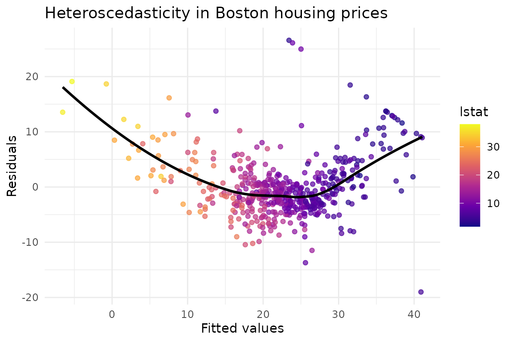
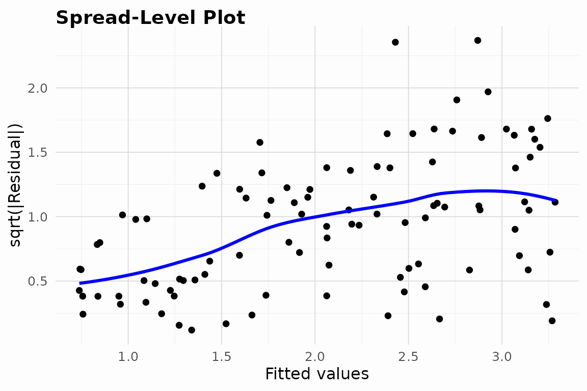
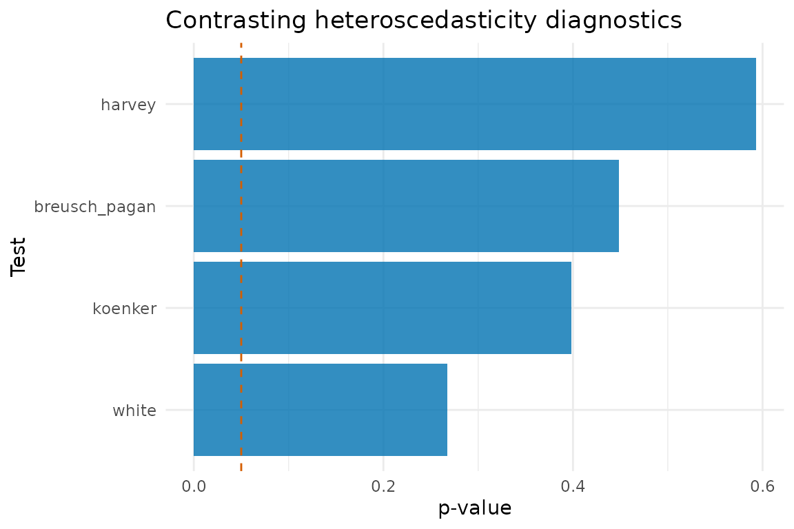

# Real-world Case Studies

This vignette illustrates how to incorporate heteroTests into real
analyses. Each case study follows a workflow of model specification,
diagnostic testing, visualisation, and interpretation.

## Case study 1: Housing affordability

The `boston_housing` dataset captures median house values (`medv`) and
socio- economic predictors for Boston census tracts. We regress prices
on socio- economic indicators and inspect residual dispersion.

``` r

data(boston_housing, package = "heteroTests")
housing_model <- lm(medv ~ lstat + rm + crim + dis, data = boston_housing)
summary(housing_model)
#> 
#> Call:
#> lm(formula = medv ~ lstat + rm + crim + dis, data = boston_housing)
#> 
#> Residuals:
#>     Min      1Q  Median      3Q     Max 
#> -19.006  -3.099  -1.047   1.885  26.571 
#> 
#> Coefficients:
#>             Estimate Std. Error t value Pr(>|t|)    
#> (Intercept)  2.23065    3.32214   0.671    0.502    
#> lstat       -0.66174    0.05101 -12.974  < 2e-16 ***
#> rm           4.97649    0.43885  11.340  < 2e-16 ***
#> crim        -0.12810    0.03209  -3.992 7.53e-05 ***
#> dis         -0.56321    0.13542  -4.159 3.76e-05 ***
#> ---
#> Signif. codes:  0 '***' 0.001 '**' 0.01 '*' 0.05 '.' 0.1 ' ' 1
#> 
#> Residual standard error: 5.403 on 501 degrees of freedom
#> Multiple R-squared:  0.6577, Adjusted R-squared:  0.6549 
#> F-statistic: 240.6 on 4 and 501 DF,  p-value: < 2.2e-16
```

Formal diagnostics flag heteroscedasticity consistent with the classical
literature on this dataset.

``` r

white_housing <- performWhiteTest(housing_model, boston_housing)
#> [INFO] Running White test
#> [INFO] White test completed: statistic = 193.7739 df = 14 p = 0
bp_housing <- performBPTest(housing_model, boston_housing)
#> [INFO] Running Breusch-Pagan test
koenker_housing <- performKoenkerTest(housing_model, boston_housing)
#> [INFO] Running Koenker test
list(White = white_housing, Breusch_Pagan = bp_housing, Koenker = koenker_housing)
#> $White
#> 
#>  White's test for heteroscedasticity
#> 
#> data:  housing_model
#> X-squared = 193.77, df = 14, p-value < 2.2e-16
#> alternative hypothesis: heteroscedasticity present
#> 
#> 
#> $Breusch_Pagan
#> 
#>  Breusch-Pagan test for heteroscedasticity
#> 
#> data:  medv ~ lstat + rm + crim + dis
#> X-squared = 88.532, df = 4, p-value < 2.2e-16
#> 
#> 
#> $Koenker
#> 
#>  Koenker studentized Breusch-Pagan test
#> 
#> data:  medv ~ lstat + rm + crim + dis
#> X-squared = 31.028, df = 4, p-value = 3.022e-06
```

``` r

plot_data <- data.frame(
  fitted = fitted(housing_model),
  residual = resid(housing_model),
  lstat = boston_housing$lstat
)

ggplot(plot_data, aes(x = fitted, y = residual, colour = lstat)) +
  geom_point(alpha = 0.7) +
  scale_colour_viridis_c(option = "C") +
  geom_smooth(se = FALSE, colour = "black") +
  labs(
    x = "Fitted values",
    y = "Residuals",
    colour = "lstat",
    title = "Heteroscedasticity in Boston housing prices"
  ) +
  theme_minimal()
#> `geom_smooth()` using method = 'loess' and formula = 'y ~ x'
```



*Interpretation.* All three tests reject homoskedasticity. The residual
plot reveals wider dispersion at higher predicted prices and for
neighbourhoods with larger `lstat` (lower socio-economic status).
Weighted least squares is a common remedy.

``` r

wls_housing <- fitWLS(housing_model)
scale_comparison <- c(OLS = sigma(housing_model), WLS = sigma(wls_housing))
scale_comparison
#>       OLS       WLS 
#> 5.4025613 0.9987815
```

The WLS fit reduces the residual scale, validating the remedy.

## Case study 2: Income volatility in simulated survey data

The `hetero_data` sample mimics survey responses with variance inflation
driven by the regressor `x`.

``` r

data(hetero_data, package = "heteroTests")
survey_model <- lm(y ~ x, data = hetero_data)
summary(survey_model)
#> 
#> Call:
#> lm(formula = y ~ x, data = hetero_data)
#> 
#> Residuals:
#>     Min      1Q  Median      3Q     Max 
#> -5.5452 -0.7444  0.0477  1.0228  5.6119 
#> 
#> Coefficients:
#>             Estimate Std. Error t value Pr(>|t|)    
#> (Intercept)   0.7378     0.3257   2.265   0.0257 *  
#> x             2.5752     0.5389   4.779 6.19e-06 ***
#> ---
#> Signif. codes:  0 '***' 0.001 '**' 0.01 '*' 0.05 '.' 0.1 ' ' 1
#> 
#> Residual standard error: 1.619 on 98 degrees of freedom
#> Multiple R-squared:  0.189,  Adjusted R-squared:  0.1807 
#> F-statistic: 22.84 on 1 and 98 DF,  p-value: 6.193e-06
```

[`HeteroDiagnostic()`](https://diogoribeiro7.github.io/heteroTests/reference/HeteroDiagnostic.md)
orchestrates multiple tests and visualisations.

``` r

survey_diag <- HeteroDiagnostic(survey_model, hetero_data)
test(survey_diag, tests = c("white", "breusch_pagan"))
#> [INFO] Running White test
#> [INFO] White test completed: statistic = 11.7509 df = 2 p = 0.0028
#> [INFO] Running Breusch-Pagan test
#> $white
#> 
#>  White's test for heteroscedasticity
#> 
#> data:  model
#> X-squared = 11.751, df = 2, p-value = 0.002808
#> alternative hypothesis: heteroscedasticity present
#> 
#> 
#> $breusch_pagan
#> 
#>  Breusch-Pagan test for heteroscedasticity
#> 
#> data:  y ~ x
#> X-squared = 22.407, df = 1, p-value = 2.206e-06
#> 
#> 
#> $vif
#> x 
#> 1 
#> 
#> $reset
#> 
#>  RESET test for nonlinearity
#> 
#> data:  y ~ x
#> F = 0.19163, df1 = 2, df2 = 96, p-value = 0.8259
#> 
#> 
#> $influence
#> $influence$cooks_distance
#>            1            2            3            4            5            6 
#> 1.278638e-03 2.668070e-02 1.026024e-02 5.579106e-03 6.349527e-06 2.946038e-04 
#>            7            8            9           10           11           12 
#> 4.094356e-03 3.482987e-04 7.177781e-02 4.287314e-04 5.548406e-04 1.200565e-04 
#>           13           14           15           16           17           18 
#> 7.046439e-03 8.347577e-03 2.196691e-03 4.693749e-02 1.840612e-03 5.256587e-03 
#>           19           20           21           22           23           24 
#> 3.506653e-03 2.425103e-03 3.708640e-02 6.722310e-05 1.062325e-02 3.964618e-02 
#>           25           26           27           28           29           30 
#> 1.375270e-04 1.422646e-03 2.445764e-03 3.471924e-03 3.143240e-03 2.806895e-02 
#>           31           32           33           34           35           36 
#> 2.360327e-02 4.454703e-04 5.432384e-05 3.228093e-04 9.956784e-04 5.019479e-03 
#>           37           38           39           40           41           42 
#> 1.752426e-04 2.533352e-06 1.900465e-02 3.721407e-03 7.782027e-03 8.725955e-04 
#>           43           44           45           46           47           48 
#> 2.814303e-03 6.358229e-02 4.810743e-03 3.504117e-02 3.936733e-02 1.637565e-02 
#>           49           50           51           52           53           54 
#> 6.669138e-05 2.323281e-03 5.969784e-03 4.538897e-03 3.694097e-03 4.572941e-02 
#>           55           56           57           58           59           60 
#> 1.570581e-04 5.468116e-06 2.041706e-03 1.750695e-05 3.239294e-04 4.294907e-05 
#>           61           62           63           64           65           66 
#> 7.328273e-05 9.144212e-06 4.237541e-03 1.562168e-03 6.517162e-02 1.497437e-04 
#>           67           68           69           70           71           72 
#> 6.196408e-04 1.265350e-01 1.886956e-02 2.507069e-04 2.977826e-03 4.955547e-03 
#>           73           74           75           76           77           78 
#> 2.632780e-04 4.288032e-03 9.415246e-05 2.688959e-03 2.835162e-05 1.507058e-02 
#>           79           80           81           82           83           84 
#> 7.080331e-03 1.031802e-03 1.533660e-03 2.658511e-04 7.930212e-06 8.215338e-03 
#>           85           86           87           88           89           90 
#> 2.575105e-02 6.758119e-03 7.811066e-07 6.629211e-03 6.675177e-05 2.424104e-06 
#>           91           92           93           94           95           96 
#> 1.876505e-04 2.782585e-04 2.957596e-04 6.822842e-04 8.685014e-03 1.205923e-02 
#>           97           98           99          100 
#> 6.633159e-04 9.462862e-04 4.488622e-03 7.988868e-03 
#> 
#> $influence$influential
#>  9 16 44 54 65 68 
#>  9 16 44 54 65 68 
#> 
#> $influence$cutoff
#> [1] 0.04081633
performGlejserTest(survey_model, hetero_data, "x")
#> [INFO] Running Glejser test
#> 
#>  Glejser test for heteroscedasticity
#> 
#> data:  y ~ x
#> t = 5.0897, df = 98, p-value = 1.733e-06
```

``` r

plot(survey_diag, plots = c("spread_level"))
#> $spread_level
#> `geom_smooth()` using formula = 'y ~ x'
```



*Interpretation.* Glejser’s test and the scale-location plot both
indicate that variance increases with `x`. Depending on the modelling
goal, analysts might log transform the response or model the variance
explicitly (e.g. via `lm` weights or `glm` with a variance function).

## Case study 3: Engineering reliability assessment

The `diagnostic_data` dataset contains correlated predictors
representing engineering stress measures. Nonlinear effects and
multicollinearity can mask heteroscedasticity. We run the broader
diagnostic suite to capture interactions between variance and structure
checks.

``` r

data(diagnostic_data, package = "heteroTests")
diagnostic_ext <- transform(diagnostic_data, x1_sq = x1^2)
engineering_model <- lm(y ~ x1 + x1_sq + x2, data = diagnostic_ext)
engineer_results <- runDiagnostics(engineering_model, diagnostic_ext,
  tests = c("breusch_pagan", "koenker")
)
#> [INFO] Running Breusch-Pagan test
#> [INFO] Running Koenker test
safe_htest <- function(fn, method) {
  tryCatch(
    fn(),
    error = function(e) {
      message(method, " unavailable: ", e$message)
      structure(
        list(
          statistic = c(statistic = NA_real_),
          parameter = NA_real_,
          p.value = NA_real_,
          method = paste0(method, " (failed)"),
          data.name = deparse(stats::formula(engineering_model))
        ),
        class = "htest"
      )
    }
  )
}
white_engineering <- safe_htest(
  function() performWhiteTest(engineering_model, diagnostic_ext, cross_products = FALSE),
  "White test"
)
#> [INFO] Running White test
#> [INFO] White test: dropped 1 collinear auxiliary term(s); using df = 5.
#> [INFO] White test completed: statistic = 6.4178 df = 5 p = 0.2677
bp_engineering <- safe_htest(
  function() performBPTest(engineering_model, diagnostic_ext),
  "Breusch-Pagan test"
)
#> [INFO] Running Breusch-Pagan test
koenker_engineering <- safe_htest(
  function() performKoenkerTest(engineering_model, diagnostic_ext),
  "Koenker test"
)
#> [INFO] Running Koenker test
harvey_engineering <- safe_htest(
  function() performHarveyTest(engineering_model),
  "Harvey test"
)
#> [INFO] Running Harvey test
engineer_tests <- list(
  white = white_engineering,
  breusch_pagan = bp_engineering,
  koenker = koenker_engineering,
  harvey = harvey_engineering
)
engineer_tests
#> $white
#> 
#>  White's test for heteroscedasticity
#> 
#> data:  engineering_model
#> X-squared = 6.4178, df = 5, p-value = 0.2677
#> alternative hypothesis: heteroscedasticity present
#> 
#> 
#> $breusch_pagan
#> 
#>  Breusch-Pagan test for heteroscedasticity
#> 
#> data:  y ~ x1 + x1_sq + x2
#> X-squared = 2.65, df = 3, p-value = 0.4488
#> 
#> 
#> $koenker
#> 
#>  Koenker studentized Breusch-Pagan test
#> 
#> data:  y ~ x1 + x1_sq + x2
#> X-squared = 2.9548, df = 3, p-value = 0.3986
#> 
#> 
#> $harvey
#> 
#>  Harvey test for multiplicative heteroscedasticity
#> 
#> data:  y ~ x1 + x1_sq + x2; variance regressors: model regressors
#> X-squared = 1.9025, df = 3, p-value = 0.5929
#> alternative hypothesis: error variance is a multiplicative function of the variance regressors
```

The heteroscedasticity tests disagree, so we inspect the accompanying
multicollinearity and RESET diagnostics.

``` r

engineer_results$vif
#>         x1      x1_sq         x2 
#> 102.975949   1.011998 102.854968
engineer_results$reset
#> 
#>  RESET test for nonlinearity
#> 
#> data:  y ~ x1 + x1_sq + x2
#> F = 1.336, df1 = 2, df2 = 144, p-value = 0.2661
```

Finally, we consolidate $`p`$-values to visualise which tests detect
variance instability.

``` r

pvals <- sapply(engineer_tests, function(x) x$p.value)
pval_df <- data.frame(
  test = names(pvals),
  p_value = as.numeric(pvals)
)

ggplot(pval_df, aes(x = reorder(test, p_value), y = p_value)) +
  geom_col(fill = "#0072B2", alpha = 0.8) +
  geom_hline(yintercept = 0.05, linetype = "dashed", colour = "#D55E00") +
  coord_cartesian(ylim = c(0, 1)) +
  coord_flip() +
  labs(
    x = "Test",
    y = "p-value",
    title = "Contrasting heteroscedasticity diagnostics"
  ) +
  theme_minimal()
#> Coordinate system already present.
#> ℹ Adding new coordinate system, which will replace the existing one.
```



*Interpretation.* Koenker’s robust variant is conservative in this
moderate sample, whereas White’s omnibus test remains sensitive to
nonlinear variance. The RESET test also signals functional-form
misspecification, suggesting that a variance stabilising transformation
or spline terms could stabilise the error variance while addressing
nonlinearity.

## Summary

Across the three scenarios, heteroTests streamlines workflows by
combining statistical theory with practical diagnostics. The package
encourages analysts to inspect residual plots alongside formal tests and
to validate remedies such as weighted least squares or variance
modelling.
