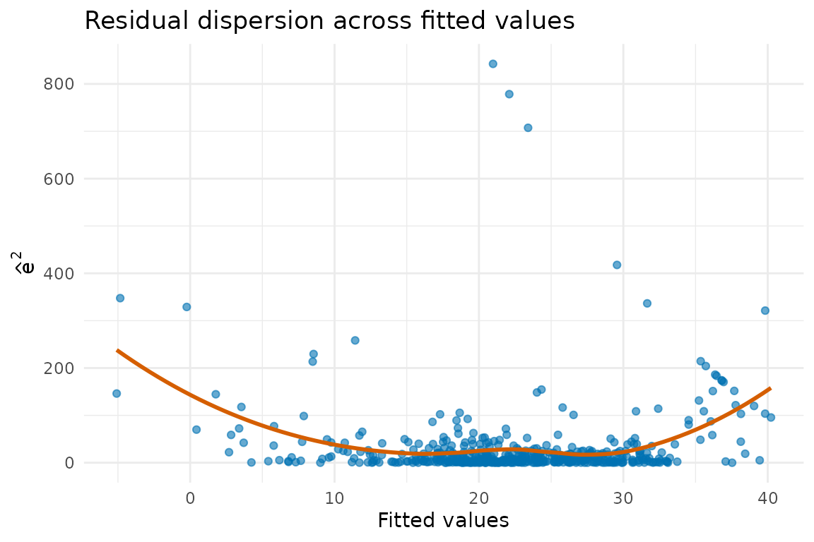
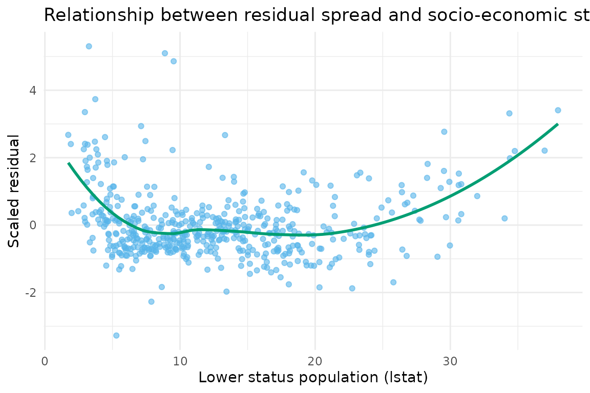

# Statistical Theory and Implementation Details

## Motivation

The heteroTests package consolidates classical and modern diagnostics
for heteroscedasticity into a consistent interface. This vignette
summarises the statistical foundations of the flagship procedures and
explains how the implementation orchestrates validation, auxiliary
regressions, and reporting. Throughout we work with the `boston_housing`
dataset included with the package.

``` r

data(boston_housing, package = "heteroTests")
model <- lm(medv ~ lstat + rm + crim, data = boston_housing)
summary(model)
#> 
#> Call:
#> lm(formula = medv ~ lstat + rm + crim, data = boston_housing)
#> 
#> Residuals:
#>     Min      1Q  Median      3Q     Max 
#> -17.925  -3.567  -1.157   1.906  29.024 
#> 
#> Coefficients:
#>             Estimate Std. Error t value Pr(>|t|)    
#> (Intercept) -2.56225    3.16602  -0.809  0.41873    
#> lstat       -0.57849    0.04767 -12.135  < 2e-16 ***
#> rm           5.21695    0.44203  11.802  < 2e-16 ***
#> crim        -0.10294    0.03202  -3.215  0.00139 ** 
#> ---
#> Signif. codes:  0 '***' 0.001 '**' 0.01 '*' 0.05 '.' 0.1 ' ' 1
#> 
#> Residual standard error: 5.49 on 502 degrees of freedom
#> Multiple R-squared:  0.6459, Adjusted R-squared:  0.6437 
#> F-statistic: 305.2 on 3 and 502 DF,  p-value: < 2.2e-16
```

To visualise the heteroscedastic structure we inspect the squared
residuals.

``` r

augmented <- data.frame(
  fitted = fitted(model),
  residuals = resid(model)
)
augmented$squared_residuals <- augmented$residuals^2

ggplot(augmented, aes(x = fitted, y = squared_residuals)) +
  geom_point(alpha = 0.6, colour = "#0072B2") +
  geom_smooth(se = FALSE, colour = "#D55E00") +
  labs(
    x = "Fitted values",
    y = expression(hat(e)^2),
    title = "Residual dispersion across fitted values"
  ) +
  theme_minimal()
#> `geom_smooth()` using method = 'loess' and formula = 'y ~ x'
```



The upward trend in squared residuals suggests that variance increases
with predicted price, motivating a formal test.

## White’s test

White (1980) proposed a general test that regresses squared residuals on
all original regressors, their squares, and cross-products. Let
$`\widehat{e}_i`$ be residuals from the baseline model and $`Z_i`$ the
vector formed by $`1`$, the regressors $`x_{ij}`$, their squares, and
pairwise products. The auxiliary regression is
``` math
\widehat{e}_i^2 = Z_i^\top\gamma + u_i.
```
The test statistic is $`nR^2`$ from this regression, which converges to
a $`\chi^2_q`$ distribution under homoskedasticity, with $`q`$ equal to
the number of non-constant terms in $`Z`$.

Implementation details:

- [`rvalidateModelInputs()`](https://diogoribeiro7.github.io/heteroTests/reference/rvalidateModelInputs.md)
  ensures the supplied model contains at least 20 usable observations
  with finite residuals.
- [`rvalidateDataInputs()`](https://diogoribeiro7.github.io/heteroTests/reference/rvalidateDataInputs.md)
  and
  [`rhandleMissingValues()`](https://diogoribeiro7.github.io/heteroTests/reference/rhandleMissingValues.md)
  align the auxiliary data with the model frame.
- [`rvalidateTestRequirements()`](https://diogoribeiro7.github.io/heteroTests/reference/rvalidateTestRequirements.md)
  checks that the design matrix has full rank and warns when a large
  number of regressors may destabilise the statistic.

``` r

white_result <- performWhiteTest(model, boston_housing)
#> Warning: Residual outliers detected at rows 369, 373 (|z| > 5). Inspect
#> leverage before running White.
#> [INFO] Running White test
#> [INFO] White test completed: statistic = 135.1481 df = 9 p = 0
white_result
#> 
#>  White's test for heteroscedasticity
#> 
#> data:  model
#> X-squared = 135.15, df = 9, p-value < 2.2e-16
#> alternative hypothesis: heteroscedasticity present
```

The small $`p`$-value rejects homoskedasticity, confirming the visual
pattern. The `htest` object stores the LM statistic and degrees of
freedom, making it easy to compare with bootstrap or robust variants.

## Breusch–Pagan test

Breusch and Pagan (1979) derived a Lagrange Multiplier (LM) test for
variance patterns linear in the regressors. Denote by $`X`$ the
regressor matrix without intercept. The statistic is
``` math
\text{LM} = \frac{1}{2\sigma^2} \widehat{e}^\top X(X^\top X)^{-1}X^\top \widehat{e},
```
which is equivalent to $`nR^2`$ from regressing $`\widehat{e}^2`$ on
$`X`$. The test converges to a $`\chi^2_{k}`$ distribution, where $`k`$
is the number of non-intercept regressors.

The package implementation supplements the LM computation with
diagnostics that highlight influential residuals and stability warnings.

``` r

bp_result <- performBPTest(model, boston_housing)
#> Warning: Residual outliers detected at rows 369, 373 (|z| > 5). Inspect
#> leverage before running Breusch-Pagan.
#> [INFO] Running Breusch-Pagan test
bp_result
#> 
#>  Breusch-Pagan test for heteroscedasticity
#> 
#> data:  medv ~ lstat + rm + crim
#> X-squared = 24.344, df = 3, p-value = 2.117e-05
```

A significant Breusch–Pagan statistic reinforces the evidence of
increasing variance. Because the test assumes normal errors, the
vignette later contrasts it with Koenker’s robust variant.

## Koenker–Bassett studentised test

Koenker (1981) proposed studentising the LM statistic to accommodate
non-normal errors by scaling residuals with an estimate of their
variance. The package implements this through
[`performKoenkerTest()`](https://diogoribeiro7.github.io/heteroTests/reference/performKoenkerTest.md),
which focuses on absolute residuals and yields a statistic with the same
asymptotic $`\chi^2`$ reference but improved Type I error control under
heavy tails.

``` r

koenker_result <- performKoenkerTest(model, boston_housing)
#> Warning: Residual outliers detected at rows 369, 373 (|z| > 5). Inspect
#> leverage before running Koenker.
#> Warning: Residual outliers detected at rows 369, 373 (|z| > 5). Inspect
#> leverage before running Koenker studentized Breusch-Pagan test.
#> [INFO] Running Koenker test
koenker_result
#> 
#>  Koenker studentized Breusch-Pagan test
#> 
#> data:  medv ~ lstat + rm + crim
#> X-squared = 7.4741, df = 3, p-value = 0.05823
```

Comparing the three $`p`$-values offers insight into how sensitive each
test is to model misspecification. When Koenker’s statistic agrees with
White’s result, the variance pattern is likely structural rather than a
normality artefact.

## Park and Harvey logarithmic tests

Variance functions that follow a power law in a regressor motivate tests
based on log-linear relationships. Park’s test fits
``` math
\log(\widehat{e}_i^2) = \alpha + \beta \log x_i + u_i,
```
while Harvey’s version models a multiplicative variance and regresses
the log squared residuals on the variance regressors $`z_i`$, which
default to the model’s own explanatory variables,
``` math
\log(\widehat{e}_i^2) = \alpha + z_i^{\top} \gamma + u_i.
```
Park’s statistic is the $`t`$ ratio on $`\beta`$. Harvey’s is
$`\mathrm{ESS} / (\pi^2/2)`$, referred to a $`\chi^2_q`$ distribution,
because $`\pi^2/2`$ is the null variance of $`\log \chi^2_1`$. Passing
`studentize = TRUE` estimates that variance from the data instead of
assuming it, and `auxiliary = "fitted"` recovers the pre-0.7.0 variance
model based on $`\widehat{y}_i`$ and $`\widehat{y}_i^2`$.

``` r

park_result <- performParkTest(model, boston_housing, "lstat")
#> Warning: Residual outliers detected at rows 369, 373 (|z| > 5). Inspect
#> leverage before running Park.
#> Warning: Residual outliers detected at rows 369, 373 (|z| > 5). Inspect
#> leverage before running Park test.
#> [INFO] Running Park test
harvey_result <- performHarveyTest(model)
#> Warning: Residual outliers detected at rows 369, 373 (|z| > 5). Inspect
#> leverage before running Harvey.
#> [INFO] Running Harvey test
list(Park = park_result, Harvey = harvey_result)
#> $Park
#> 
#>  Park test for heteroscedasticity
#> 
#> data:  medv ~ lstat + rm + crim
#> t = -0.54024, df = 504, p-value = 0.5893
#> 
#> 
#> $Harvey
#> 
#>  Harvey test for multiplicative heteroscedasticity
#> 
#> data:  medv ~ lstat + rm + crim; variance regressors: model regressors
#> X-squared = 19.392, df = 3, p-value = 0.0002269
#> alternative hypothesis: error variance is a multiplicative function of the variance regressors
```

Both functions rely on the shared validation helpers: Park requires an
explicit variance driver and checks positivity for the logarithmic
transform, whereas the Harvey helper defaults to the model’s own
regressors as the variance model. Inspecting the estimated coefficients
helps determine the functional form that best captures the
heteroscedastic structure.

## Visual interpretation

The diagnostic plots included in heteroTests contextualise statistical
conclusions. For instance, plotting scaled residuals against the key
variance term clarifies departures.

``` r

augmented$scaled_residuals <- scale(augmented$residuals)[, 1]
augmented$lstat <- boston_housing$lstat

ggplot(augmented, aes(x = lstat, y = scaled_residuals)) +
  geom_point(alpha = 0.6, colour = "#56B4E9") +
  geom_smooth(method = "loess", se = FALSE, colour = "#009E73") +
  labs(
    x = "Lower status population (lstat)",
    y = "Scaled residual",
    title = "Relationship between residual spread and socio-economic status"
  ) +
  theme_minimal()
#> `geom_smooth()` using formula = 'y ~ x'
```



A pronounced curvature corroborates the Park and Harvey results,
signalling that variance inflates as `lstat` increases. Together,
theory, implementation checks, and visualisation guide practitioners
towards remedies such as weighted least squares or variance stabilising
transforms.

## Further reading

- Breusch, T. S., & Pagan, A. R. (1979). A simple test for
  heteroscedasticity and random coefficient variation. *Econometrica,
  47*(5), 1287–1294.
- Harvey, A. C. (1976). Estimating regression models with multiplicative
  heteroscedasticity. *Econometrica, 44*(3), 461–465.
- Koenker, R. (1981). A note on studentizing a test for
  heteroscedasticity. *Journal of Econometrics, 17*(1), 107–112.
- Park, R. E. (1966). Estimation with heteroscedastic error terms.
  *Econometrica, 34*(4), 888–908.
- White, H. (1980). A heteroskedasticity-consistent covariance matrix
  estimator and a direct test for heteroskedasticity. *Econometrica,
  48*(4), 817–838.
