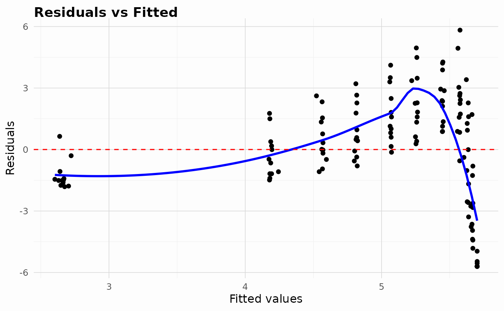
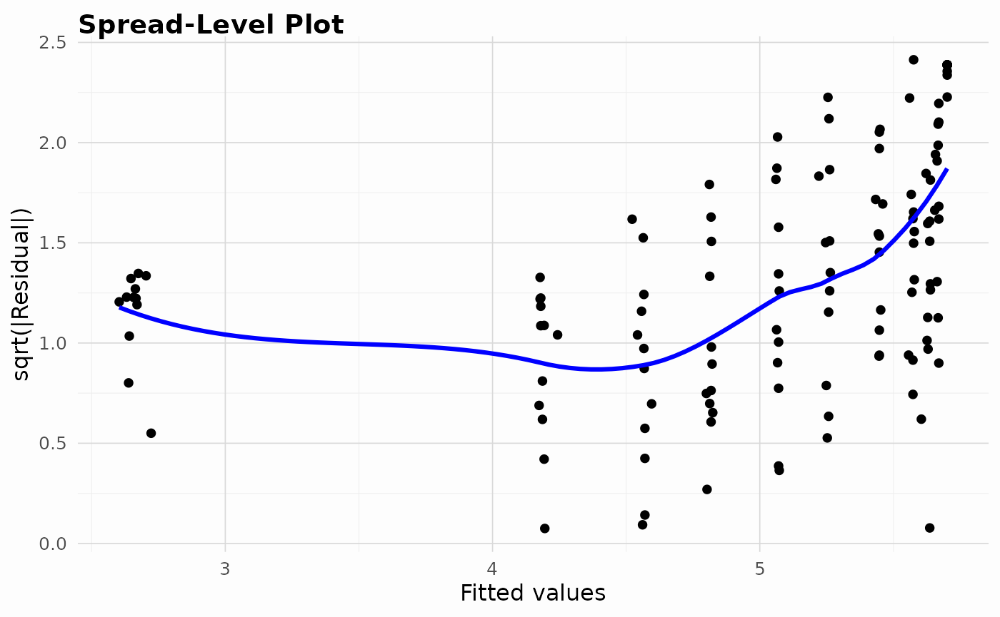
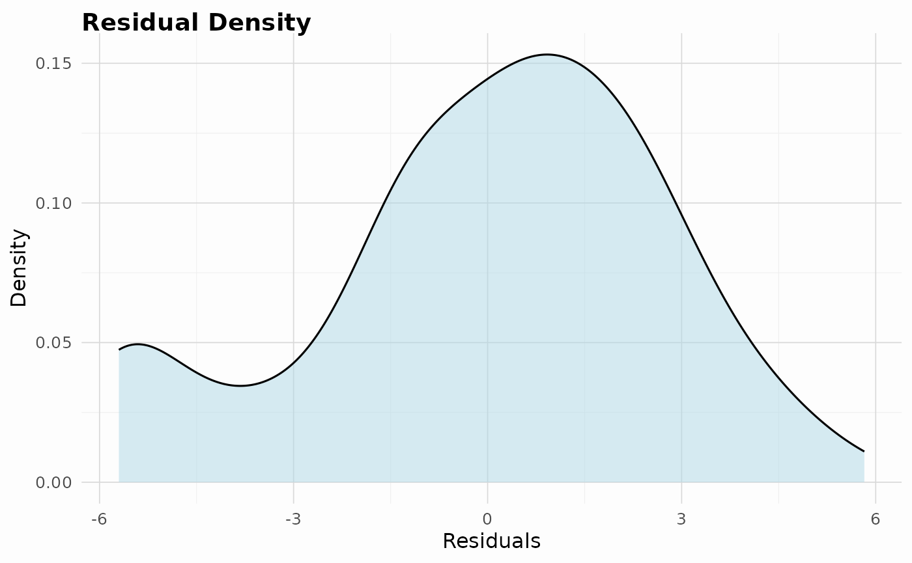
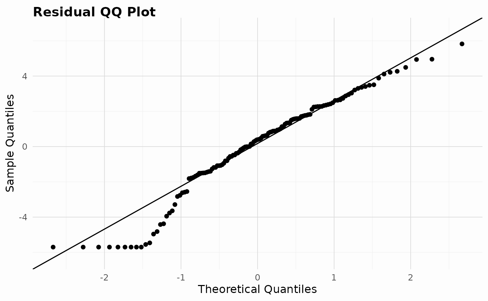
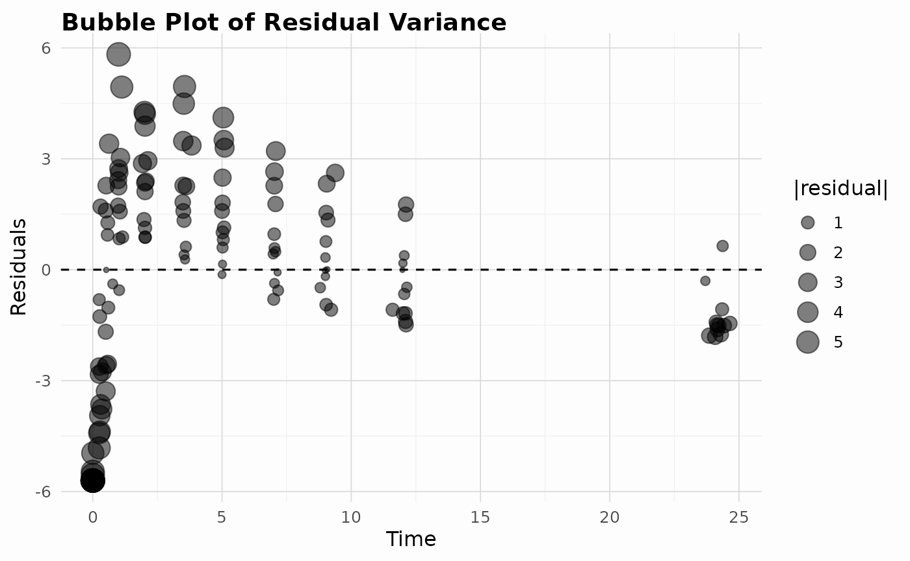

# Using heteroTests

The **heteroTests** package provides several classical tests for
detecting heteroscedasticity in linear models.

``` r

library(heteroTests)

# Fit a simple linear model on real data
model <- lm(stations ~ mag + depth, data = quakes)
# A second dataset demonstrates collinearity and mild nonlinearity
data(diagnostic_data)
diag_model <- lm(y ~ x1 + x2, data = diagnostic_data)

# Run White's test and get an htest object
performWhiteTest(model, quakes)
# [INFO] Running White test
# [INFO] White test completed: statistic = 125.558 df = 5 p = 0
# 
#   White's test for heteroscedasticity
# 
# data:  model
# X-squared = 125.56, df = 5, p-value < 2.2e-16
# alternative hypothesis: heteroscedasticity present
performWhiteTest(diag_model, diagnostic_data)
# [INFO] Running White test
# [INFO] White test completed: statistic = 1.5791 df = 5 p = 0.9038
# 
#   White's test for heteroscedasticity
# 
# data:  diag_model
# X-squared = 1.5791, df = 5, p-value = 0.9038
# alternative hypothesis: heteroscedasticity present
```

## Other available tests

Many additional diagnostics follow the same interface and also return an
`htest` object.

``` r

# Breusch-Pagan and its robust Koenker version. The data argument must be
# the data the model was fitted on.
performBPTest(model, quakes)
# [INFO] Running Breusch-Pagan test
# 
#   Breusch-Pagan test for heteroscedasticity
# 
# data:  stations ~ mag + depth
# X-squared = 191.93, df = 2, p-value < 2.2e-16
performKoenkerTest(model, quakes)
# [INFO] Running Koenker test
# 
#   Koenker studentized Breusch-Pagan test
# 
# data:  stations ~ mag + depth
# X-squared = 111.31, df = 2, p-value < 2.2e-16

# Group-based tests need a grouping factor in that same data
quakes_grouped <- quakes
quakes_grouped$depth_band <- cut(quakes_grouped$depth, 3,
                                 labels = c("shallow", "mid", "deep"))
performLeveneTest(model, quakes_grouped, "depth_band")
# 
#   Levene's test for equality of variances
# 
# data:  stations ~ mag + depth
# F = 11.207, df1 = 2, df2 = 997, p-value = 1.537e-05

# ARCH effects in time series
performArchLMTest(model, lags = 2)
# [INFO] Running ARCH LM test
# 
#   Engle's ARCH LM test
# 
# data:  stations ~ mag + depth
# X-squared = 2.1647, df = 2, p-value = 0.3388
```

Several diagnostics can also be run together.

``` r

# Alternatively run multiple tests at once
runHeteroTests(model, quakes)
# [INFO] Running White test
# [INFO] White test completed: statistic = 125.558 df = 5 p = 0
# [INFO] Running Breusch-Pagan test
# $white
# 
#   White's test for heteroscedasticity
# 
# data:  model
# X-squared = 125.56, df = 5, p-value < 2.2e-16
# alternative hypothesis: heteroscedasticity present
# 
# 
# $breusch_pagan
# 
#   Breusch-Pagan test for heteroscedasticity
# 
# data:  stations ~ mag + depth
# X-squared = 191.93, df = 2, p-value < 2.2e-16
# 
# 
# attr(,"class")
# [1] "hetero_test_suite" "list"             
# attr(,"tests")
# [1] "white"         "breusch_pagan"
# attr(,"model")
# 
# Call:
# lm(formula = stations ~ mag + depth, data = quakes)
# 
# Coefficients:
# (Intercept)          mag        depth  
#  -192.04290     47.90872      0.01318  
# 
# attr(,"data_source")
# [1] "data.frame"
# Choose a subset of diagnostics
runHeteroTests(model, quakes, tests = c("white", "koenker", "ncv"))
# [INFO] Running Koenker test
# [INFO] Running NCV score test
# $white
# 
#   White's test for heteroscedasticity
# 
# data:  model
# X-squared = 125.56, df = 5, p-value < 2.2e-16
# alternative hypothesis: heteroscedasticity present
# 
# 
# $koenker
# 
#   Koenker studentized Breusch-Pagan test
# 
# data:  stations ~ mag + depth
# X-squared = 111.31, df = 2, p-value < 2.2e-16
# 
# 
# $ncv
# 
#   Cook-Weisberg score test for non-constant variance
# 
# data:  stations ~ mag + depth; variance model: fitted values
# X-squared = 187.98, df = 1, p-value < 2.2e-16
# alternative hypothesis: error variance depends on the variance model
# 
# 
# attr(,"class")
# [1] "hetero_test_suite" "list"             
# attr(,"tests")
# [1] "white"   "koenker" "ncv"    
# attr(,"model")
# 
# Call:
# lm(formula = stations ~ mag + depth, data = quakes)
# 
# Coefficients:
# (Intercept)          mag        depth  
#  -192.04290     47.90872      0.01318  
# 
# attr(,"data_source")
# [1] "data.frame"
runDiagnostics(model, quakes)
# $white
# 
#   White's test for heteroscedasticity
# 
# data:  model
# X-squared = 125.56, df = 5, p-value < 2.2e-16
# alternative hypothesis: heteroscedasticity present
# 
# 
# $breusch_pagan
# 
#   Breusch-Pagan test for heteroscedasticity
# 
# data:  stations ~ mag + depth
# X-squared = 191.93, df = 2, p-value < 2.2e-16
# 
# 
# $vif
#      mag    depth 
# 1.056182 1.056182 
# 
# $reset
# 
#   RESET test for nonlinearity
# 
# data:  stations ~ mag + depth
# F = 130.76, df1 = 2, df2 = 995, p-value < 2.2e-16
# 
# 
# $influence
# $influence$cooks_distance
#            1            2            3            4            5            6 
# 1.454504e-04 8.010212e-05 8.607284e-03 4.476282e-04 1.083646e-04 1.101297e-03 
#            7            8            9           10           11           12 
# 9.346367e-05 1.896963e-04 2.711637e-06 8.889251e-05 1.290241e-03 7.175734e-04 
#           13           14           15           16           17           18 
# 3.149500e-04 2.130391e-03 2.575807e-03 2.204550e-04 6.057777e-03 7.650046e-04 
#           19           20           21           22           23           24 
# 1.190645e-03 5.675233e-04 1.346824e-03 1.460858e-08 2.996695e-04 7.652187e-04 
#           25           26           27           28           29           30 
# 3.698536e-03 7.253494e-04 6.479370e-04 2.918215e-03 2.676040e-04 1.288935e-04 
#           31           32           33           34           35           36 
# 1.322797e-03 9.548130e-05 1.742009e-07 3.095089e-04 1.540495e-03 6.444379e-04 
#           37           38           39           40           41           42 
# 3.260122e-04 2.439560e-03 2.378747e-04 4.890376e-04 1.933416e-05 3.213154e-05 
#           43           44           45           46           47           48 
# 3.286688e-05 9.828450e-04 6.219085e-05 6.215958e-04 4.397684e-05 2.226081e-05 
#           49           50           51           52           53           54 
# 1.627580e-06 2.684053e-03 9.471056e-05 1.672773e-03 6.134508e-05 6.147939e-04 
#           55           56           57           58           59           60 
# 9.598194e-07 1.531032e-04 5.821807e-04 1.577887e-04 4.602208e-05 5.081784e-04 
#           61           62           63           64           65           66 
# 2.555869e-04 1.404548e-04 3.687735e-04 3.866285e-05 1.120433e-03 3.959218e-04 
#           67           68           69           70           71           72 
# 7.711234e-06 1.525450e-03 6.805645e-05 6.242748e-03 1.107397e-03 5.611105e-05 
#           73           74           75           76           77           78 
# 1.265586e-05 1.599208e-03 5.009306e-04 2.932025e-04 1.477644e-04 5.132385e-05 
#           79           80           81           82           83           84 
# 1.406470e-05 3.708912e-04 4.770958e-04 5.773726e-06 2.887050e-05 3.410668e-05 
#           85           86           87           88           89           90 
# 2.795555e-04 9.271635e-06 3.468520e-05 1.217204e-04 2.481608e-04 6.814963e-03 
#           91           92           93           94           95           96 
# 3.669910e-04 6.172743e-04 1.669868e-06 9.655687e-06 5.355154e-04 1.648327e-03 
#           97           98           99          100          101          102 
# 1.628626e-04 4.319054e-04 5.695834e-04 2.039865e-04 4.447047e-04 8.648204e-04 
#          103          104          105          106          107          108 
# 1.060195e-03 8.762672e-04 5.391740e-04 2.282779e-05 2.876198e-04 3.213382e-04 
#          109          110          111          112          113          114 
# 7.318723e-04 1.233571e-03 1.777470e-06 4.652695e-07 9.803300e-04 4.875947e-04 
#          115          116          117          118          119          120 
# 2.593973e-04 5.672999e-04 2.534789e-04 2.487786e-03 5.464304e-04 2.000237e-06 
#          121          122          123          124          125          126 
# 7.066360e-04 1.439374e-04 1.686707e-03 4.291146e-04 8.996980e-05 8.922963e-04 
#          127          128          129          130          131          132 
# 1.774334e-04 2.216767e-03 2.182832e-03 4.403744e-06 6.631434e-05 4.506828e-04 
#          133          134          135          136          137          138 
# 8.167050e-05 1.288742e-04 6.006885e-04 3.127797e-03 2.116238e-03 1.004081e-03 
#          139          140          141          142          143          144 
# 9.299250e-04 1.804579e-04 3.572856e-04 5.178035e-04 1.004533e-04 7.195587e-04 
#          145          146          147          148          149          150 
# 3.116365e-04 1.990741e-05 2.728980e-05 1.294776e-05 3.390635e-04 1.573656e-03 
#          151          152          153          154          155          156 
# 1.360986e-02 1.896685e-03 2.604840e-04 8.298848e-04 1.575989e-03 3.239846e-05 
#          157          158          159          160          161          162 
# 1.678554e-04 4.248443e-06 1.011350e-03 5.040741e-07 4.476282e-04 6.733230e-04 
#          163          164          165          166          167          168 
# 3.444458e-06 6.973463e-05 8.824090e-05 9.927529e-04 6.812188e-03 6.498815e-04 
#          169          170          171          172          173          174 
# 2.270698e-06 3.125087e-07 2.438938e-05 1.719060e-04 2.999155e-05 8.219002e-04 
#          175          176          177          178          179          180 
# 9.285053e-07 8.359222e-04 2.152513e-04 6.901722e-05 6.377049e-04 9.174977e-05 
#          181          182          183          184          185          186 
# 2.020731e-03 9.618092e-04 8.136624e-05 4.393195e-06 5.803189e-05 2.541396e-03 
#          187          188          189          190          191          192 
# 2.221635e-04 1.295871e-04 6.758772e-04 2.713664e-05 3.786639e-04 3.596338e-06 
#          193          194          195          196          197          198 
# 3.789532e-03 7.784533e-04 1.713832e-04 3.015250e-04 5.545890e-05 6.063209e-04 
#          199          200          201          202          203          204 
# 6.453820e-04 1.324058e-03 8.072757e-05 3.973659e-04 2.675495e-05 4.011410e-04 
#          205          206          207          208          209          210 
# 1.407020e-03 9.454527e-05 1.548665e-05 1.302680e-03 9.641889e-05 1.993678e-04 
#          211          212          213          214          215          216 
# 4.196361e-05 1.288936e-04 1.158573e-03 4.022601e-03 6.262349e-06 1.971215e-06 
#          217          218          219          220          221          222 
# 2.178179e-04 1.705779e-04 2.017235e-04 5.743189e-07 1.027551e-04 3.806313e-04 
#          223          224          225          226          227          228 
# 1.321782e-04 3.275625e-04 8.601217e-05 4.586044e-04 2.643659e-04 6.050473e-05 
#          229          230          231          232          233          234 
# 1.012548e-04 2.298672e-04 6.736951e-04 1.040411e-04 2.849544e-04 1.077104e-03 
#          235          236          237          238          239          240 
# 1.275991e-03 2.631424e-04 5.638491e-07 6.907381e-04 3.080151e-04 5.050617e-05 
#          241          242          243          244          245          246 
# 9.059249e-05 9.687826e-04 2.673171e-02 8.418424e-04 1.375358e-05 5.113758e-04 
#          247          248          249          250          251          252 
# 1.322236e-04 1.679069e-03 1.128422e-03 6.064643e-06 3.326078e-04 8.474387e-06 
#          253          254          255          256          257          258 
# 2.276769e-03 2.148537e-04 2.253596e-05 1.761104e-04 7.382196e-06 6.357909e-06 
#          259          260          261          262          263          264 
# 3.457661e-04 3.432381e-04 1.699472e-03 4.533231e-04 6.434685e-04 4.594787e-06 
#          265          266          267          268          269          270 
# 4.831830e-05 2.899479e-04 9.381715e-04 2.560821e-04 2.355808e-05 5.659708e-04 
#          271          272          273          274          275          276 
# 1.802743e-04 2.397531e-03 8.998723e-06 1.582943e-04 7.625471e-03 5.861506e-04 
#          277          278          279          280          281          282 
# 1.924824e-04 1.107913e-04 8.970116e-04 1.167657e-03 1.846352e-05 1.730819e-04 
#          283          284          285          286          287          288 
# 7.920044e-04 2.609575e-04 5.391706e-06 6.975056e-04 4.653230e-05 7.404759e-06 
#          289          290          291          292          293          294 
# 1.710657e-04 1.873463e-04 6.666394e-04 2.698283e-03 1.229054e-04 1.750572e-09 
#          295          296          297          298          299          300 
# 3.170299e-04 3.544604e-05 3.660165e-04 8.561011e-04 2.362550e-03 2.197877e-04 
#          301          302          303          304          305          306 
# 2.770440e-04 4.111539e-06 1.070166e-04 2.662680e-03 1.738459e-05 5.963423e-04 
#          307          308          309          310          311          312 
# 5.132561e-04 8.988712e-03 5.424953e-06 1.050619e-03 3.464273e-03 2.215072e-04 
#          313          314          315          316          317          318 
# 1.448382e-03 3.059074e-04 3.246473e-04 5.743752e-04 3.454396e-05 1.431169e-03 
#          319          320          321          322          323          324 
# 1.163457e-04 1.813361e-03 6.527792e-04 6.963019e-04 7.674768e-05 2.572294e-04 
#          325          326          327          328          329          330 
# 8.315699e-04 6.089535e-04 1.991033e-04 5.185259e-04 1.115880e-03 7.399841e-04 
#          331          332          333          334          335          336 
# 5.165306e-03 2.132156e-03 6.131062e-04 2.603176e-03 2.506294e-05 7.819124e-04 
#          337          338          339          340          341          342 
# 1.698762e-05 2.571719e-06 5.144821e-04 1.916724e-03 1.747126e-04 3.974441e-03 
#          343          344          345          346          347          348 
# 9.515094e-04 7.608203e-05 7.073745e-06 1.522752e-04 2.172272e-03 1.081543e-03 
#          349          350          351          352          353          354 
# 2.891747e-03 2.466954e-03 1.346290e-03 1.870995e-03 2.457227e-04 2.980428e-04 
#          355          356          357          358          359          360 
# 1.046704e-03 4.461092e-04 1.981092e-04 4.960450e-04 4.381174e-04 1.149823e-03 
#          361          362          363          364          365          366 
# 7.627428e-05 5.547037e-03 1.147347e-03 4.532987e-07 1.390313e-04 3.430484e-04 
#          367          368          369          370          371          372 
# 1.230063e-03 7.095661e-04 2.278052e-04 1.848886e-03 1.168403e-03 1.610536e-02 
#          373          374          375          376          377          378 
# 3.100138e-05 6.661052e-04 4.271869e-06 3.983228e-02 9.135738e-04 8.049329e-05 
#          379          380          381          382          383          384 
# 1.783047e-06 7.596862e-03 1.181469e-03 7.748307e-05 3.657023e-03 7.482897e-06 
#          385          386          387          388          389          390 
# 1.799792e-03 3.984432e-04 6.173186e-05 3.370196e-04 1.594575e-03 3.862815e-04 
#          391          392          393          394          395          396 
# 2.650254e-04 9.117874e-04 1.647818e-04 2.591620e-06 3.034451e-04 1.155703e-04 
#          397          398          399          400          401          402 
# 6.754566e-03 2.593063e-03 1.732800e-02 1.080629e-02 6.488127e-04 2.036229e-04 
#          403          404          405          406          407          408 
# 6.494197e-05 1.556864e-03 6.067727e-04 2.664229e-04 3.644854e-05 2.155424e-04 
#          409          410          411          412          413          414 
# 4.480440e-06 8.012708e-04 5.701054e-04 1.714623e-03 2.003942e-05 1.523301e-04 
#          415          416          417          418          419          420 
# 1.848538e-04 1.094555e-04 7.906993e-05 1.526538e-03 1.696066e-04 2.598171e-03 
#          421          422          423          424          425          426 
# 2.421435e-04 8.371938e-05 3.606731e-03 4.834455e-05 6.600910e-04 2.714689e-05 
#          427          428          429          430          431          432 
# 7.181677e-05 2.352459e-03 1.858691e-04 3.368187e-04 8.712020e-06 1.960936e-03 
#          433          434          435          436          437          438 
# 1.094602e-03 1.003610e-03 5.697673e-05 9.225951e-06 5.285353e-06 1.684751e-03 
#          439          440          441          442          443          444 
# 5.976188e-06 1.232448e-04 2.250342e-05 1.562610e-04 2.091322e-04 2.430178e-03 
#          445          446          447          448          449          450 
# 1.771010e-03 1.294777e-03 1.948488e-04 1.058032e-02 1.466783e-02 9.123870e-05 
#          451          452          453          454          455          456 
# 1.767965e-04 1.952028e-08 7.831851e-04 4.303933e-06 9.991133e-05 4.739780e-04 
#          457          458          459          460          461          462 
# 5.532880e-04 5.808676e-04 3.387232e-03 4.607543e-05 6.113513e-04 2.642472e-02 
#          463          464          465          466          467          468 
# 7.763971e-04 1.280139e-03 1.119801e-04 5.261916e-04 1.304009e-06 9.110953e-04 
#          469          470          471          472          473          474 
# 1.206394e-04 5.181372e-05 9.163320e-05 4.070636e-04 8.691006e-05 5.259315e-04 
#          475          476          477          478          479          480 
# 2.079891e-04 5.040618e-05 9.032160e-05 2.495771e-04 1.199250e-03 3.439535e-04 
#          481          482          483          484          485          486 
# 1.515597e-03 2.303425e-05 1.431066e-03 1.351893e-04 6.491783e-06 4.093342e-03 
#          487          488          489          490          491          492 
# 1.781758e-03 1.855779e-06 5.769551e-04 2.559844e-03 3.830718e-04 4.104833e-04 
#          493          494          495          496          497          498 
# 6.293088e-05 4.330607e-04 5.075353e-04 2.312563e-05 2.142592e-06 2.325249e-03 
#          499          500          501          502          503          504 
# 3.507072e-04 8.735888e-05 4.160862e-05 6.759620e-04 2.326792e-04 7.488486e-05 
#          505          506          507          508          509          510 
# 3.311136e-04 3.724447e-05 2.229418e-04 8.787383e-03 5.077269e-03 8.041707e-06 
#          511          512          513          514          515          516 
# 2.750208e-11 6.618443e-03 9.950213e-05 7.020521e-05 3.082069e-05 2.229626e-04 
#          517          518          519          520          521          522 
# 4.093466e-04 5.848930e-04 1.916268e-06 9.987753e-05 9.496668e-04 9.703981e-04 
#          523          524          525          526          527          528 
# 9.950213e-05 4.467513e-04 1.397896e-03 1.435793e-03 8.655248e-04 1.463409e-03 
#          529          530          531          532          533          534 
# 6.054252e-05 9.539230e-06 8.271521e-06 7.213105e-04 1.501862e-03 1.734793e-04 
#          535          536          537          538          539          540 
# 1.395680e-04 2.389608e-05 3.541492e-04 6.581780e-04 5.663764e-03 1.314865e-05 
#          541          542          543          544          545          546 
# 3.391677e-03 2.006795e-04 4.608500e-05 8.994636e-05 2.264099e-03 6.989653e-04 
#          547          548          549          550          551          552 
# 2.041812e-03 3.282826e-05 2.607819e-03 1.127666e-04 6.635391e-05 1.396609e-06 
#          553          554          555          556          557          558 
# 7.882728e-04 2.062552e-05 8.759916e-04 4.060994e-04 3.169261e-04 2.172569e-02 
#          559          560          561          562          563          564 
# 4.727893e-04 8.468366e-07 1.720969e-05 1.934250e-03 2.335144e-03 1.647439e-03 
#          565          566          567          568          569          570 
# 2.502536e-04 6.653024e-04 2.663844e-04 8.400234e-05 6.262081e-05 6.106452e-05 
#          571          572          573          574          575          576 
# 6.271639e-03 8.441752e-05 2.287273e-08 3.125011e-03 4.863026e-06 2.928999e-04 
#          577          578          579          580          581          582 
# 2.540225e-04 2.979886e-04 1.333432e-03 5.272996e-06 8.759020e-05 1.293530e-04 
#          583          584          585          586          587          588 
# 7.342273e-06 3.509985e-03 2.019662e-03 8.410665e-04 2.498742e-04 3.103613e-08 
#          589          590          591          592          593          594 
# 4.820507e-04 1.452900e-03 3.470369e-05 1.002250e-04 1.143857e-04 4.096423e-04 
#          595          596          597          598          599          600 
# 1.189062e-03 3.913174e-05 4.652351e-04 1.322955e-03 5.610553e-05 2.936843e-05 
#          601          602          603          604          605          606 
# 1.015027e-02 8.058720e-04 4.205245e-05 8.513408e-03 3.572264e-03 3.343216e-04 
#          607          608          609          610          611          612 
# 1.768871e-05 2.085399e-04 4.677359e-08 5.287110e-05 1.743867e-05 9.013439e-05 
#          613          614          615          616          617          618 
# 2.064262e-04 8.242024e-06 6.489838e-06 8.013945e-04 9.719191e-05 1.400797e-04 
#          619          620          621          622          623          624 
# 3.140498e-04 8.144097e-04 5.364940e-06 4.608256e-04 4.792040e-03 1.531676e-03 
#          625          626          627          628          629          630 
# 2.163090e-04 2.809024e-04 2.806910e-04 3.576925e-04 8.135362e-05 7.327558e-04 
#          631          632          633          634          635          636 
# 1.098637e-05 2.063031e-03 2.530280e-06 2.611493e-04 1.184755e-07 4.906597e-02 
#          637          638          639          640          641          642 
# 1.584843e-03 1.347520e-03 3.252513e-03 9.801511e-05 2.770572e-03 1.769412e-05 
#          643          644          645          646          647          648 
# 2.036713e-03 3.565046e-04 2.398026e-07 4.103639e-04 8.210783e-04 6.047580e-05 
#          649          650          651          652          653          654 
# 1.438482e-03 9.673131e-05 4.016773e-03 1.377735e-04 5.285564e-03 8.632848e-06 
#          655          656          657          658          659          660 
# 1.568621e-03 2.698125e-05 4.515412e-03 2.973097e-04 6.681463e-05 3.082506e-04 
#          661          662          663          664          665          666 
# 5.529114e-06 1.077364e-07 1.714489e-02 1.795071e-03 1.271018e-04 2.302518e-04 
#          667          668          669          670          671          672 
# 1.088180e-03 1.908814e-04 1.181343e-04 3.085384e-04 2.328757e-06 3.428290e-07 
#          673          674          675          676          677          678 
# 1.108826e-03 5.411973e-06 2.278891e-02 3.514741e-07 5.192652e-04 3.645797e-04 
#          679          680          681          682          683          684 
# 3.886925e-03 5.209815e-08 2.747551e-04 1.347936e-04 6.909379e-07 2.246006e-04 
#          685          686          687          688          689          690 
# 6.526249e-05 1.543942e-03 1.163792e-05 7.226645e-06 8.701434e-04 2.318997e-05 
#          691          692          693          694          695          696 
# 6.784884e-05 2.243106e-04 2.548919e-04 1.556602e-04 7.314943e-05 7.577799e-04 
#          697          698          699          700          701          702 
# 1.106356e-03 6.782817e-04 8.864887e-04 2.058625e-04 5.444202e-04 1.002087e-02 
#          703          704          705          706          707          708 
# 1.600480e-04 1.803078e-03 2.460335e-05 2.069061e-04 3.165046e-03 2.358445e-03 
#          709          710          711          712          713          714 
# 7.031996e-04 1.059012e-04 4.403328e-05 1.726870e-02 4.600677e-05 7.334050e-03 
#          715          716          717          718          719          720 
# 3.839671e-03 6.552220e-04 1.148730e-04 3.271510e-04 1.531447e-03 1.768982e-05 
#          721          722          723          724          725          726 
# 8.951990e-06 1.100596e-03 6.252350e-04 3.780479e-04 4.012709e-04 7.788258e-07 
#          727          728          729          730          731          732 
# 7.799883e-04 1.027596e-05 1.981505e-03 1.292803e-04 3.795289e-05 1.038615e-04 
#          733          734          735          736          737          738 
# 1.147388e-03 2.027998e-05 2.694623e-04 5.660228e-04 3.577965e-04 1.004580e-04 
#          739          740          741          742          743          744 
# 4.354559e-03 1.688785e-04 2.976606e-04 5.688377e-04 3.401688e-04 2.157617e-06 
#          745          746          747          748          749          750 
# 9.418815e-04 8.055503e-04 9.429964e-06 8.097102e-04 1.282625e-03 4.039396e-04 
#          751          752          753          754          755          756 
# 7.221887e-05 4.944557e-04 1.811121e-02 2.174841e-05 7.114780e-05 2.591806e-04 
#          757          758          759          760          761          762 
# 5.901567e-04 6.151635e-03 3.190628e-04 2.729119e-03 2.485600e-06 1.534935e-03 
#          763          764          765          766          767          768 
# 6.175267e-05 1.730799e-03 9.005416e-04 1.745883e-04 6.251554e-04 1.148522e-04 
#          769          770          771          772          773          774 
# 4.808785e-04 1.308032e-03 4.701841e-04 1.150277e-03 1.128134e-04 4.666687e-06 
#          775          776          777          778          779          780 
# 2.488478e-03 6.896079e-05 9.256739e-05 1.269279e-03 2.105541e-06 2.498533e-04 
#          781          782          783          784          785          786 
# 8.468366e-07 3.504641e-05 1.323630e-06 4.530716e-04 1.293002e-05 4.223379e-07 
#          787          788          789          790          791          792 
# 4.773331e-04 6.832607e-04 1.798748e-04 4.348118e-03 1.458296e-04 7.183720e-03 
#          793          794          795          796          797          798 
# 1.564156e-04 2.144356e-03 1.704494e-06 2.024022e-04 4.799621e-04 2.244956e-04 
#          799          800          801          802          803          804 
# 1.545022e-04 1.539064e-03 1.178145e-03 2.258859e-04 8.577806e-04 6.252462e-05 
#          805          806          807          808          809          810 
# 8.684960e-05 1.954506e-03 6.867399e-03 1.447474e-03 7.233463e-06 2.838495e-05 
#          811          812          813          814          815          816 
# 3.450252e-04 8.049103e-04 2.048382e-04 1.574569e-04 1.611919e-03 5.668589e-04 
#          817          818          819          820          821          822 
# 5.175394e-04 4.537397e-04 2.873279e-04 1.831688e-05 2.888562e-06 1.624922e-04 
#          823          824          825          826          827          828 
# 1.175545e-03 6.731792e-06 6.584022e-05 5.571627e-04 2.312258e-03 1.808312e-04 
#          829          830          831          832          833          834 
# 1.661190e-03 3.361467e-04 1.178129e-03 1.216249e-03 2.413154e-04 4.678317e-04 
#          835          836          837          838          839          840 
# 2.927428e-04 1.357345e-03 1.565820e-04 2.538871e-06 7.224042e-04 4.787038e-04 
#          841          842          843          844          845          846 
# 4.584536e-04 2.761186e-03 1.103406e-03 2.896864e-05 1.007796e-04 1.539240e-04 
#          847          848          849          850          851          852 
# 1.295321e-03 3.550946e-05 1.504903e-05 5.147707e-03 1.425211e-03 2.978816e-04 
#          853          854          855          856          857          858 
# 9.658880e-06 5.237535e-04 2.112962e-05 6.986277e-04 5.488686e-04 3.094403e-04 
#          859          860          861          862          863          864 
# 4.015529e-07 1.856976e-06 4.660315e-04 8.403742e-04 2.163241e-03 1.008769e-04 
#          865          866          867          868          869          870 
# 5.638730e-05 3.525929e-04 2.006359e-06 2.337344e-03 2.978989e-04 3.970738e-02 
#          871          872          873          874          875          876 
# 1.079820e-04 2.335804e-04 3.854268e-04 1.365224e-04 7.325721e-04 1.462793e-05 
#          877          878          879          880          881          882 
# 3.534996e-04 3.498689e-06 1.858280e-03 1.544534e-05 2.396300e-04 1.656366e-04 
#          883          884          885          886          887          888 
# 2.156032e-03 1.388267e-04 1.975113e-04 5.737835e-06 5.405373e-05 5.326550e-03 
#          889          890          891          892          893          894 
# 1.176008e-04 1.242068e-04 5.745081e-04 1.386001e-04 6.947351e-05 4.630405e-04 
#          895          896          897          898          899          900 
# 1.670376e-04 7.488923e-05 6.111467e-03 1.357382e-03 3.857840e-04 7.251249e-03 
#          901          902          903          904          905          906 
# 2.409060e-06 5.256316e-04 9.719191e-05 6.205035e-08 4.527863e-08 3.255239e-03 
#          907          908          909          910          911          912 
# 2.201119e-03 7.471355e-03 5.891925e-05 8.942198e-04 1.233727e-03 1.294729e-03 
#          913          914          915          916          917          918 
# 1.230718e-03 2.170011e-04 2.653200e-03 1.499562e-03 1.882859e-03 1.027551e-04 
#          919          920          921          922          923          924 
# 2.097703e-03 2.762033e-02 2.888581e-03 6.460248e-03 2.159218e-04 1.710444e-05 
#          925          926          927          928          929          930 
# 1.105967e-03 1.489553e-04 2.621228e-03 5.913036e-04 6.063600e-05 5.970866e-04 
#          931          932          933          934          935          936 
# 8.895451e-06 3.343695e-04 1.172793e-03 7.047283e-06 3.605056e-02 2.675004e-02 
#          937          938          939          940          941          942 
# 1.850290e-03 1.581126e-03 1.776866e-04 2.001583e-03 4.560962e-04 6.846274e-04 
#          943          944          945          946          947          948 
# 1.796572e-04 5.243167e-03 8.985467e-04 3.359145e-04 2.936231e-04 5.159867e-04 
#          949          950          951          952          953          954 
# 2.033926e-03 7.428518e-06 7.076266e-06 3.545068e-04 2.886557e-04 7.967128e-04 
#          955          956          957          958          959          960 
# 2.784865e-03 7.501866e-04 3.034125e-04 2.429106e-04 2.072199e-06 1.080548e-03 
#          961          962          963          964          965          966 
# 3.442114e-05 8.862949e-05 1.285736e-04 2.116088e-03 6.813540e-04 1.924525e-03 
#          967          968          969          970          971          972 
# 1.361347e-04 7.131638e-05 1.208481e-03 7.242327e-03 2.554560e-04 2.729120e-03 
#          973          974          975          976          977          978 
# 7.439769e-04 4.683381e-04 1.700287e-03 3.237171e-03 2.456969e-03 4.734591e-05 
#          979          980          981          982          983          984 
# 8.290908e-04 3.969786e-03 1.567362e-03 1.111097e-03 1.818735e-04 4.633508e-04 
#          985          986          987          988          989          990 
# 3.908670e-04 5.306012e-05 5.421865e-04 8.648190e-04 2.279865e-04 1.221198e-05 
#          991          992          993          994          995          996 
# 9.360577e-05 2.680374e-04 1.473071e-03 1.046325e-03 6.445468e-07 3.948441e-05 
#          997          998          999         1000 
# 5.766960e-06 1.744932e-04 8.057529e-04 1.604166e-02 
# 
# $influence$influential
#    3   17   70   90  151  167  214  243  275  308  331  362  372  376  380  397 
#    3   17   70   90  151  167  214  243  275  308  331  362  372  376  380  397 
#  399  400  448  449  462  486  508  509  512  539  558  571  601  604  623  636 
#  399  400  448  449  462  486  508  509  512  539  558  571  601  604  623  636 
#  651  653  657  663  675  702  712  714  739  753  758  790  792  807  850  870 
#  651  653  657  663  675  702  712  714  739  753  758  790  792  807  850  870 
#  888  897  900  908  920  922  935  936  944  970 1000 
#  888  897  900  908  920  922  935  936  944  970 1000 
# 
# $influence$cutoff
# [1] 0.004012036
```

Remediation helpers operate on the fitted model directly.

``` r

fitWLS(model)
# 
# Call:
# lm(formula = stations ~ mag + depth, data = quakes)
# 
# Coefficients:
# (Intercept)          mag        depth  
#  -191.59387     47.81484      0.01309
fitRobust(model)
# Call:
# rlm(formula = form, data = data)
# Converged in 7 iterations
# 
# Coefficients:
#   (Intercept)           mag         depth 
# -180.64561558   45.40282582    0.01238906 
# 
# Degrees of freedom: 1000 total; 997 residual
# Scale estimate: 9.68
autoTransform(model)
# [INFO] Running Breusch-Pagan test
# [INFO] Running Breusch-Pagan test
# [INFO] Running Breusch-Pagan test
# [INFO] Running Breusch-Pagan test
# $model
# 
# Call:
# lm(formula = formula_trans, data = df)
# 
# Coefficients:
# (Intercept)          mag        depth  
#  -2.5048466    1.2426849    0.0003033  
# 
# 
# $method
# [1] "log"
# 
# $lambda
# [1] NA
```

See the package README for a complete list of implemented tests.

## Earthquake station-count example

R’s built-in `quakes` dataset records 1,000 seismic events near Fiji. We
can run the diagnostics and attempt a remedial fit on this real-world
data.

``` r

quakes_model <- lm(stations ~ mag + depth, data = quakes)
runDiagnostics(quakes_model, quakes)
# $white
# 
#   White's test for heteroscedasticity
# 
# data:  model
# X-squared = 125.56, df = 5, p-value < 2.2e-16
# alternative hypothesis: heteroscedasticity present
# 
# 
# $breusch_pagan
# 
#   Breusch-Pagan test for heteroscedasticity
# 
# data:  stations ~ mag + depth
# X-squared = 191.93, df = 2, p-value < 2.2e-16
# 
# 
# $vif
#      mag    depth 
# 1.056182 1.056182 
# 
# $reset
# 
#   RESET test for nonlinearity
# 
# data:  stations ~ mag + depth
# F = 130.76, df1 = 2, df2 = 995, p-value < 2.2e-16
# 
# 
# $influence
# $influence$cooks_distance
#            1            2            3            4            5            6 
# 1.454504e-04 8.010212e-05 8.607284e-03 4.476282e-04 1.083646e-04 1.101297e-03 
#            7            8            9           10           11           12 
# 9.346367e-05 1.896963e-04 2.711637e-06 8.889251e-05 1.290241e-03 7.175734e-04 
#           13           14           15           16           17           18 
# 3.149500e-04 2.130391e-03 2.575807e-03 2.204550e-04 6.057777e-03 7.650046e-04 
#           19           20           21           22           23           24 
# 1.190645e-03 5.675233e-04 1.346824e-03 1.460858e-08 2.996695e-04 7.652187e-04 
#           25           26           27           28           29           30 
# 3.698536e-03 7.253494e-04 6.479370e-04 2.918215e-03 2.676040e-04 1.288935e-04 
#           31           32           33           34           35           36 
# 1.322797e-03 9.548130e-05 1.742009e-07 3.095089e-04 1.540495e-03 6.444379e-04 
#           37           38           39           40           41           42 
# 3.260122e-04 2.439560e-03 2.378747e-04 4.890376e-04 1.933416e-05 3.213154e-05 
#           43           44           45           46           47           48 
# 3.286688e-05 9.828450e-04 6.219085e-05 6.215958e-04 4.397684e-05 2.226081e-05 
#           49           50           51           52           53           54 
# 1.627580e-06 2.684053e-03 9.471056e-05 1.672773e-03 6.134508e-05 6.147939e-04 
#           55           56           57           58           59           60 
# 9.598194e-07 1.531032e-04 5.821807e-04 1.577887e-04 4.602208e-05 5.081784e-04 
#           61           62           63           64           65           66 
# 2.555869e-04 1.404548e-04 3.687735e-04 3.866285e-05 1.120433e-03 3.959218e-04 
#           67           68           69           70           71           72 
# 7.711234e-06 1.525450e-03 6.805645e-05 6.242748e-03 1.107397e-03 5.611105e-05 
#           73           74           75           76           77           78 
# 1.265586e-05 1.599208e-03 5.009306e-04 2.932025e-04 1.477644e-04 5.132385e-05 
#           79           80           81           82           83           84 
# 1.406470e-05 3.708912e-04 4.770958e-04 5.773726e-06 2.887050e-05 3.410668e-05 
#           85           86           87           88           89           90 
# 2.795555e-04 9.271635e-06 3.468520e-05 1.217204e-04 2.481608e-04 6.814963e-03 
#           91           92           93           94           95           96 
# 3.669910e-04 6.172743e-04 1.669868e-06 9.655687e-06 5.355154e-04 1.648327e-03 
#           97           98           99          100          101          102 
# 1.628626e-04 4.319054e-04 5.695834e-04 2.039865e-04 4.447047e-04 8.648204e-04 
#          103          104          105          106          107          108 
# 1.060195e-03 8.762672e-04 5.391740e-04 2.282779e-05 2.876198e-04 3.213382e-04 
#          109          110          111          112          113          114 
# 7.318723e-04 1.233571e-03 1.777470e-06 4.652695e-07 9.803300e-04 4.875947e-04 
#          115          116          117          118          119          120 
# 2.593973e-04 5.672999e-04 2.534789e-04 2.487786e-03 5.464304e-04 2.000237e-06 
#          121          122          123          124          125          126 
# 7.066360e-04 1.439374e-04 1.686707e-03 4.291146e-04 8.996980e-05 8.922963e-04 
#          127          128          129          130          131          132 
# 1.774334e-04 2.216767e-03 2.182832e-03 4.403744e-06 6.631434e-05 4.506828e-04 
#          133          134          135          136          137          138 
# 8.167050e-05 1.288742e-04 6.006885e-04 3.127797e-03 2.116238e-03 1.004081e-03 
#          139          140          141          142          143          144 
# 9.299250e-04 1.804579e-04 3.572856e-04 5.178035e-04 1.004533e-04 7.195587e-04 
#          145          146          147          148          149          150 
# 3.116365e-04 1.990741e-05 2.728980e-05 1.294776e-05 3.390635e-04 1.573656e-03 
#          151          152          153          154          155          156 
# 1.360986e-02 1.896685e-03 2.604840e-04 8.298848e-04 1.575989e-03 3.239846e-05 
#          157          158          159          160          161          162 
# 1.678554e-04 4.248443e-06 1.011350e-03 5.040741e-07 4.476282e-04 6.733230e-04 
#          163          164          165          166          167          168 
# 3.444458e-06 6.973463e-05 8.824090e-05 9.927529e-04 6.812188e-03 6.498815e-04 
#          169          170          171          172          173          174 
# 2.270698e-06 3.125087e-07 2.438938e-05 1.719060e-04 2.999155e-05 8.219002e-04 
#          175          176          177          178          179          180 
# 9.285053e-07 8.359222e-04 2.152513e-04 6.901722e-05 6.377049e-04 9.174977e-05 
#          181          182          183          184          185          186 
# 2.020731e-03 9.618092e-04 8.136624e-05 4.393195e-06 5.803189e-05 2.541396e-03 
#          187          188          189          190          191          192 
# 2.221635e-04 1.295871e-04 6.758772e-04 2.713664e-05 3.786639e-04 3.596338e-06 
#          193          194          195          196          197          198 
# 3.789532e-03 7.784533e-04 1.713832e-04 3.015250e-04 5.545890e-05 6.063209e-04 
#          199          200          201          202          203          204 
# 6.453820e-04 1.324058e-03 8.072757e-05 3.973659e-04 2.675495e-05 4.011410e-04 
#          205          206          207          208          209          210 
# 1.407020e-03 9.454527e-05 1.548665e-05 1.302680e-03 9.641889e-05 1.993678e-04 
#          211          212          213          214          215          216 
# 4.196361e-05 1.288936e-04 1.158573e-03 4.022601e-03 6.262349e-06 1.971215e-06 
#          217          218          219          220          221          222 
# 2.178179e-04 1.705779e-04 2.017235e-04 5.743189e-07 1.027551e-04 3.806313e-04 
#          223          224          225          226          227          228 
# 1.321782e-04 3.275625e-04 8.601217e-05 4.586044e-04 2.643659e-04 6.050473e-05 
#          229          230          231          232          233          234 
# 1.012548e-04 2.298672e-04 6.736951e-04 1.040411e-04 2.849544e-04 1.077104e-03 
#          235          236          237          238          239          240 
# 1.275991e-03 2.631424e-04 5.638491e-07 6.907381e-04 3.080151e-04 5.050617e-05 
#          241          242          243          244          245          246 
# 9.059249e-05 9.687826e-04 2.673171e-02 8.418424e-04 1.375358e-05 5.113758e-04 
#          247          248          249          250          251          252 
# 1.322236e-04 1.679069e-03 1.128422e-03 6.064643e-06 3.326078e-04 8.474387e-06 
#          253          254          255          256          257          258 
# 2.276769e-03 2.148537e-04 2.253596e-05 1.761104e-04 7.382196e-06 6.357909e-06 
#          259          260          261          262          263          264 
# 3.457661e-04 3.432381e-04 1.699472e-03 4.533231e-04 6.434685e-04 4.594787e-06 
#          265          266          267          268          269          270 
# 4.831830e-05 2.899479e-04 9.381715e-04 2.560821e-04 2.355808e-05 5.659708e-04 
#          271          272          273          274          275          276 
# 1.802743e-04 2.397531e-03 8.998723e-06 1.582943e-04 7.625471e-03 5.861506e-04 
#          277          278          279          280          281          282 
# 1.924824e-04 1.107913e-04 8.970116e-04 1.167657e-03 1.846352e-05 1.730819e-04 
#          283          284          285          286          287          288 
# 7.920044e-04 2.609575e-04 5.391706e-06 6.975056e-04 4.653230e-05 7.404759e-06 
#          289          290          291          292          293          294 
# 1.710657e-04 1.873463e-04 6.666394e-04 2.698283e-03 1.229054e-04 1.750572e-09 
#          295          296          297          298          299          300 
# 3.170299e-04 3.544604e-05 3.660165e-04 8.561011e-04 2.362550e-03 2.197877e-04 
#          301          302          303          304          305          306 
# 2.770440e-04 4.111539e-06 1.070166e-04 2.662680e-03 1.738459e-05 5.963423e-04 
#          307          308          309          310          311          312 
# 5.132561e-04 8.988712e-03 5.424953e-06 1.050619e-03 3.464273e-03 2.215072e-04 
#          313          314          315          316          317          318 
# 1.448382e-03 3.059074e-04 3.246473e-04 5.743752e-04 3.454396e-05 1.431169e-03 
#          319          320          321          322          323          324 
# 1.163457e-04 1.813361e-03 6.527792e-04 6.963019e-04 7.674768e-05 2.572294e-04 
#          325          326          327          328          329          330 
# 8.315699e-04 6.089535e-04 1.991033e-04 5.185259e-04 1.115880e-03 7.399841e-04 
#          331          332          333          334          335          336 
# 5.165306e-03 2.132156e-03 6.131062e-04 2.603176e-03 2.506294e-05 7.819124e-04 
#          337          338          339          340          341          342 
# 1.698762e-05 2.571719e-06 5.144821e-04 1.916724e-03 1.747126e-04 3.974441e-03 
#          343          344          345          346          347          348 
# 9.515094e-04 7.608203e-05 7.073745e-06 1.522752e-04 2.172272e-03 1.081543e-03 
#          349          350          351          352          353          354 
# 2.891747e-03 2.466954e-03 1.346290e-03 1.870995e-03 2.457227e-04 2.980428e-04 
#          355          356          357          358          359          360 
# 1.046704e-03 4.461092e-04 1.981092e-04 4.960450e-04 4.381174e-04 1.149823e-03 
#          361          362          363          364          365          366 
# 7.627428e-05 5.547037e-03 1.147347e-03 4.532987e-07 1.390313e-04 3.430484e-04 
#          367          368          369          370          371          372 
# 1.230063e-03 7.095661e-04 2.278052e-04 1.848886e-03 1.168403e-03 1.610536e-02 
#          373          374          375          376          377          378 
# 3.100138e-05 6.661052e-04 4.271869e-06 3.983228e-02 9.135738e-04 8.049329e-05 
#          379          380          381          382          383          384 
# 1.783047e-06 7.596862e-03 1.181469e-03 7.748307e-05 3.657023e-03 7.482897e-06 
#          385          386          387          388          389          390 
# 1.799792e-03 3.984432e-04 6.173186e-05 3.370196e-04 1.594575e-03 3.862815e-04 
#          391          392          393          394          395          396 
# 2.650254e-04 9.117874e-04 1.647818e-04 2.591620e-06 3.034451e-04 1.155703e-04 
#          397          398          399          400          401          402 
# 6.754566e-03 2.593063e-03 1.732800e-02 1.080629e-02 6.488127e-04 2.036229e-04 
#          403          404          405          406          407          408 
# 6.494197e-05 1.556864e-03 6.067727e-04 2.664229e-04 3.644854e-05 2.155424e-04 
#          409          410          411          412          413          414 
# 4.480440e-06 8.012708e-04 5.701054e-04 1.714623e-03 2.003942e-05 1.523301e-04 
#          415          416          417          418          419          420 
# 1.848538e-04 1.094555e-04 7.906993e-05 1.526538e-03 1.696066e-04 2.598171e-03 
#          421          422          423          424          425          426 
# 2.421435e-04 8.371938e-05 3.606731e-03 4.834455e-05 6.600910e-04 2.714689e-05 
#          427          428          429          430          431          432 
# 7.181677e-05 2.352459e-03 1.858691e-04 3.368187e-04 8.712020e-06 1.960936e-03 
#          433          434          435          436          437          438 
# 1.094602e-03 1.003610e-03 5.697673e-05 9.225951e-06 5.285353e-06 1.684751e-03 
#          439          440          441          442          443          444 
# 5.976188e-06 1.232448e-04 2.250342e-05 1.562610e-04 2.091322e-04 2.430178e-03 
#          445          446          447          448          449          450 
# 1.771010e-03 1.294777e-03 1.948488e-04 1.058032e-02 1.466783e-02 9.123870e-05 
#          451          452          453          454          455          456 
# 1.767965e-04 1.952028e-08 7.831851e-04 4.303933e-06 9.991133e-05 4.739780e-04 
#          457          458          459          460          461          462 
# 5.532880e-04 5.808676e-04 3.387232e-03 4.607543e-05 6.113513e-04 2.642472e-02 
#          463          464          465          466          467          468 
# 7.763971e-04 1.280139e-03 1.119801e-04 5.261916e-04 1.304009e-06 9.110953e-04 
#          469          470          471          472          473          474 
# 1.206394e-04 5.181372e-05 9.163320e-05 4.070636e-04 8.691006e-05 5.259315e-04 
#          475          476          477          478          479          480 
# 2.079891e-04 5.040618e-05 9.032160e-05 2.495771e-04 1.199250e-03 3.439535e-04 
#          481          482          483          484          485          486 
# 1.515597e-03 2.303425e-05 1.431066e-03 1.351893e-04 6.491783e-06 4.093342e-03 
#          487          488          489          490          491          492 
# 1.781758e-03 1.855779e-06 5.769551e-04 2.559844e-03 3.830718e-04 4.104833e-04 
#          493          494          495          496          497          498 
# 6.293088e-05 4.330607e-04 5.075353e-04 2.312563e-05 2.142592e-06 2.325249e-03 
#          499          500          501          502          503          504 
# 3.507072e-04 8.735888e-05 4.160862e-05 6.759620e-04 2.326792e-04 7.488486e-05 
#          505          506          507          508          509          510 
# 3.311136e-04 3.724447e-05 2.229418e-04 8.787383e-03 5.077269e-03 8.041707e-06 
#          511          512          513          514          515          516 
# 2.750208e-11 6.618443e-03 9.950213e-05 7.020521e-05 3.082069e-05 2.229626e-04 
#          517          518          519          520          521          522 
# 4.093466e-04 5.848930e-04 1.916268e-06 9.987753e-05 9.496668e-04 9.703981e-04 
#          523          524          525          526          527          528 
# 9.950213e-05 4.467513e-04 1.397896e-03 1.435793e-03 8.655248e-04 1.463409e-03 
#          529          530          531          532          533          534 
# 6.054252e-05 9.539230e-06 8.271521e-06 7.213105e-04 1.501862e-03 1.734793e-04 
#          535          536          537          538          539          540 
# 1.395680e-04 2.389608e-05 3.541492e-04 6.581780e-04 5.663764e-03 1.314865e-05 
#          541          542          543          544          545          546 
# 3.391677e-03 2.006795e-04 4.608500e-05 8.994636e-05 2.264099e-03 6.989653e-04 
#          547          548          549          550          551          552 
# 2.041812e-03 3.282826e-05 2.607819e-03 1.127666e-04 6.635391e-05 1.396609e-06 
#          553          554          555          556          557          558 
# 7.882728e-04 2.062552e-05 8.759916e-04 4.060994e-04 3.169261e-04 2.172569e-02 
#          559          560          561          562          563          564 
# 4.727893e-04 8.468366e-07 1.720969e-05 1.934250e-03 2.335144e-03 1.647439e-03 
#          565          566          567          568          569          570 
# 2.502536e-04 6.653024e-04 2.663844e-04 8.400234e-05 6.262081e-05 6.106452e-05 
#          571          572          573          574          575          576 
# 6.271639e-03 8.441752e-05 2.287273e-08 3.125011e-03 4.863026e-06 2.928999e-04 
#          577          578          579          580          581          582 
# 2.540225e-04 2.979886e-04 1.333432e-03 5.272996e-06 8.759020e-05 1.293530e-04 
#          583          584          585          586          587          588 
# 7.342273e-06 3.509985e-03 2.019662e-03 8.410665e-04 2.498742e-04 3.103613e-08 
#          589          590          591          592          593          594 
# 4.820507e-04 1.452900e-03 3.470369e-05 1.002250e-04 1.143857e-04 4.096423e-04 
#          595          596          597          598          599          600 
# 1.189062e-03 3.913174e-05 4.652351e-04 1.322955e-03 5.610553e-05 2.936843e-05 
#          601          602          603          604          605          606 
# 1.015027e-02 8.058720e-04 4.205245e-05 8.513408e-03 3.572264e-03 3.343216e-04 
#          607          608          609          610          611          612 
# 1.768871e-05 2.085399e-04 4.677359e-08 5.287110e-05 1.743867e-05 9.013439e-05 
#          613          614          615          616          617          618 
# 2.064262e-04 8.242024e-06 6.489838e-06 8.013945e-04 9.719191e-05 1.400797e-04 
#          619          620          621          622          623          624 
# 3.140498e-04 8.144097e-04 5.364940e-06 4.608256e-04 4.792040e-03 1.531676e-03 
#          625          626          627          628          629          630 
# 2.163090e-04 2.809024e-04 2.806910e-04 3.576925e-04 8.135362e-05 7.327558e-04 
#          631          632          633          634          635          636 
# 1.098637e-05 2.063031e-03 2.530280e-06 2.611493e-04 1.184755e-07 4.906597e-02 
#          637          638          639          640          641          642 
# 1.584843e-03 1.347520e-03 3.252513e-03 9.801511e-05 2.770572e-03 1.769412e-05 
#          643          644          645          646          647          648 
# 2.036713e-03 3.565046e-04 2.398026e-07 4.103639e-04 8.210783e-04 6.047580e-05 
#          649          650          651          652          653          654 
# 1.438482e-03 9.673131e-05 4.016773e-03 1.377735e-04 5.285564e-03 8.632848e-06 
#          655          656          657          658          659          660 
# 1.568621e-03 2.698125e-05 4.515412e-03 2.973097e-04 6.681463e-05 3.082506e-04 
#          661          662          663          664          665          666 
# 5.529114e-06 1.077364e-07 1.714489e-02 1.795071e-03 1.271018e-04 2.302518e-04 
#          667          668          669          670          671          672 
# 1.088180e-03 1.908814e-04 1.181343e-04 3.085384e-04 2.328757e-06 3.428290e-07 
#          673          674          675          676          677          678 
# 1.108826e-03 5.411973e-06 2.278891e-02 3.514741e-07 5.192652e-04 3.645797e-04 
#          679          680          681          682          683          684 
# 3.886925e-03 5.209815e-08 2.747551e-04 1.347936e-04 6.909379e-07 2.246006e-04 
#          685          686          687          688          689          690 
# 6.526249e-05 1.543942e-03 1.163792e-05 7.226645e-06 8.701434e-04 2.318997e-05 
#          691          692          693          694          695          696 
# 6.784884e-05 2.243106e-04 2.548919e-04 1.556602e-04 7.314943e-05 7.577799e-04 
#          697          698          699          700          701          702 
# 1.106356e-03 6.782817e-04 8.864887e-04 2.058625e-04 5.444202e-04 1.002087e-02 
#          703          704          705          706          707          708 
# 1.600480e-04 1.803078e-03 2.460335e-05 2.069061e-04 3.165046e-03 2.358445e-03 
#          709          710          711          712          713          714 
# 7.031996e-04 1.059012e-04 4.403328e-05 1.726870e-02 4.600677e-05 7.334050e-03 
#          715          716          717          718          719          720 
# 3.839671e-03 6.552220e-04 1.148730e-04 3.271510e-04 1.531447e-03 1.768982e-05 
#          721          722          723          724          725          726 
# 8.951990e-06 1.100596e-03 6.252350e-04 3.780479e-04 4.012709e-04 7.788258e-07 
#          727          728          729          730          731          732 
# 7.799883e-04 1.027596e-05 1.981505e-03 1.292803e-04 3.795289e-05 1.038615e-04 
#          733          734          735          736          737          738 
# 1.147388e-03 2.027998e-05 2.694623e-04 5.660228e-04 3.577965e-04 1.004580e-04 
#          739          740          741          742          743          744 
# 4.354559e-03 1.688785e-04 2.976606e-04 5.688377e-04 3.401688e-04 2.157617e-06 
#          745          746          747          748          749          750 
# 9.418815e-04 8.055503e-04 9.429964e-06 8.097102e-04 1.282625e-03 4.039396e-04 
#          751          752          753          754          755          756 
# 7.221887e-05 4.944557e-04 1.811121e-02 2.174841e-05 7.114780e-05 2.591806e-04 
#          757          758          759          760          761          762 
# 5.901567e-04 6.151635e-03 3.190628e-04 2.729119e-03 2.485600e-06 1.534935e-03 
#          763          764          765          766          767          768 
# 6.175267e-05 1.730799e-03 9.005416e-04 1.745883e-04 6.251554e-04 1.148522e-04 
#          769          770          771          772          773          774 
# 4.808785e-04 1.308032e-03 4.701841e-04 1.150277e-03 1.128134e-04 4.666687e-06 
#          775          776          777          778          779          780 
# 2.488478e-03 6.896079e-05 9.256739e-05 1.269279e-03 2.105541e-06 2.498533e-04 
#          781          782          783          784          785          786 
# 8.468366e-07 3.504641e-05 1.323630e-06 4.530716e-04 1.293002e-05 4.223379e-07 
#          787          788          789          790          791          792 
# 4.773331e-04 6.832607e-04 1.798748e-04 4.348118e-03 1.458296e-04 7.183720e-03 
#          793          794          795          796          797          798 
# 1.564156e-04 2.144356e-03 1.704494e-06 2.024022e-04 4.799621e-04 2.244956e-04 
#          799          800          801          802          803          804 
# 1.545022e-04 1.539064e-03 1.178145e-03 2.258859e-04 8.577806e-04 6.252462e-05 
#          805          806          807          808          809          810 
# 8.684960e-05 1.954506e-03 6.867399e-03 1.447474e-03 7.233463e-06 2.838495e-05 
#          811          812          813          814          815          816 
# 3.450252e-04 8.049103e-04 2.048382e-04 1.574569e-04 1.611919e-03 5.668589e-04 
#          817          818          819          820          821          822 
# 5.175394e-04 4.537397e-04 2.873279e-04 1.831688e-05 2.888562e-06 1.624922e-04 
#          823          824          825          826          827          828 
# 1.175545e-03 6.731792e-06 6.584022e-05 5.571627e-04 2.312258e-03 1.808312e-04 
#          829          830          831          832          833          834 
# 1.661190e-03 3.361467e-04 1.178129e-03 1.216249e-03 2.413154e-04 4.678317e-04 
#          835          836          837          838          839          840 
# 2.927428e-04 1.357345e-03 1.565820e-04 2.538871e-06 7.224042e-04 4.787038e-04 
#          841          842          843          844          845          846 
# 4.584536e-04 2.761186e-03 1.103406e-03 2.896864e-05 1.007796e-04 1.539240e-04 
#          847          848          849          850          851          852 
# 1.295321e-03 3.550946e-05 1.504903e-05 5.147707e-03 1.425211e-03 2.978816e-04 
#          853          854          855          856          857          858 
# 9.658880e-06 5.237535e-04 2.112962e-05 6.986277e-04 5.488686e-04 3.094403e-04 
#          859          860          861          862          863          864 
# 4.015529e-07 1.856976e-06 4.660315e-04 8.403742e-04 2.163241e-03 1.008769e-04 
#          865          866          867          868          869          870 
# 5.638730e-05 3.525929e-04 2.006359e-06 2.337344e-03 2.978989e-04 3.970738e-02 
#          871          872          873          874          875          876 
# 1.079820e-04 2.335804e-04 3.854268e-04 1.365224e-04 7.325721e-04 1.462793e-05 
#          877          878          879          880          881          882 
# 3.534996e-04 3.498689e-06 1.858280e-03 1.544534e-05 2.396300e-04 1.656366e-04 
#          883          884          885          886          887          888 
# 2.156032e-03 1.388267e-04 1.975113e-04 5.737835e-06 5.405373e-05 5.326550e-03 
#          889          890          891          892          893          894 
# 1.176008e-04 1.242068e-04 5.745081e-04 1.386001e-04 6.947351e-05 4.630405e-04 
#          895          896          897          898          899          900 
# 1.670376e-04 7.488923e-05 6.111467e-03 1.357382e-03 3.857840e-04 7.251249e-03 
#          901          902          903          904          905          906 
# 2.409060e-06 5.256316e-04 9.719191e-05 6.205035e-08 4.527863e-08 3.255239e-03 
#          907          908          909          910          911          912 
# 2.201119e-03 7.471355e-03 5.891925e-05 8.942198e-04 1.233727e-03 1.294729e-03 
#          913          914          915          916          917          918 
# 1.230718e-03 2.170011e-04 2.653200e-03 1.499562e-03 1.882859e-03 1.027551e-04 
#          919          920          921          922          923          924 
# 2.097703e-03 2.762033e-02 2.888581e-03 6.460248e-03 2.159218e-04 1.710444e-05 
#          925          926          927          928          929          930 
# 1.105967e-03 1.489553e-04 2.621228e-03 5.913036e-04 6.063600e-05 5.970866e-04 
#          931          932          933          934          935          936 
# 8.895451e-06 3.343695e-04 1.172793e-03 7.047283e-06 3.605056e-02 2.675004e-02 
#          937          938          939          940          941          942 
# 1.850290e-03 1.581126e-03 1.776866e-04 2.001583e-03 4.560962e-04 6.846274e-04 
#          943          944          945          946          947          948 
# 1.796572e-04 5.243167e-03 8.985467e-04 3.359145e-04 2.936231e-04 5.159867e-04 
#          949          950          951          952          953          954 
# 2.033926e-03 7.428518e-06 7.076266e-06 3.545068e-04 2.886557e-04 7.967128e-04 
#          955          956          957          958          959          960 
# 2.784865e-03 7.501866e-04 3.034125e-04 2.429106e-04 2.072199e-06 1.080548e-03 
#          961          962          963          964          965          966 
# 3.442114e-05 8.862949e-05 1.285736e-04 2.116088e-03 6.813540e-04 1.924525e-03 
#          967          968          969          970          971          972 
# 1.361347e-04 7.131638e-05 1.208481e-03 7.242327e-03 2.554560e-04 2.729120e-03 
#          973          974          975          976          977          978 
# 7.439769e-04 4.683381e-04 1.700287e-03 3.237171e-03 2.456969e-03 4.734591e-05 
#          979          980          981          982          983          984 
# 8.290908e-04 3.969786e-03 1.567362e-03 1.111097e-03 1.818735e-04 4.633508e-04 
#          985          986          987          988          989          990 
# 3.908670e-04 5.306012e-05 5.421865e-04 8.648190e-04 2.279865e-04 1.221198e-05 
#          991          992          993          994          995          996 
# 9.360577e-05 2.680374e-04 1.473071e-03 1.046325e-03 6.445468e-07 3.948441e-05 
#          997          998          999         1000 
# 5.766960e-06 1.744932e-04 8.057529e-04 1.604166e-02 
# 
# $influence$influential
#    3   17   70   90  151  167  214  243  275  308  331  362  372  376  380  397 
#    3   17   70   90  151  167  214  243  275  308  331  362  372  376  380  397 
#  399  400  448  449  462  486  508  509  512  539  558  571  601  604  623  636 
#  399  400  448  449  462  486  508  509  512  539  558  571  601  604  623  636 
#  651  653  657  663  675  702  712  714  739  753  758  790  792  807  850  870 
#  651  653  657  663  675  702  712  714  739  753  758  790  792  807  850  870 
#  888  897  900  908  920  922  935  936  944  970 1000 
#  888  897  900  908  920  922  935  936  944  970 1000 
# 
# $influence$cutoff
# [1] 0.004012036
fitWLS(quakes_model)
# 
# Call:
# lm(formula = stations ~ mag + depth, data = quakes)
# 
# Coefficients:
# (Intercept)          mag        depth  
#  -191.59387     47.81484      0.01309
```

## Theophylline dosing example

The `Theoph` dataset from base R contains blood concentration measures
after a single dose. Diagnostics reveal heteroscedasticity and let us
visualise the residual spread.

``` r

data(Theoph, package = "datasets")
dose_model <- lm(conc ~ Time, data = Theoph)
performWhiteTest(dose_model, Theoph)
# [INFO] Running White test
# [INFO] White test completed: statistic = 40.4104 df = 2 p = 0
# 
#   White's test for heteroscedasticity
# 
# data:  dose_model
# X-squared = 40.41, df = 2, p-value = 1.679e-09
# alternative hypothesis: heteroscedasticity present
plot(HeteroDiagnostic(dose_model, Theoph))
# $residuals_fitted
# `geom_smooth()` using formula = 'y ~ x'
```



    # 
    # $spread_level
    # `geom_smooth()` using formula = 'y ~ x'



    # 
    # $density



    # 
    # $qq



    # 
    # $bubble_variance



## Step-by-step workflow

This short example shows how to detect heteroscedasticity, choose a
remedy and re-test the model.

``` r

hd <- HeteroDiagnostic(stations ~ mag + depth, quakes)
test(hd)
# $white
# 
#   White's test for heteroscedasticity
# 
# data:  model
# X-squared = 125.56, df = 5, p-value < 2.2e-16
# alternative hypothesis: heteroscedasticity present
# 
# 
# $breusch_pagan
# 
#   Breusch-Pagan test for heteroscedasticity
# 
# data:  stations ~ mag + depth
# X-squared = 191.93, df = 2, p-value < 2.2e-16
# 
# 
# $vif
#      mag    depth 
# 1.056182 1.056182 
# 
# $reset
# 
#   RESET test for nonlinearity
# 
# data:  stations ~ mag + depth
# F = 130.76, df1 = 2, df2 = 995, p-value < 2.2e-16
# 
# 
# $influence
# $influence$cooks_distance
#            1            2            3            4            5            6 
# 1.454504e-04 8.010212e-05 8.607284e-03 4.476282e-04 1.083646e-04 1.101297e-03 
#            7            8            9           10           11           12 
# 9.346367e-05 1.896963e-04 2.711637e-06 8.889251e-05 1.290241e-03 7.175734e-04 
#           13           14           15           16           17           18 
# 3.149500e-04 2.130391e-03 2.575807e-03 2.204550e-04 6.057777e-03 7.650046e-04 
#           19           20           21           22           23           24 
# 1.190645e-03 5.675233e-04 1.346824e-03 1.460858e-08 2.996695e-04 7.652187e-04 
#           25           26           27           28           29           30 
# 3.698536e-03 7.253494e-04 6.479370e-04 2.918215e-03 2.676040e-04 1.288935e-04 
#           31           32           33           34           35           36 
# 1.322797e-03 9.548130e-05 1.742009e-07 3.095089e-04 1.540495e-03 6.444379e-04 
#           37           38           39           40           41           42 
# 3.260122e-04 2.439560e-03 2.378747e-04 4.890376e-04 1.933416e-05 3.213154e-05 
#           43           44           45           46           47           48 
# 3.286688e-05 9.828450e-04 6.219085e-05 6.215958e-04 4.397684e-05 2.226081e-05 
#           49           50           51           52           53           54 
# 1.627580e-06 2.684053e-03 9.471056e-05 1.672773e-03 6.134508e-05 6.147939e-04 
#           55           56           57           58           59           60 
# 9.598194e-07 1.531032e-04 5.821807e-04 1.577887e-04 4.602208e-05 5.081784e-04 
#           61           62           63           64           65           66 
# 2.555869e-04 1.404548e-04 3.687735e-04 3.866285e-05 1.120433e-03 3.959218e-04 
#           67           68           69           70           71           72 
# 7.711234e-06 1.525450e-03 6.805645e-05 6.242748e-03 1.107397e-03 5.611105e-05 
#           73           74           75           76           77           78 
# 1.265586e-05 1.599208e-03 5.009306e-04 2.932025e-04 1.477644e-04 5.132385e-05 
#           79           80           81           82           83           84 
# 1.406470e-05 3.708912e-04 4.770958e-04 5.773726e-06 2.887050e-05 3.410668e-05 
#           85           86           87           88           89           90 
# 2.795555e-04 9.271635e-06 3.468520e-05 1.217204e-04 2.481608e-04 6.814963e-03 
#           91           92           93           94           95           96 
# 3.669910e-04 6.172743e-04 1.669868e-06 9.655687e-06 5.355154e-04 1.648327e-03 
#           97           98           99          100          101          102 
# 1.628626e-04 4.319054e-04 5.695834e-04 2.039865e-04 4.447047e-04 8.648204e-04 
#          103          104          105          106          107          108 
# 1.060195e-03 8.762672e-04 5.391740e-04 2.282779e-05 2.876198e-04 3.213382e-04 
#          109          110          111          112          113          114 
# 7.318723e-04 1.233571e-03 1.777470e-06 4.652695e-07 9.803300e-04 4.875947e-04 
#          115          116          117          118          119          120 
# 2.593973e-04 5.672999e-04 2.534789e-04 2.487786e-03 5.464304e-04 2.000237e-06 
#          121          122          123          124          125          126 
# 7.066360e-04 1.439374e-04 1.686707e-03 4.291146e-04 8.996980e-05 8.922963e-04 
#          127          128          129          130          131          132 
# 1.774334e-04 2.216767e-03 2.182832e-03 4.403744e-06 6.631434e-05 4.506828e-04 
#          133          134          135          136          137          138 
# 8.167050e-05 1.288742e-04 6.006885e-04 3.127797e-03 2.116238e-03 1.004081e-03 
#          139          140          141          142          143          144 
# 9.299250e-04 1.804579e-04 3.572856e-04 5.178035e-04 1.004533e-04 7.195587e-04 
#          145          146          147          148          149          150 
# 3.116365e-04 1.990741e-05 2.728980e-05 1.294776e-05 3.390635e-04 1.573656e-03 
#          151          152          153          154          155          156 
# 1.360986e-02 1.896685e-03 2.604840e-04 8.298848e-04 1.575989e-03 3.239846e-05 
#          157          158          159          160          161          162 
# 1.678554e-04 4.248443e-06 1.011350e-03 5.040741e-07 4.476282e-04 6.733230e-04 
#          163          164          165          166          167          168 
# 3.444458e-06 6.973463e-05 8.824090e-05 9.927529e-04 6.812188e-03 6.498815e-04 
#          169          170          171          172          173          174 
# 2.270698e-06 3.125087e-07 2.438938e-05 1.719060e-04 2.999155e-05 8.219002e-04 
#          175          176          177          178          179          180 
# 9.285053e-07 8.359222e-04 2.152513e-04 6.901722e-05 6.377049e-04 9.174977e-05 
#          181          182          183          184          185          186 
# 2.020731e-03 9.618092e-04 8.136624e-05 4.393195e-06 5.803189e-05 2.541396e-03 
#          187          188          189          190          191          192 
# 2.221635e-04 1.295871e-04 6.758772e-04 2.713664e-05 3.786639e-04 3.596338e-06 
#          193          194          195          196          197          198 
# 3.789532e-03 7.784533e-04 1.713832e-04 3.015250e-04 5.545890e-05 6.063209e-04 
#          199          200          201          202          203          204 
# 6.453820e-04 1.324058e-03 8.072757e-05 3.973659e-04 2.675495e-05 4.011410e-04 
#          205          206          207          208          209          210 
# 1.407020e-03 9.454527e-05 1.548665e-05 1.302680e-03 9.641889e-05 1.993678e-04 
#          211          212          213          214          215          216 
# 4.196361e-05 1.288936e-04 1.158573e-03 4.022601e-03 6.262349e-06 1.971215e-06 
#          217          218          219          220          221          222 
# 2.178179e-04 1.705779e-04 2.017235e-04 5.743189e-07 1.027551e-04 3.806313e-04 
#          223          224          225          226          227          228 
# 1.321782e-04 3.275625e-04 8.601217e-05 4.586044e-04 2.643659e-04 6.050473e-05 
#          229          230          231          232          233          234 
# 1.012548e-04 2.298672e-04 6.736951e-04 1.040411e-04 2.849544e-04 1.077104e-03 
#          235          236          237          238          239          240 
# 1.275991e-03 2.631424e-04 5.638491e-07 6.907381e-04 3.080151e-04 5.050617e-05 
#          241          242          243          244          245          246 
# 9.059249e-05 9.687826e-04 2.673171e-02 8.418424e-04 1.375358e-05 5.113758e-04 
#          247          248          249          250          251          252 
# 1.322236e-04 1.679069e-03 1.128422e-03 6.064643e-06 3.326078e-04 8.474387e-06 
#          253          254          255          256          257          258 
# 2.276769e-03 2.148537e-04 2.253596e-05 1.761104e-04 7.382196e-06 6.357909e-06 
#          259          260          261          262          263          264 
# 3.457661e-04 3.432381e-04 1.699472e-03 4.533231e-04 6.434685e-04 4.594787e-06 
#          265          266          267          268          269          270 
# 4.831830e-05 2.899479e-04 9.381715e-04 2.560821e-04 2.355808e-05 5.659708e-04 
#          271          272          273          274          275          276 
# 1.802743e-04 2.397531e-03 8.998723e-06 1.582943e-04 7.625471e-03 5.861506e-04 
#          277          278          279          280          281          282 
# 1.924824e-04 1.107913e-04 8.970116e-04 1.167657e-03 1.846352e-05 1.730819e-04 
#          283          284          285          286          287          288 
# 7.920044e-04 2.609575e-04 5.391706e-06 6.975056e-04 4.653230e-05 7.404759e-06 
#          289          290          291          292          293          294 
# 1.710657e-04 1.873463e-04 6.666394e-04 2.698283e-03 1.229054e-04 1.750572e-09 
#          295          296          297          298          299          300 
# 3.170299e-04 3.544604e-05 3.660165e-04 8.561011e-04 2.362550e-03 2.197877e-04 
#          301          302          303          304          305          306 
# 2.770440e-04 4.111539e-06 1.070166e-04 2.662680e-03 1.738459e-05 5.963423e-04 
#          307          308          309          310          311          312 
# 5.132561e-04 8.988712e-03 5.424953e-06 1.050619e-03 3.464273e-03 2.215072e-04 
#          313          314          315          316          317          318 
# 1.448382e-03 3.059074e-04 3.246473e-04 5.743752e-04 3.454396e-05 1.431169e-03 
#          319          320          321          322          323          324 
# 1.163457e-04 1.813361e-03 6.527792e-04 6.963019e-04 7.674768e-05 2.572294e-04 
#          325          326          327          328          329          330 
# 8.315699e-04 6.089535e-04 1.991033e-04 5.185259e-04 1.115880e-03 7.399841e-04 
#          331          332          333          334          335          336 
# 5.165306e-03 2.132156e-03 6.131062e-04 2.603176e-03 2.506294e-05 7.819124e-04 
#          337          338          339          340          341          342 
# 1.698762e-05 2.571719e-06 5.144821e-04 1.916724e-03 1.747126e-04 3.974441e-03 
#          343          344          345          346          347          348 
# 9.515094e-04 7.608203e-05 7.073745e-06 1.522752e-04 2.172272e-03 1.081543e-03 
#          349          350          351          352          353          354 
# 2.891747e-03 2.466954e-03 1.346290e-03 1.870995e-03 2.457227e-04 2.980428e-04 
#          355          356          357          358          359          360 
# 1.046704e-03 4.461092e-04 1.981092e-04 4.960450e-04 4.381174e-04 1.149823e-03 
#          361          362          363          364          365          366 
# 7.627428e-05 5.547037e-03 1.147347e-03 4.532987e-07 1.390313e-04 3.430484e-04 
#          367          368          369          370          371          372 
# 1.230063e-03 7.095661e-04 2.278052e-04 1.848886e-03 1.168403e-03 1.610536e-02 
#          373          374          375          376          377          378 
# 3.100138e-05 6.661052e-04 4.271869e-06 3.983228e-02 9.135738e-04 8.049329e-05 
#          379          380          381          382          383          384 
# 1.783047e-06 7.596862e-03 1.181469e-03 7.748307e-05 3.657023e-03 7.482897e-06 
#          385          386          387          388          389          390 
# 1.799792e-03 3.984432e-04 6.173186e-05 3.370196e-04 1.594575e-03 3.862815e-04 
#          391          392          393          394          395          396 
# 2.650254e-04 9.117874e-04 1.647818e-04 2.591620e-06 3.034451e-04 1.155703e-04 
#          397          398          399          400          401          402 
# 6.754566e-03 2.593063e-03 1.732800e-02 1.080629e-02 6.488127e-04 2.036229e-04 
#          403          404          405          406          407          408 
# 6.494197e-05 1.556864e-03 6.067727e-04 2.664229e-04 3.644854e-05 2.155424e-04 
#          409          410          411          412          413          414 
# 4.480440e-06 8.012708e-04 5.701054e-04 1.714623e-03 2.003942e-05 1.523301e-04 
#          415          416          417          418          419          420 
# 1.848538e-04 1.094555e-04 7.906993e-05 1.526538e-03 1.696066e-04 2.598171e-03 
#          421          422          423          424          425          426 
# 2.421435e-04 8.371938e-05 3.606731e-03 4.834455e-05 6.600910e-04 2.714689e-05 
#          427          428          429          430          431          432 
# 7.181677e-05 2.352459e-03 1.858691e-04 3.368187e-04 8.712020e-06 1.960936e-03 
#          433          434          435          436          437          438 
# 1.094602e-03 1.003610e-03 5.697673e-05 9.225951e-06 5.285353e-06 1.684751e-03 
#          439          440          441          442          443          444 
# 5.976188e-06 1.232448e-04 2.250342e-05 1.562610e-04 2.091322e-04 2.430178e-03 
#          445          446          447          448          449          450 
# 1.771010e-03 1.294777e-03 1.948488e-04 1.058032e-02 1.466783e-02 9.123870e-05 
#          451          452          453          454          455          456 
# 1.767965e-04 1.952028e-08 7.831851e-04 4.303933e-06 9.991133e-05 4.739780e-04 
#          457          458          459          460          461          462 
# 5.532880e-04 5.808676e-04 3.387232e-03 4.607543e-05 6.113513e-04 2.642472e-02 
#          463          464          465          466          467          468 
# 7.763971e-04 1.280139e-03 1.119801e-04 5.261916e-04 1.304009e-06 9.110953e-04 
#          469          470          471          472          473          474 
# 1.206394e-04 5.181372e-05 9.163320e-05 4.070636e-04 8.691006e-05 5.259315e-04 
#          475          476          477          478          479          480 
# 2.079891e-04 5.040618e-05 9.032160e-05 2.495771e-04 1.199250e-03 3.439535e-04 
#          481          482          483          484          485          486 
# 1.515597e-03 2.303425e-05 1.431066e-03 1.351893e-04 6.491783e-06 4.093342e-03 
#          487          488          489          490          491          492 
# 1.781758e-03 1.855779e-06 5.769551e-04 2.559844e-03 3.830718e-04 4.104833e-04 
#          493          494          495          496          497          498 
# 6.293088e-05 4.330607e-04 5.075353e-04 2.312563e-05 2.142592e-06 2.325249e-03 
#          499          500          501          502          503          504 
# 3.507072e-04 8.735888e-05 4.160862e-05 6.759620e-04 2.326792e-04 7.488486e-05 
#          505          506          507          508          509          510 
# 3.311136e-04 3.724447e-05 2.229418e-04 8.787383e-03 5.077269e-03 8.041707e-06 
#          511          512          513          514          515          516 
# 2.750208e-11 6.618443e-03 9.950213e-05 7.020521e-05 3.082069e-05 2.229626e-04 
#          517          518          519          520          521          522 
# 4.093466e-04 5.848930e-04 1.916268e-06 9.987753e-05 9.496668e-04 9.703981e-04 
#          523          524          525          526          527          528 
# 9.950213e-05 4.467513e-04 1.397896e-03 1.435793e-03 8.655248e-04 1.463409e-03 
#          529          530          531          532          533          534 
# 6.054252e-05 9.539230e-06 8.271521e-06 7.213105e-04 1.501862e-03 1.734793e-04 
#          535          536          537          538          539          540 
# 1.395680e-04 2.389608e-05 3.541492e-04 6.581780e-04 5.663764e-03 1.314865e-05 
#          541          542          543          544          545          546 
# 3.391677e-03 2.006795e-04 4.608500e-05 8.994636e-05 2.264099e-03 6.989653e-04 
#          547          548          549          550          551          552 
# 2.041812e-03 3.282826e-05 2.607819e-03 1.127666e-04 6.635391e-05 1.396609e-06 
#          553          554          555          556          557          558 
# 7.882728e-04 2.062552e-05 8.759916e-04 4.060994e-04 3.169261e-04 2.172569e-02 
#          559          560          561          562          563          564 
# 4.727893e-04 8.468366e-07 1.720969e-05 1.934250e-03 2.335144e-03 1.647439e-03 
#          565          566          567          568          569          570 
# 2.502536e-04 6.653024e-04 2.663844e-04 8.400234e-05 6.262081e-05 6.106452e-05 
#          571          572          573          574          575          576 
# 6.271639e-03 8.441752e-05 2.287273e-08 3.125011e-03 4.863026e-06 2.928999e-04 
#          577          578          579          580          581          582 
# 2.540225e-04 2.979886e-04 1.333432e-03 5.272996e-06 8.759020e-05 1.293530e-04 
#          583          584          585          586          587          588 
# 7.342273e-06 3.509985e-03 2.019662e-03 8.410665e-04 2.498742e-04 3.103613e-08 
#          589          590          591          592          593          594 
# 4.820507e-04 1.452900e-03 3.470369e-05 1.002250e-04 1.143857e-04 4.096423e-04 
#          595          596          597          598          599          600 
# 1.189062e-03 3.913174e-05 4.652351e-04 1.322955e-03 5.610553e-05 2.936843e-05 
#          601          602          603          604          605          606 
# 1.015027e-02 8.058720e-04 4.205245e-05 8.513408e-03 3.572264e-03 3.343216e-04 
#          607          608          609          610          611          612 
# 1.768871e-05 2.085399e-04 4.677359e-08 5.287110e-05 1.743867e-05 9.013439e-05 
#          613          614          615          616          617          618 
# 2.064262e-04 8.242024e-06 6.489838e-06 8.013945e-04 9.719191e-05 1.400797e-04 
#          619          620          621          622          623          624 
# 3.140498e-04 8.144097e-04 5.364940e-06 4.608256e-04 4.792040e-03 1.531676e-03 
#          625          626          627          628          629          630 
# 2.163090e-04 2.809024e-04 2.806910e-04 3.576925e-04 8.135362e-05 7.327558e-04 
#          631          632          633          634          635          636 
# 1.098637e-05 2.063031e-03 2.530280e-06 2.611493e-04 1.184755e-07 4.906597e-02 
#          637          638          639          640          641          642 
# 1.584843e-03 1.347520e-03 3.252513e-03 9.801511e-05 2.770572e-03 1.769412e-05 
#          643          644          645          646          647          648 
# 2.036713e-03 3.565046e-04 2.398026e-07 4.103639e-04 8.210783e-04 6.047580e-05 
#          649          650          651          652          653          654 
# 1.438482e-03 9.673131e-05 4.016773e-03 1.377735e-04 5.285564e-03 8.632848e-06 
#          655          656          657          658          659          660 
# 1.568621e-03 2.698125e-05 4.515412e-03 2.973097e-04 6.681463e-05 3.082506e-04 
#          661          662          663          664          665          666 
# 5.529114e-06 1.077364e-07 1.714489e-02 1.795071e-03 1.271018e-04 2.302518e-04 
#          667          668          669          670          671          672 
# 1.088180e-03 1.908814e-04 1.181343e-04 3.085384e-04 2.328757e-06 3.428290e-07 
#          673          674          675          676          677          678 
# 1.108826e-03 5.411973e-06 2.278891e-02 3.514741e-07 5.192652e-04 3.645797e-04 
#          679          680          681          682          683          684 
# 3.886925e-03 5.209815e-08 2.747551e-04 1.347936e-04 6.909379e-07 2.246006e-04 
#          685          686          687          688          689          690 
# 6.526249e-05 1.543942e-03 1.163792e-05 7.226645e-06 8.701434e-04 2.318997e-05 
#          691          692          693          694          695          696 
# 6.784884e-05 2.243106e-04 2.548919e-04 1.556602e-04 7.314943e-05 7.577799e-04 
#          697          698          699          700          701          702 
# 1.106356e-03 6.782817e-04 8.864887e-04 2.058625e-04 5.444202e-04 1.002087e-02 
#          703          704          705          706          707          708 
# 1.600480e-04 1.803078e-03 2.460335e-05 2.069061e-04 3.165046e-03 2.358445e-03 
#          709          710          711          712          713          714 
# 7.031996e-04 1.059012e-04 4.403328e-05 1.726870e-02 4.600677e-05 7.334050e-03 
#          715          716          717          718          719          720 
# 3.839671e-03 6.552220e-04 1.148730e-04 3.271510e-04 1.531447e-03 1.768982e-05 
#          721          722          723          724          725          726 
# 8.951990e-06 1.100596e-03 6.252350e-04 3.780479e-04 4.012709e-04 7.788258e-07 
#          727          728          729          730          731          732 
# 7.799883e-04 1.027596e-05 1.981505e-03 1.292803e-04 3.795289e-05 1.038615e-04 
#          733          734          735          736          737          738 
# 1.147388e-03 2.027998e-05 2.694623e-04 5.660228e-04 3.577965e-04 1.004580e-04 
#          739          740          741          742          743          744 
# 4.354559e-03 1.688785e-04 2.976606e-04 5.688377e-04 3.401688e-04 2.157617e-06 
#          745          746          747          748          749          750 
# 9.418815e-04 8.055503e-04 9.429964e-06 8.097102e-04 1.282625e-03 4.039396e-04 
#          751          752          753          754          755          756 
# 7.221887e-05 4.944557e-04 1.811121e-02 2.174841e-05 7.114780e-05 2.591806e-04 
#          757          758          759          760          761          762 
# 5.901567e-04 6.151635e-03 3.190628e-04 2.729119e-03 2.485600e-06 1.534935e-03 
#          763          764          765          766          767          768 
# 6.175267e-05 1.730799e-03 9.005416e-04 1.745883e-04 6.251554e-04 1.148522e-04 
#          769          770          771          772          773          774 
# 4.808785e-04 1.308032e-03 4.701841e-04 1.150277e-03 1.128134e-04 4.666687e-06 
#          775          776          777          778          779          780 
# 2.488478e-03 6.896079e-05 9.256739e-05 1.269279e-03 2.105541e-06 2.498533e-04 
#          781          782          783          784          785          786 
# 8.468366e-07 3.504641e-05 1.323630e-06 4.530716e-04 1.293002e-05 4.223379e-07 
#          787          788          789          790          791          792 
# 4.773331e-04 6.832607e-04 1.798748e-04 4.348118e-03 1.458296e-04 7.183720e-03 
#          793          794          795          796          797          798 
# 1.564156e-04 2.144356e-03 1.704494e-06 2.024022e-04 4.799621e-04 2.244956e-04 
#          799          800          801          802          803          804 
# 1.545022e-04 1.539064e-03 1.178145e-03 2.258859e-04 8.577806e-04 6.252462e-05 
#          805          806          807          808          809          810 
# 8.684960e-05 1.954506e-03 6.867399e-03 1.447474e-03 7.233463e-06 2.838495e-05 
#          811          812          813          814          815          816 
# 3.450252e-04 8.049103e-04 2.048382e-04 1.574569e-04 1.611919e-03 5.668589e-04 
#          817          818          819          820          821          822 
# 5.175394e-04 4.537397e-04 2.873279e-04 1.831688e-05 2.888562e-06 1.624922e-04 
#          823          824          825          826          827          828 
# 1.175545e-03 6.731792e-06 6.584022e-05 5.571627e-04 2.312258e-03 1.808312e-04 
#          829          830          831          832          833          834 
# 1.661190e-03 3.361467e-04 1.178129e-03 1.216249e-03 2.413154e-04 4.678317e-04 
#          835          836          837          838          839          840 
# 2.927428e-04 1.357345e-03 1.565820e-04 2.538871e-06 7.224042e-04 4.787038e-04 
#          841          842          843          844          845          846 
# 4.584536e-04 2.761186e-03 1.103406e-03 2.896864e-05 1.007796e-04 1.539240e-04 
#          847          848          849          850          851          852 
# 1.295321e-03 3.550946e-05 1.504903e-05 5.147707e-03 1.425211e-03 2.978816e-04 
#          853          854          855          856          857          858 
# 9.658880e-06 5.237535e-04 2.112962e-05 6.986277e-04 5.488686e-04 3.094403e-04 
#          859          860          861          862          863          864 
# 4.015529e-07 1.856976e-06 4.660315e-04 8.403742e-04 2.163241e-03 1.008769e-04 
#          865          866          867          868          869          870 
# 5.638730e-05 3.525929e-04 2.006359e-06 2.337344e-03 2.978989e-04 3.970738e-02 
#          871          872          873          874          875          876 
# 1.079820e-04 2.335804e-04 3.854268e-04 1.365224e-04 7.325721e-04 1.462793e-05 
#          877          878          879          880          881          882 
# 3.534996e-04 3.498689e-06 1.858280e-03 1.544534e-05 2.396300e-04 1.656366e-04 
#          883          884          885          886          887          888 
# 2.156032e-03 1.388267e-04 1.975113e-04 5.737835e-06 5.405373e-05 5.326550e-03 
#          889          890          891          892          893          894 
# 1.176008e-04 1.242068e-04 5.745081e-04 1.386001e-04 6.947351e-05 4.630405e-04 
#          895          896          897          898          899          900 
# 1.670376e-04 7.488923e-05 6.111467e-03 1.357382e-03 3.857840e-04 7.251249e-03 
#          901          902          903          904          905          906 
# 2.409060e-06 5.256316e-04 9.719191e-05 6.205035e-08 4.527863e-08 3.255239e-03 
#          907          908          909          910          911          912 
# 2.201119e-03 7.471355e-03 5.891925e-05 8.942198e-04 1.233727e-03 1.294729e-03 
#          913          914          915          916          917          918 
# 1.230718e-03 2.170011e-04 2.653200e-03 1.499562e-03 1.882859e-03 1.027551e-04 
#          919          920          921          922          923          924 
# 2.097703e-03 2.762033e-02 2.888581e-03 6.460248e-03 2.159218e-04 1.710444e-05 
#          925          926          927          928          929          930 
# 1.105967e-03 1.489553e-04 2.621228e-03 5.913036e-04 6.063600e-05 5.970866e-04 
#          931          932          933          934          935          936 
# 8.895451e-06 3.343695e-04 1.172793e-03 7.047283e-06 3.605056e-02 2.675004e-02 
#          937          938          939          940          941          942 
# 1.850290e-03 1.581126e-03 1.776866e-04 2.001583e-03 4.560962e-04 6.846274e-04 
#          943          944          945          946          947          948 
# 1.796572e-04 5.243167e-03 8.985467e-04 3.359145e-04 2.936231e-04 5.159867e-04 
#          949          950          951          952          953          954 
# 2.033926e-03 7.428518e-06 7.076266e-06 3.545068e-04 2.886557e-04 7.967128e-04 
#          955          956          957          958          959          960 
# 2.784865e-03 7.501866e-04 3.034125e-04 2.429106e-04 2.072199e-06 1.080548e-03 
#          961          962          963          964          965          966 
# 3.442114e-05 8.862949e-05 1.285736e-04 2.116088e-03 6.813540e-04 1.924525e-03 
#          967          968          969          970          971          972 
# 1.361347e-04 7.131638e-05 1.208481e-03 7.242327e-03 2.554560e-04 2.729120e-03 
#          973          974          975          976          977          978 
# 7.439769e-04 4.683381e-04 1.700287e-03 3.237171e-03 2.456969e-03 4.734591e-05 
#          979          980          981          982          983          984 
# 8.290908e-04 3.969786e-03 1.567362e-03 1.111097e-03 1.818735e-04 4.633508e-04 
#          985          986          987          988          989          990 
# 3.908670e-04 5.306012e-05 5.421865e-04 8.648190e-04 2.279865e-04 1.221198e-05 
#          991          992          993          994          995          996 
# 9.360577e-05 2.680374e-04 1.473071e-03 1.046325e-03 6.445468e-07 3.948441e-05 
#          997          998          999         1000 
# 5.766960e-06 1.744932e-04 8.057529e-04 1.604166e-02 
# 
# $influence$influential
#    3   17   70   90  151  167  214  243  275  308  331  362  372  376  380  397 
#    3   17   70   90  151  167  214  243  275  308  331  362  372  376  380  397 
#  399  400  448  449  462  486  508  509  512  539  558  571  601  604  623  636 
#  399  400  448  449  462  486  508  509  512  539  558  571  601  604  623  636 
#  651  653  657  663  675  702  712  714  739  753  758  790  792  807  850  870 
#  651  653  657  663  675  702  712  714  739  753  758  790  792  807  850  870 
#  888  897  900  908  920  922  935  936  944  970 1000 
#  888  897  900  908  920  922  935  936  944  970 1000 
# 
# $influence$cutoff
# [1] 0.004012036

wls_model <- fitWLS(hd$model)

# Re-test after remedy
test(HeteroDiagnostic(wls_model, quakes))
# [INFO] Running White test
# [INFO] White test completed: statistic = 126.7671 df = 5 p = 0
# [INFO] Running Breusch-Pagan test
# $white
# 
#   White's test for heteroscedasticity
# 
# data:  model
# X-squared = 126.77, df = 5, p-value < 2.2e-16
# alternative hypothesis: heteroscedasticity present
# 
# 
# $breusch_pagan
# 
#   Breusch-Pagan test for heteroscedasticity
# 
# data:  stations ~ mag + depth
# X-squared = 194.28, df = 2, p-value < 2.2e-16
# 
# 
# $vif
#      mag    depth 
# 1.056182 1.056182 
# 
# $reset
# 
#   RESET test for nonlinearity
# 
# data:  stations ~ mag + depth
# F = 130.75, df1 = 2, df2 = 995, p-value < 2.2e-16
# 
# 
# $influence
# $influence$cooks_distance
#            1            2            3            4            5            6 
# 1.124424e-05 3.464988e-05 1.209104e-06 8.832063e-06 5.937657e-05 6.530557e-06 
#            7            8            9           10           11           12 
# 1.149771e-06 2.582677e-06 1.572988e-05 1.816077e-05 6.957876e-07 6.364072e-08 
#           13           14           15           16           17           18 
# 2.359573e-06 4.713553e-07 4.535140e-05 3.455876e-06 1.432139e-05 1.030520e-06 
#           19           20           21           22           23           24 
# 6.927728e-07 1.743484e-06 5.219493e-07 1.646630e-02 1.914348e-06 1.973572e-08 
#           25           26           27           28           29           30 
# 4.542862e-06 7.213101e-06 7.038683e-08 3.067026e-06 2.749949e-06 2.437384e-06 
#           31           32           33           34           35           36 
# 4.837366e-07 1.213274e-07 1.614018e-03 1.637710e-05 3.222607e-07 2.251694e-06 
#           37           38           39           40           41           42 
# 4.825713e-07 3.183174e-07 1.483004e-05 8.344074e-07 3.481390e-06 2.286216e-06 
#           43           44           45           46           47           48 
# 1.728929e-05 1.928365e-06 7.245521e-07 6.617781e-07 2.920376e-06 4.899364e-05 
#           49           50           51           52           53           54 
# 5.525422e-04 7.474351e-07 2.081329e-05 3.972425e-06 2.168308e-06 2.281008e-06 
#           55           56           57           58           59           60 
# 1.606758e-03 5.148592e-06 4.104483e-07 3.556970e-05 1.427560e-05 2.070405e-06 
#           61           62           63           64           65           66 
# 4.661008e-06 2.405123e-05 1.708884e-05 2.165529e-06 3.023249e-06 2.066563e-07 
#           67           68           69           70           71           72 
# 4.483138e-04 4.281842e-06 6.969281e-06 2.594384e-06 7.438348e-06 2.857848e-06 
#           73           74           75           76           77           78 
# 1.584615e-04 5.804605e-06 1.417182e-06 4.168476e-06 2.776304e-05 2.478394e-06 
#           79           80           81           82           83           84 
# 1.065060e-04 2.039849e-05 7.986733e-06 2.524608e-05 2.911394e-05 2.381134e-05 
#           85           86           87           88           89           90 
# 1.727545e-05 1.445446e-04 3.838619e-07 4.177627e-06 1.242454e-05 3.208418e-07 
#           91           92           93           94           95           96 
# 5.507407e-06 8.802241e-08 8.112860e-03 1.723318e-04 3.787312e-06 3.017586e-06 
#           97           98           99          100          101          102 
# 8.912458e-07 1.039209e-05 3.658180e-06 2.439291e-06 1.301396e-05 9.712985e-07 
#          103          104          105          106          107          108 
# 1.401952e-06 1.007633e-08 2.450532e-06 7.014945e-05 4.353834e-06 2.213795e-07 
#          109          110          111          112          113          114 
# 4.532508e-05 7.887783e-07 6.936239e-05 3.720266e-03 5.019030e-06 5.062485e-06 
#          115          116          117          118          119          120 
# 4.013930e-06 4.176940e-06 2.627529e-05 3.758993e-09 2.581758e-07 8.335925e-04 
#          121          122          123          124          125          126 
# 1.511971e-07 1.452509e-05 8.684456e-07 1.567878e-06 3.493806e-06 2.341599e-06 
#          127          128          129          130          131          132 
# 9.871951e-06 2.606098e-06 5.047942e-08 1.651073e-04 2.613217e-06 4.002471e-06 
#          133          134          135          136          137          138 
# 5.424965e-06 3.273707e-06 2.721590e-06 3.497896e-09 1.005958e-06 4.060111e-08 
#          139          140          141          142          143          144 
# 4.411755e-07 1.177320e-05 4.522627e-06 1.086180e-05 1.008371e-05 6.364031e-07 
#          145          146          147          148          149          150 
# 7.744625e-06 1.251799e-04 3.138232e-05 3.132977e-05 3.467893e-05 3.527437e-06 
#          151          152          153          154          155          156 
# 2.536217e-06 1.409009e-04 3.690235e-06 3.938947e-06 1.203431e-08 4.049776e-05 
#          157          158          159          160          161          162 
# 2.350862e-05 1.914991e-04 4.014442e-07 1.291089e-04 8.832063e-06 1.570420e-06 
#          163          164          165          166          167          168 
# 1.184668e-05 1.966339e-06 1.157167e-06 1.047305e-06 3.758186e-06 1.089098e-05 
#          169          170          171          172          173          174 
# 4.725942e-04 4.181999e-04 7.362851e-05 1.168413e-06 1.346607e-04 7.334833e-06 
#          175          176          177          178          179          180 
# 2.543780e-03 4.595209e-05 1.892672e-05 2.284880e-06 5.012070e-06 8.889722e-07 
#          181          182          183          184          185          186 
# 5.888110e-07 2.287600e-06 7.312099e-06 3.173103e-04 5.362237e-05 1.638218e-07 
#          187          188          189          190          191          192 
# 3.408006e-06 2.448888e-05 7.119181e-07 2.089210e-06 1.852445e-05 1.324588e-05 
#          193          194          195          196          197          198 
# 1.959578e-07 4.791330e-06 1.039200e-06 8.741538e-06 7.360116e-07 3.102549e-07 
#          199          200          201          202          203          204 
# 1.686446e-06 1.019090e-05 8.742743e-06 1.216414e-05 6.081738e-06 4.263066e-07 
#          205          206          207          208          209          210 
# 7.691156e-07 9.173606e-06 1.059722e-03 3.050090e-07 1.457535e-06 9.265764e-06 
#          211          212          213          214          215          216 
# 6.052467e-06 5.626793e-06 3.265857e-06 2.584574e-06 1.715755e-04 6.428173e-04 
#          217          218          219          220          221          222 
# 1.074381e-05 6.825708e-06 1.906159e-06 2.249531e-03 9.052411e-08 1.410242e-07 
#          223          224          225          226          227          228 
# 3.130890e-06 4.444144e-06 4.480037e-06 8.969756e-07 8.150656e-06 3.596856e-06 
#          229          230          231          232          233          234 
# 1.056826e-05 4.250928e-06 3.398231e-06 6.897628e-06 1.334088e-06 3.819936e-07 
#          235          236          237          238          239          240 
# 3.591655e-07 2.100326e-05 1.454147e-03 9.259925e-06 4.252226e-08 1.566968e-05 
#          241          242          243          244          245          246 
# 1.362193e-06 5.137030e-06 2.425763e-07 1.354652e-07 7.837507e-05 1.855312e-06 
#          247          248          249          250          251          252 
# 1.211796e-05 7.468770e-09 1.453624e-05 4.142849e-04 9.541328e-08 3.798470e-05 
#          253          254          255          256          257          258 
# 3.633453e-06 1.880984e-06 2.395714e-05 1.778964e-05 8.560917e-06 9.764832e-06 
#          259          260          261          262          263          264 
# 5.128003e-06 6.352137e-06 1.355713e-06 1.970735e-06 9.344922e-07 1.755107e-04 
#          265          266          267          268          269          270 
# 3.293044e-05 1.409632e-06 5.734710e-08 3.834244e-06 1.400061e-05 1.599023e-06 
#          271          272          273          274          275          276 
# 4.687871e-06 1.391336e-06 3.161562e-04 1.080553e-05 9.451685e-06 8.691489e-07 
#          277          278          279          280          281          282 
# 2.047947e-05 8.198746e-06 6.911177e-07 1.038842e-05 1.929444e-05 1.178258e-05 
#          283          284          285          286          287          288 
# 6.395208e-08 1.876419e-05 6.850885e-05 1.017698e-06 6.476429e-05 1.985762e-06 
#          289          290          291          292          293          294 
# 3.953561e-06 1.997889e-05 1.047995e-05 3.844866e-08 4.834604e-06 3.350638e-01 
#          295          296          297          298          299          300 
# 3.116620e-06 2.685004e-05 1.281790e-04 6.825653e-06 3.250268e-06 2.183174e-07 
#          301          302          303          304          305          306 
# 5.154154e-06 4.152078e-05 1.432264e-07 2.451078e-07 9.950957e-05 9.726817e-07 
#          307          308          309          310          311          312 
# 5.905689e-06 3.562637e-07 7.536537e-05 9.690068e-08 1.368470e-06 4.669231e-05 
#          313          314          315          316          317          318 
# 1.235942e-05 9.043939e-07 1.344849e-06 8.295705e-07 8.386453e-05 4.643835e-06 
#          319          320          321          322          323          324 
# 2.977076e-06 3.522348e-07 1.819382e-07 5.594139e-06 1.104192e-05 2.807986e-06 
#          325          326          327          328          329          330 
# 4.935969e-07 2.000844e-06 8.186258e-06 1.476981e-07 5.340954e-08 8.516069e-06 
#          331          332          333          334          335          336 
# 1.242395e-06 2.319923e-07 2.082053e-06 3.941066e-07 2.449228e-04 5.951421e-07 
#          337          338          339          340          341          342 
# 2.406850e-05 5.452232e-03 9.914330e-07 6.979434e-09 2.302629e-05 2.678811e-08 
#          343          344          345          346          347          348 
# 5.094322e-07 2.979787e-05 3.393233e-04 1.213048e-05 5.077570e-08 3.864347e-07 
#          349          350          351          352          353          354 
# 3.557798e-07 4.802400e-08 8.910186e-08 2.197946e-07 1.393032e-05 5.191626e-05 
#          355          356          357          358          359          360 
# 8.846564e-09 1.166867e-05 9.915145e-06 4.966565e-05 2.551864e-07 1.419173e-08 
#          361          362          363          364          365          366 
# 2.913967e-05 1.583138e-06 2.297596e-05 1.742257e-03 3.069552e-06 4.147539e-07 
#          367          368          369          370          371          372 
# 4.472257e-06 4.477829e-07 6.470006e-06 2.599131e-06 5.297661e-06 6.860860e-07 
#          373          374          375          376          377          378 
# 2.314323e-04 1.503838e-05 9.052815e-05 8.636467e-07 8.092694e-07 2.555296e-05 
#          379          380          381          382          383          384 
# 2.549050e-05 2.134749e-06 1.728324e-06 5.304582e-06 2.672780e-07 1.266754e-04 
#          385          386          387          388          389          390 
# 4.997703e-06 5.330182e-06 3.399323e-05 5.238930e-07 4.519201e-06 1.063970e-06 
#          391          392          393          394          395          396 
# 6.801760e-06 1.104040e-07 4.562471e-06 6.059247e-04 1.090662e-05 2.362624e-05 
#          397          398          399          400          401          402 
# 2.622095e-06 3.962799e-07 3.750692e-06 2.164901e-06 2.156941e-08 3.174826e-07 
#          403          404          405          406          407          408 
# 3.839865e-05 1.521405e-05 1.260284e-06 5.261015e-06 2.479763e-05 6.789145e-08 
#          409          410          411          412          413          414 
# 1.050787e-04 3.387075e-06 5.157896e-07 6.509105e-08 5.130437e-06 5.740379e-06 
#          415          416          417          418          419          420 
# 3.672300e-06 1.849317e-05 8.000989e-06 2.912272e-07 5.293575e-06 3.885441e-08 
#          421          422          423          424          425          426 
# 3.635821e-06 3.310032e-06 1.895094e-06 1.535505e-04 1.549716e-08 1.549648e-06 
#          427          428          429          430          431          432 
# 2.044546e-05 1.455674e-07 3.431089e-06 5.664812e-06 3.124406e-04 3.901153e-07 
#          433          434          435          436          437          438 
# 4.980744e-06 1.365651e-06 5.532017e-06 2.411531e-04 7.016302e-05 1.811059e-07 
#          439          440          441          442          443          444 
# 6.014305e-05 5.236083e-07 5.607189e-05 1.142925e-07 6.063413e-07 2.003601e-07 
#          445          446          447          448          449          450 
# 1.159081e-06 7.183558e-09 7.611192e-06 5.217215e-07 2.320154e-06 3.097895e-06 
#          451          452          453          454          455          456 
# 6.790545e-06 8.113394e-02 1.635921e-08 2.061097e-04 1.305091e-05 1.084487e-07 
#          457          458          459          460          461          462 
# 1.596249e-06 5.301347e-07 7.042736e-06 3.064833e-05 2.046763e-06 2.638521e-07 
#          463          464          465          466          467          468 
# 2.010013e-05 9.684374e-07 1.816395e-05 1.431392e-06 4.761650e-04 2.537438e-07 
#          469          470          471          472          473          474 
# 6.724361e-06 5.350802e-07 7.757375e-07 1.603310e-06 2.235140e-05 1.845571e-06 
#          475          476          477          478          479          480 
# 1.519766e-06 8.524786e-07 1.091802e-04 4.817847e-07 2.502782e-07 2.152114e-06 
#          481          482          483          484          485          486 
# 6.487939e-07 1.314405e-04 5.269851e-06 3.049356e-06 5.400404e-04 9.137995e-07 
#          487          488          489          490          491          492 
# 2.627083e-07 1.876682e-03 5.881326e-06 5.274046e-07 9.994314e-07 3.821886e-07 
#          493          494          495          496          497          498 
# 2.798060e-05 3.362985e-06 7.496454e-06 6.125674e-04 6.050407e-04 4.349605e-08 
#          499          500          501          502          503          504 
# 4.883968e-06 2.015832e-06 1.001747e-05 1.595114e-07 6.837065e-07 9.258336e-06 
#          505          506          507          508          509          510 
# 1.753454e-06 5.895455e-05 5.094705e-08 1.410169e-07 8.603414e-08 1.908930e-04 
#          511          512          513          514          515          516 
# 6.598258e+02 2.436405e-06 8.964332e-08 8.045086e-06 1.172931e-04 5.192320e-08 
#          517          518          519          520          521          522 
# 1.701799e-07 2.470194e-06 5.219130e-04 4.058935e-06 2.291168e-06 3.512648e-06 
#          523          524          525          526          527          528 
# 8.964332e-08 5.479449e-07 1.167910e-05 5.319093e-07 5.761084e-08 1.428229e-06 
#          529          530          531          532          533          534 
# 5.531193e-06 1.182345e-06 2.382550e-03 1.844734e-07 3.709493e-06 7.279243e-07 
#          535          536          537          538          539          540 
# 7.202272e-07 3.769250e-07 2.541724e-06 4.174797e-06 1.854356e-06 4.283107e-05 
#          541          542          543          544          545          546 
# 4.787929e-06 1.704586e-05 8.052845e-06 3.698612e-06 4.516274e-08 8.021020e-08 
#          547          548          549          550          551          552 
# 5.109280e-06 2.656428e-05 3.953157e-07 9.864575e-06 1.436728e-05 7.039749e-05 
#          553          554          555          556          557          558 
# 1.735686e-08 4.234052e-07 1.175696e-07 8.318716e-06 1.119869e-05 3.062310e-06 
#          559          560          561          562          563          564 
# 1.837214e-06 3.934794e-04 1.664563e-04 7.398945e-09 1.758610e-07 4.478749e-06 
#          565          566          567          568          569          570 
# 5.809012e-06 2.668962e-06 7.114280e-07 1.553349e-04 1.985901e-06 4.280185e-04 
#          571          572          573          574          575          576 
# 6.070249e-07 1.189955e-06 7.356091e-03 3.252532e-07 2.114139e-04 1.818292e-06 
#          577          578          579          580          581          582 
# 3.126604e-06 2.040817e-06 4.703999e-06 4.283598e-04 1.151347e-06 1.148051e-05 
#          583          584          585          586          587          588 
# 2.951932e-04 3.287768e-07 4.799519e-07 1.274071e-07 5.049366e-07 1.524374e-02 
#          589          590          591          592          593          594 
# 1.399411e-06 5.137275e-06 4.395995e-05 3.505840e-06 3.727953e-07 2.552994e-07 
#          595          596          597          598          599          600 
# 5.625554e-06 1.326300e-06 8.810908e-07 3.685055e-06 1.023027e-06 3.140748e-07 
#          601          602          603          604          605          606 
# 3.774440e-07 1.261070e-07 2.368730e-05 4.602031e-07 1.890897e-05 9.071504e-08 
#          607          608          609          610          611          612 
# 7.001424e-05 1.957200e-06 1.476919e-02 7.788806e-07 7.152724e-05 1.147437e-06 
#          613          614          615          616          617          618 
# 2.584539e-07 2.731988e-04 3.465862e-04 1.417301e-06 4.305839e-06 1.476174e-05 
#          619          620          621          622          623          624 
# 3.589780e-06 1.242882e-06 1.838370e-06 1.664052e-07 3.504744e-06 3.975977e-06 
#          625          626          627          628          629          630 
# 1.869229e-06 1.534489e-06 3.117948e-08 4.595972e-06 2.509890e-05 5.332346e-07 
#          631          632          633          634          635          636 
# 1.955528e-04 4.903829e-08 4.144265e-04 3.745882e-06 5.191865e-03 7.274827e-07 
#          637          638          639          640          641          642 
# 3.635309e-06 1.035046e-06 1.146372e-06 4.965373e-06 3.950964e-07 1.004698e-05 
#          643          644          645          646          647          648 
# 5.017296e-07 2.456132e-08 2.677876e-03 3.288974e-07 5.767985e-08 1.640779e-05 
#          649          650          651          652          653          654 
# 1.729698e-05 2.050603e-05 8.532551e-06 2.232963e-05 4.556241e-06 7.675285e-05 
#          655          656          657          658          659          660 
# 1.240775e-06 4.892693e-06 1.550117e-06 1.542538e-07 1.571216e-05 8.070184e-06 
#          661          662          663          664          665          666 
# 4.108363e-05 1.487205e-02 2.545713e-06 2.248516e-06 1.971373e-05 7.024347e-05 
#          667          668          669          670          671          672 
# 2.515446e-06 1.694186e-06 8.440237e-06 1.185834e-06 1.281231e-03 1.030225e-03 
#          673          674          675          676          677          678 
# 8.355891e-07 1.332891e-04 2.782182e-07 3.877882e-04 9.409045e-08 3.055422e-06 
#          679          680          681          682          683          684 
# 2.657660e-07 4.510378e-03 2.478866e-05 3.299236e-06 1.757256e-04 6.986159e-06 
#          685          686          687          688          689          690 
# 1.365758e-05 1.347701e-06 3.654334e-04 1.968890e-04 5.466376e-06 1.435379e-04 
#          691          692          693          694          695          696 
# 2.808383e-05 2.652784e-05 6.948001e-06 5.489085e-06 6.428756e-06 1.153506e-06 
#          697          698          699          700          701          702 
# 5.331786e-06 9.098757e-06 1.752748e-07 2.501982e-05 3.766981e-06 1.078907e-06 
#          703          704          705          706          707          708 
# 8.412620e-05 1.866691e-07 3.764172e-05 2.166803e-06 1.538879e-07 8.580998e-07 
#          709          710          711          712          713          714 
# 4.935453e-07 8.429376e-06 2.012953e-07 1.449366e-06 9.086406e-06 2.724816e-07 
#          715          716          717          718          719          720 
# 2.253772e-07 1.723199e-06 1.110546e-05 9.025913e-06 2.588743e-08 1.515953e-04 
#          721          722          723          724          725          726 
# 1.008276e-06 4.889598e-06 5.818129e-06 1.547941e-05 3.960791e-07 4.066341e-04 
#          727          728          729          730          731          732 
# 6.288612e-06 1.325165e-05 4.610346e-07 3.844879e-06 3.190490e-05 1.494570e-06 
#          733          734          735          736          737          738 
# 5.070144e-06 8.397322e-05 7.612331e-07 1.545086e-08 6.998616e-07 3.245609e-05 
#          739          740          741          742          743          744 
# 2.409943e-07 4.185414e-06 3.235318e-06 6.841612e-06 3.706769e-07 1.207385e-05 
#          745          746          747          748          749          750 
# 1.343522e-06 4.680827e-06 5.054152e-05 1.284974e-07 6.203395e-07 1.195697e-05 
#          751          752          753          754          755          756 
# 3.300741e-05 1.329505e-05 7.656033e-06 1.837192e-05 5.275205e-06 1.376787e-06 
#          757          758          759          760          761          762 
# 1.789404e-05 1.043144e-06 6.511782e-06 2.450960e-06 4.391349e-04 6.510112e-07 
#          763          764          765          766          767          768 
# 6.027060e-05 1.160757e-06 7.315612e-06 2.762351e-06 5.960525e-06 4.441801e-06 
#          769          770          771          772          773          774 
# 7.202525e-08 8.075529e-06 4.374081e-06 4.268179e-06 9.671699e-06 2.965494e-04 
#          775          776          777          778          779          780 
# 2.325717e-06 5.681168e-05 4.802231e-06 1.237936e-06 1.013404e-03 2.273753e-05 
#          781          782          783          784          785          786 
# 3.934794e-04 3.918986e-07 6.759715e-04 4.655146e-06 1.738023e-04 2.157689e-05 
#          787          788          789          790          791          792 
# 1.373324e-05 5.990239e-06 2.748056e-06 7.160832e-07 2.466181e-05 6.513452e-07 
#          793          794          795          796          797          798 
# 2.201295e-05 3.324828e-06 5.817098e-04 9.132758e-07 7.832993e-07 1.666029e-06 
#          799          800          801          802          803          804 
# 1.376880e-05 8.097290e-07 8.807681e-07 1.800904e-06 3.884288e-07 2.478993e-05 
#          805          806          807          808          809          810 
# 1.231375e-05 2.042911e-06 3.973910e-07 8.298021e-07 1.021812e-04 1.033251e-05 
#          811          812          813          814          815          816 
# 2.340726e-06 4.688235e-06 2.539998e-06 1.079327e-05 3.676191e-07 9.158502e-06 
#          817          818          819          820          821          822 
# 2.646082e-07 2.530563e-07 3.236174e-06 2.075811e-04 7.874667e-04 6.398198e-08 
#          823          824          825          826          827          828 
# 3.026401e-06 1.030605e-04 1.335859e-05 9.121573e-06 7.247158e-08 4.945370e-06 
#          829          830          831          832          833          834 
# 6.476844e-07 1.253178e-07 1.289074e-06 5.591568e-06 8.495315e-06 1.041635e-05 
#          835          836          837          838          839          840 
# 1.004755e-05 4.079526e-06 2.724641e-07 3.825060e-04 2.875265e-06 2.218183e-06 
#          841          842          843          844          845          846 
# 3.940773e-06 3.510114e-07 8.922821e-07 1.263016e-04 1.470636e-05 2.259418e-05 
#          847          848          849          850          851          852 
# 6.008617e-07 8.733666e-06 3.032058e-04 1.148603e-06 4.640906e-06 3.028237e-08 
#          853          854          855          856          857          858 
# 4.280508e-04 1.988917e-07 3.721660e-05 8.971823e-06 4.089406e-06 9.691137e-06 
#          859          860          861          862          863          864 
# 2.137063e-03 4.703223e-04 1.355042e-05 1.903006e-06 1.566081e-06 1.991307e-05 
#          865          866          867          868          869          870 
# 1.964961e-06 5.580950e-07 6.808889e-04 1.037016e-06 1.093609e-04 2.508341e-06 
#          871          872          873          874          875          876 
# 1.680432e-05 1.071141e-06 1.062751e-06 6.423381e-06 7.074510e-06 8.417542e-05 
#          877          878          879          880          881          882 
# 4.761337e-06 1.516093e-04 1.077572e-06 6.297812e-05 8.523155e-06 1.211533e-05 
#          883          884          885          886          887          888 
# 4.594549e-07 2.054826e-05 1.922537e-05 1.047370e-04 7.550924e-07 1.922698e-07 
#          889          890          891          892          893          894 
# 8.902514e-06 8.677563e-05 2.946621e-07 1.658288e-05 2.155340e-04 2.596612e-06 
#          895          896          897          898          899          900 
# 1.979061e-05 8.213889e-06 6.716636e-08 6.049556e-07 1.304115e-06 7.259101e-07 
#          901          902          903          904          905          906 
# 5.346927e-05 1.956947e-06 4.305839e-06 1.498646e-02 6.585623e-02 5.853925e-07 
#          907          908          909          910          911          912 
# 7.265006e-07 4.925641e-07 1.404676e-05 2.224604e-06 4.671150e-07 4.867677e-08 
#          913          914          915          916          917          918 
# 4.735996e-07 4.948142e-06 1.543874e-07 1.378931e-06 1.176093e-06 9.052411e-08 
#          919          920          921          922          923          924 
# 4.198880e-06 1.965894e-06 2.281477e-06 1.516105e-07 6.674540e-06 2.207465e-04 
#          925          926          927          928          929          930 
# 1.821899e-06 7.210334e-06 1.558198e-07 1.724176e-05 6.560757e-07 1.742431e-07 
#          931          932          933          934          935          936 
# 1.640566e-05 5.833183e-06 4.177284e-07 1.806780e-05 6.658902e-07 3.918029e-07 
#          937          938          939          940          941          942 
# 3.006351e-06 2.353404e-06 1.159031e-05 6.118526e-07 3.547684e-06 2.153690e-07 
#          943          944          945          946          947          948 
# 3.253253e-06 1.983246e-06 1.127523e-07 3.212994e-07 5.125534e-06 3.014162e-05 
#          949          950          951          952          953          954 
# 4.759541e-09 1.313118e-06 9.137810e-05 4.710589e-05 6.526181e-07 4.022116e-06 
#          955          956          957          958          959          960 
# 1.867216e-06 1.229839e-06 3.116939e-08 1.689960e-06 3.939418e-04 4.957952e-08 
#          961          962          963          964          965          966 
# 1.556953e-05 1.137161e-06 1.156064e-05 1.808868e-06 1.485886e-05 1.888750e-06 
#          967          968          969          970          971          972 
# 8.185977e-06 3.367764e-05 8.483876e-08 1.435663e-06 2.170557e-06 1.406325e-06 
#          973          974          975          976          977          978 
# 1.213654e-08 9.485321e-07 2.387148e-07 7.556090e-07 1.514820e-07 2.751287e-05 
#          979          980          981          982          983          984 
# 1.552044e-06 1.047315e-07 3.250990e-06 1.231236e-08 2.263895e-06 4.628584e-06 
#          985          986          987          988          989          990 
# 1.153967e-06 3.064235e-05 6.725773e-06 1.203312e-07 2.619775e-05 9.502986e-07 
#          991          992          993          994          995          996 
# 1.373326e-05 2.722608e-06 3.225208e-07 6.104027e-06 4.489951e-03 1.149466e-05 
#          997          998          999         1000 
# 1.024303e-05 7.660572e-07 6.589690e-07 5.861009e-06 
# 
# $influence$influential
#  22  93 294 338 452 511 573 588 609 635 662 680 904 905 995 
#  22  93 294 338 452 511 573 588 609 635 662 680 904 905 995 
# 
# $influence$cutoff
# [1] 0.004012036
```

The drop in test statistics or diagnostic plots indicates whether the
remedy helped.

## Statistical Accuracy and Validation

The `heteroTests` package implementations have been validated against:

- **Original published papers** with known test cases
- **Established R packages** (lmtest, car, stats)  
- **Commercial software** results (Stata, EViews)
- **Simulation studies** with known statistical properties

### Cross-Package Validation

``` r

# Compare our Breusch-Pagan test with lmtest
library(lmtest)
# Loading required package: zoo
# 
# Attaching package: 'zoo'
# The following objects are masked from 'package:base':
# 
#     as.Date, as.Date.numeric
data(mtcars)
model <- lm(mpg ~ wt + hp, data = mtcars)

# Our implementation
our_result <- performBreuschPaganTest(model, mtcars)
# [INFO] Running Breusch-Pagan test

# Reference implementation
ref_result <- bptest(model)

# Results should match
print(paste("Our statistic:", round(our_result$statistic, 6)))
# [1] "Our statistic: 1.026766"
print(paste("Reference statistic:", round(ref_result$statistic, 6)))
# [1] "Reference statistic: 0.880722"
```

## Performance and Memory Considerations

### Large Datasets

The `heteroTests` package is designed to handle datasets of various
sizes, but some considerations apply:

- **Memory warnings**: Functions will warn when processing large
  datasets (\>50MB)
- **Computational time**: Some tests (White, Breusch-Pagan) can be slow
  on very large datasets
- **Memory usage**: Peak memory usage is typically 2-3x the dataset size

### Recommendations for Large Datasets

``` r

# Illustrative only: `your_data` stands for your own data frame, so this
# chunk is not evaluated when the vignette is built.

# 1. Subset for initial exploration
large_subset <- your_data[sample(nrow(your_data), 1000), ]
quick_result <- performWhiteTest(model, large_subset)

# 2. Use simpler tests first
fast_result <- performGQTest(model, your_data, order_by = "x1")

# 3. Monitor memory usage
gc()  # Garbage collection before analysis
result <- performWhiteTest(model, your_data)
gc()  # Clean up after
```

### Memory Management Tips

- Use [`gc()`](https://rdrr.io/r/base/gc.html) to free memory between
  analyses
- Consider processing data in chunks for very large datasets
- Close unused objects with [`rm()`](https://rdrr.io/r/base/rm.html) to
  free memory
